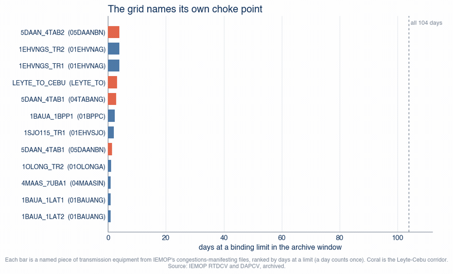
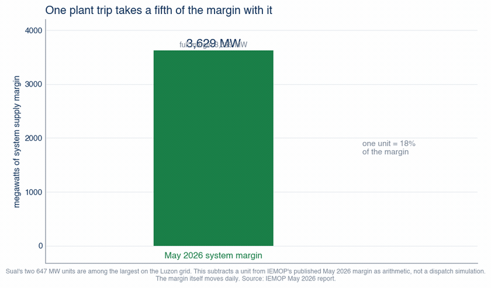
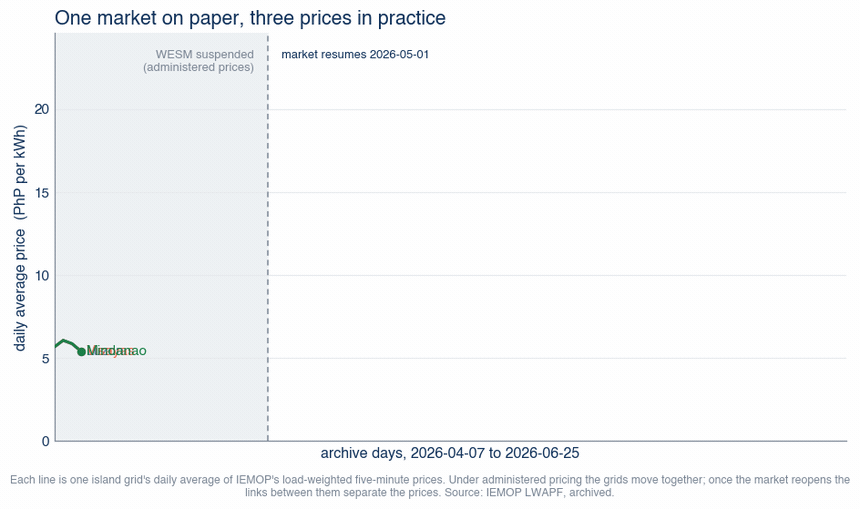
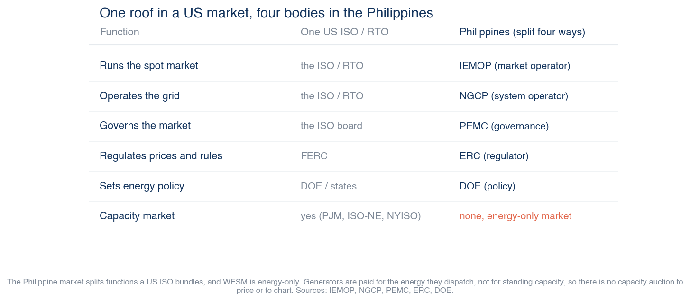

# gridbill-ph

Can the Philippine grid host the announced data-center wave? An interactive map and
a daily archive built on the market operator's own public files: where transmission
already binds (named equipment, five-minute receipts), where the announced
data-center megawatts land, and what the spot market and the Meralco bill are doing.
Inputs, method, and every number are open and reproducible from a clean clone.

[](https://github.com/xmpuspus/gridbill-ph/actions/workflows/ci.yml)
[](LICENSE)
[](https://www.python.org/downloads/)
[](README.md)

<!-- LIVE_URL and the hero recording land at deploy (gated on the maintainer). Until
     then the hero links to the in-repo methodology page; swap both at deploy. -->
[](web/methodology.html)

Live map: deploying alongside the July Meralco and June WESM prints. For now, open
`web/index.html` after `make data`, or read [every number and source](web/methodology.html).

## The grid names its own choke point

The choke points are not inferred. IEMOP publishes a "congestions manifesting" file
that names the exact transmission equipment sitting at its binding limit, per
five-minute interval, and this repo archives and ranks them. A row **literally named
`LEYTE_TO_CEBU`** shows up in the day-ahead runs on **68 of the window's 90 days**.
The 230 kV lines that carry that corridor, Tabango (Leyte) to Daanbantayan (Cebu),
top the league at a limit on **87 of 90 days**. The same corridor IEMOP's December
2025 report names in prose; here it is the receipts behind the prose.



Across the 90-day window, **84 distinct pieces of equipment** hit a limit at least
once. The map ranks them by days at a limit (a day counts once, so a day-ahead
re-run cannot inflate it) and keeps the real-time and day-ahead counts in separate
columns, because the day-ahead market re-prices hourly and its raw row count
measures re-run persistence, not time at the limit. Per-equipment receipts:
[`web/data/congestion.json`](web/data/congestion.json); rebuild with `make data`.

## Thin is the normal state

In the operator's own real-time dispatch schedules, **Luzon scheduled reserves fell
below the stated requirement on 54 of the window's 90 days**, and load was curtailed
in the dispatch schedules on **91 grid-days (4,125.4 MWh)** across the three grids.
This is observed curtailment in published schedules and observed reserve shortfall,
not a brownout forecast. The Visayas grid ran a **52-day daily yellow-alert streak
(May 11 to July 1, 2026)** that ended when one 150 MW unit returned, with 935.3 MW
still unavailable that day.

Against that thin margin, the announced data-center wave is the size of the margin
itself: DICT's forecast is **1,500 MW by 2028** (a labeled forecast, not a
measurement) and Meralco has committed **1,000 MW for 10 data centers**, while the
whole system's May 2026 supply margin was **3,629 MW**. A data center is near-flat
24/7 load, so it consumes margin in every interval, not just at the evening peak.
Per-day reserve and curtailment series:
[`web/data/reliability.json`](web/data/reliability.json).



## One market, three prices

WESM is one market on paper and three prices in practice. While the market was
suspended under administered pricing (through May 1, 2026), the three island grids
priced within **P0.015/kWh** of each other. Once trading resumed, they split: over
the market-priced days the average was **Luzon P7.65, Visayas P12.96, Mindanao
P11.52 per kWh**, with **28 days spreading beyond P5/kWh** and a widest daily spread
of **P15.72/kWh on June 8**. The links between the islands are the reason the numbers
differ, and the map keeps the two regimes labeled so the suspension is never folded
into a market-outcome claim.



That wholesale price passes into the Meralco bill monthly. The June 2026 advisory
carried WESM at **P7.03/kWh** inside a **P9.07/kWh** generation charge on a
**P14.48/kWh** total rate. One Sual unit (**647 MW**) equals **18% of the May system
margin**, which is why a single trip moves the whole grid; the map's toggle does that
subtraction in the open, as arithmetic on the published margin, not a dispatch
simulation.


The price is a shape, not a number. The same data center draws the same power every
hour, but what it does to the WESM price depends on how busy the grid already is:
almost nothing when there is room, a jump when the grid is full. This is the Luzon
grid's own price-vs-load curve, every faint dot a five-minute interval from the
archive.


The map never claims data centers set today's prices. Current data-center load is
small against a roughly 15 GW Luzon peak, and the window's prices are driven by fuel,
outages, weather, and the market restart. What the map shows is the pricing machinery
that any new flat 24/7 load plugs into. Daily price series, the regime split, and the
generation-price join: [`web/data/prices.json`](web/data/prices.json) and
[`web/data/price_load.json`](web/data/price_load.json).

### The same load, three different islands

Each island grid answers a new load differently. Luzon carries the volume and climbs
a long way; the smaller grids stay flat until they run tight. WESM is an energy-only
market: generators are paid for the energy they dispatch, not for standing capacity,
so there is no capacity auction to price, which is why this project has no
capacity-market chart.




## Simulate the dispatch

The map's fourth mode is a simplified merit-order model of the grid. It is **not
PLEXOS**: it stacks a sourced generator fleet by marginal cost against the archive's
own dispatched generation, per grid, and reads off the marginal clearing price. Coal
marginal cost is the ERC administered price of **P6.00/kWh** and Malampaya gas is
**P4.80/kWh**, both sourced; the availability derates and the split of the fleet
across grids are labeled model assumptions, and that split reconciles exactly to the
DOE national fuel totals (a test pins every column).

The honest result is that a competitive cost stack predicts a nearly flat **~P6/kWh**
line. On Luzon it averages **P6.01/kWh** against an observed **P7.05/kWh** (mean
absolute error **P3.47**): it over-prices the overnight trough, because real units
bid below cost to stay committed, and under-prices the evening peak. That evening gap
is scarcity and offer behavior, not data-center load. On the Visayas grid, tight
through the 52-day yellow-alert streak, the evening residual runs **P12.14/kWh** above
the cost stack. The daily shape and the island spread are commitment, scarcity, and
offers, not new load.

The adequacy number is the checkable one. At the evening peak Luzon has about
**15,680 MW** available against a **14,589 MW** peak, a **7.5%** reserve margin. Add
the DICT forecast of **1,500 MW** of data centers by 2028 (a labeled DICT forecast,
October 2025) and that margin falls to **-2.5%**: 109 five-minute intervals in the
window go short, 1,547 MWh unserved.

The panel re-clears the baked stack in the browser. Move the levers (add a data
center as flat 24/7 load, trip any of the 11 named units for an N-1, add firm
capacity, relieve a choke point) and the clearing price and any supply shortfall
update live, on the same stack the Python engine produced. The named-generator layer,
the N-1 table, and the full model: [`web/data/dispatch.json`](web/data/dispatch.json)
and [`web/data/generators.geojson`](web/data/generators.geojson); the engine is
`pipeline/dispatch.py` on the sourced fleet in `pipeline/fleet_ph.py`.

## What this is

- **A daily archive.** IEMOP's public window is a rolling ~90 days per dataset.
  `pipeline/archive_iemop.py` plus a GitHub Actions cron turns that window into a
  permanent public archive under `data/raw/` (the git history is the archive):
  named binding constraints (RTD + DAP), regional summaries (demand, curtailment,
  reserve slack), load-weighted average prices, HVDC limits, outage schedules. The
  archiver fails loud and a staleness gate turns the cron red if the archive stops
  growing, because losing a day is permanent once the public window rolls past it.
- **A baked, checkable map.** `pipeline/build_data.py` computes every number the site
  shows into `web/data/*.json`; the page renders only baked artifacts, so copy cannot
  drift from data. `web/index.html` is a single-file MapLibre map with a findings
  drawer (each computed finding flies the map to its evidence) and deep-linkable
  `?q=&finding=` URLs.
- **A sourced constants layer.** Choke-point corridors (schematic lines between named
  converter stations and substations, with their archive receipts joined on), 14
  data-center sites with a citable source each (public MW on 11 of them, 591.3 MW
  named total), and every market anchor with its primary source, in
  `pipeline/constants_ph.py`.

## What it is not

- Not a claim that data centers raised Philippine electricity prices. The window's
  prices are driven by fuel, outages, weather, and the market restart.
- Not a brownout forecast. It shows observed curtailment in dispatch schedules,
  observed reserve shortfalls, and arithmetic on published margins.
- Not a price forecast. The dispatch model is a simplified merit-order stack (not
  PLEXOS) calibrated against observed prices; it shows what a competitive cost stack
  does and does not explain, and is not a predictor. Every plant number is sourced;
  the fuel-availability and per-grid-split assumptions are labeled as such.
- Not a complete data-center inventory (Cushman counts 24 operational facilities;
  DataCenterMap lists 44; only publicly-sourced sites are pinned, at city precision).
- Not route maps: corridor lines are schematic links between named endpoints.
- Not a nodal congestion-premium layer. WESM's settlement-final files report the LMP
  congestion component as zero (the market re-prices most intervals under a
  substitution methodology and expresses inter-island congestion as regional price
  separation, not a per-node charge), so that layer stays archived, not displayed.
  Full resolution in [`docs/research-launch-20260705.md`](docs/research-launch-20260705.md).

## Where the data comes from

The primary Philippine sources this project reads, archives, or reconciles against.
Every number on the map traces back to one of these.

- [IEMOP market data](https://www.iemop.ph/market-data/). the Independent Electricity
  Market Operator's public files: congestions manifesting (named binding equipment per
  five-minute interval), regional summaries, load-weighted average prices, HVDC limits,
  outage schedules. The rolling ~90-day window is what `pipeline/archive_iemop.py`
  turns into a permanent archive.
- [IEMOP monthly reports](https://www.iemop.ph/news/). the operator's narrative on each
  billing month: which links bound, why prices moved, supply-and-demand margins. The
  prose the archive turns into receipts.
- [NGCP Transmission Development Plan](https://www.ngcp.ph/tdp). the system operator's
  2025-2050 plan: the corridors, the reinforcement projects, and the schedule that
  says when a choke point is meant to be relieved.
- [DOE Power Statistics](https://doe.gov.ph/electric-power/electric-power-statistics).
  the Department of Energy's installed and dependable capacity by grid and by fuel,
  and the list of existing power plants; the reference the dispatch fleet is
  reconciled to.
- [WESM / PEMC](https://www.wesm.ph/). the spot market rules and the Philippine
  Electricity Market Corporation's governance; why WESM is energy-only and how the
  regional price separation this map shows is settled.
- [ICSC Philippine Power Outlook](https://icsc.ngo/tag/philippine-power-outlook/).
  the Institute for Climate and Sustainable Cities' annual PH grid-adequacy analysis
  (reserve margins, alert risk, HVDC constraints) built on NGCP and DOE outlooks; the
  neighbor to the supply question, in static-report form.
- [DataCenterMap](https://www.datacentermap.com/philippines/) and
  [Cushman & Wakefield APAC updates](https://www.cushmanwakefield.com/en/singapore/insights/apac-data-centre-update).
  the public facility inventories the data-center layer is drawn and cross-checked
  against (named sites with a citable source each).

## Reproduce locally

Requires Python 3.11+ and curl. No accounts, no keys.

```bash
git clone https://github.com/xmpuspus/gridbill-ph
cd gridbill-ph
make backfill    # pull the full public window from iemop.ph (~15 min, ~50 MB)
make data        # bake web/data/ from the archive + sourced constants
make qa          # data-integrity pins + banned-framing gate
make serve       # http://localhost:8789
make e2e         # behavioral checks against the running map
```

The committed `data/raw/` means `make data` works offline from a clean clone;
`make backfill` tops up any days the archive is missing (fetches are sequential and
throttled out of courtesy to IEMOP's servers). `make archive` is the daily
incremental the cron runs; `python3 pipeline/archive_iemop.py --check` is the
staleness gate that fails the cron if the archive stops growing.

## Data products

| File | What it is |
|---|---|
| `data/raw/RTDCV/`, `data/raw/DAPCV/` | IEMOP "congestions manifesting" daily CSVs: named equipment, station, binding limit, MW flow, overload, per five-minute interval (RTD) or hourly (DAP) |
| `data/raw/RTDSUM/` | RTD regional summaries: energy and reserve rows per grid (demand bids, load curtailed, reserve requirement vs scheduled) |
| `data/raw/LWAPF/` | Load-weighted average prices, final, per grid per five-minute interval (PhP/MWh) |
| `data/raw/HVDCRTD/`, `data/raw/OUTRTD/` | HVDC limits imposed in RTD; outage schedules used in RTD |
| `web/data/congestion.json` | Constraint league (ranked by days, RT and DAP counts separate) plus per-corridor receipts joined to the choke-point lines |
| `web/data/prices.json` | Daily regional price series, the administered-vs-market regime split, and the widest-spread day |
| `web/data/findings.json` | The findings drawer: computed cards, each with the map focus that flies to its evidence |
| `web/data/*.json` | The rest of the baked layers: reliability series, the three answers, choke points, data-center sites, anchors |

## Methodology

Every number, source, unit conversion, and caveat:
[`web/methodology.html`](web/methodology.html). The launch research (prior art, the
WESM price-determination resolution, the news sweep) is in
[`docs/research-launch-20260705.md`](docs/research-launch-20260705.md). Working notes
and the non-negotiable stance (no attribution claims, no prophecy, labeled forecasts,
schematic lines, city-precision pins): [`CLAUDE.md`](CLAUDE.md).

## License and attribution

Code: MIT. Baked data products: CC-BY-4.0. See [`LICENSE`](LICENSE) and
[`CITATION.cff`](CITATION.cff). Upstream market data belongs to its publishers
(IEMOP, NGCP, Meralco); this repository mirrors public files as-is for research with
attribution, and will honor any takedown request from the publisher.

Attribution when redistributing the baked data: *gridbill-ph (2026), IEMOP public
market data archive, https://github.com/xmpuspus/gridbill-ph*.

## Public-record disclaimer

All data sourced from public records (IEMOP market files, NGCP publications, Meralco
advisories, PCIJ reporting, company announcements). This tool computes statistical
indicators only. Patterns may have legitimate explanations. Specific allegations, if
any, require independent investigation and corroboration.
