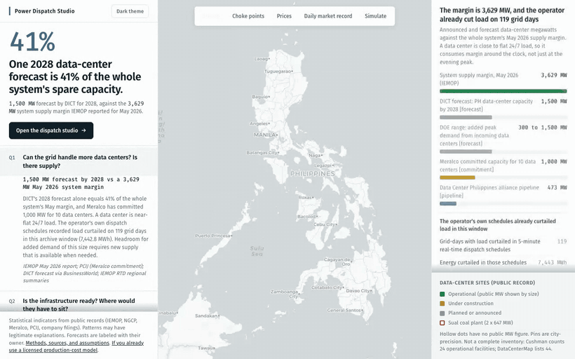

# Power Dispatch Studio

**Replay and stress-test the Philippine wholesale power market from public
records.** A daily archive of the market operator's own files, a dispatch model
that runs in your browser, price backcasts against what the market actually
charged, and scenarios that travel as a link. No account, no install, no licence.

[](https://github.com/xmpuspus/power-dispatch-studio/actions/workflows/ci.yml)
[](LICENSE)
[](https://www.python.org/downloads/)
[](https://pypi.org/project/power-dispatch-studio/)

[](https://power-dispatch-studio.vercel.app)

## Pick the door that fits you

| You are | Start here |
|---|---|
| **Curious, or writing about the grid.** You want to know what constrained it and what that costs. | **[Open the map](https://power-dispatch-studio.vercel.app)**. Five modes over the archive. Move one slider and watch the price move. |
| **An analyst or developer.** You want to replay a market day, add demand, trip a unit, and read the answer. | **[Open the studio](https://power-dispatch-studio.vercel.app/studio/)**. 42 views, a command palette, and every scenario is a URL you can send. |
| **A researcher or engineer.** You want the model in your own code. | `pip install power-dispatch-studio`, then `power-dispatch run --date 2026-06-17`. [Three worked examples](examples/). |

## Add 3,000 MW to Luzon and the price doubles, in your browser, in one drag

One 2028 data-center forecast equals 41% of the whole system's May 2026 supply
margin. Put that demand on the grid in [Simulate](https://power-dispatch-studio.vercel.app/?q=simulate&dc=3000)
and the lowest-cost-first dispatch moves from coal at P6.00/kWh to oil at
P12.00/kWh. That link carries the scenario, so it opens on the same result for
whoever you send it to.


## A nightly archive, receipts from 5-minute records, and one engine in two languages

- **A daily archive.** The market operator publishes a rolling 90-day window and
  then erases it. This repository fetches it every night and keeps it, so the
  record outlives the window. The git history is the archive.
- **Receipts, not estimates.** Five-minute dispatch records name the transmission
  equipment that reached a limit, on which day, for how long.
- **Backcasts you can check.** The model replays recorded days two ways, on a cost
  stack and on the operator's own published offer books, and publishes how far
  each lands from what the market charged.
- **One engine, two languages.** The browser and the Python package write the same
  linear program, byte for byte, pinned by a hash in `tests/test_lp_parity.py`.
- **Every number is checked.** `scripts/verify_claims.py` holds 111 claims across
  the prose and fails when one drifts from the data build.

**[Read the eleven findings](docs/findings.md)** for what the archive supports,
each with its own evidence. **[The 42 studio views](docs/studio-views.md)** lists
every deep link.

This front door downloads 6.1 MB of media across
2 files. The eleven findings and the 42-view catalog carry the rest, so a
visitor pays for them only after choosing to read them.

## PyPSA-PH models a finer network. This one archives the market and checks its own prices.

| | What it is | What it has that this does not | What this has |
|---|---|---|---|
| [PyPSA-PH](https://github.com/arizeosalac/PyPSA-PH) | An open Philippine power-system model on PyPSA | A far finer network: 192 nodes, 425 units, 236 lines | A daily archive, backcasts against recorded prices, and a browser you can send a link to |
| [PyPSA](https://github.com/PyPSA/PyPSA) | The mature open toolbox the above builds on | Capacity expansion, unit commitment, a large community | Philippine market data, already fetched and derived, and no install |
| [PowerSimulations.jl](https://github.com/NREL-Sienna/PowerSimulations.jl) | NREL's simulation library | Security-constrained unit commitment, and a research pedigree | Runs in a browser, and brings its own system |

None of them archives the Philippine market operator's files every night, and
none publishes how far its own replay lands from what the market charged. That
pair is the reason to pick this one. For everything else on the list, pick them.


## It is a three-zone dispatch calculation, not a utility planning model

It is a simplified three-zone dispatch calculation, not a utility planning model.
It does not do security-constrained unit commitment, nodal power flow, or
anything a licensed production-cost suite is bought for. It tests how added
demand, plant outages, storage, and inter-island limits change *this* calculation.
[The model states six limits](docs/findings.md) and
[what it refuses to solve](web/for-analysts.html) in its own words.


## IEMOP's public window rolls at 90 days, so the git history is the archive

- **The daily archive preserves IEMOP files after the public window closes.**
  IEMOP's public window rolls by about 90 days per dataset.
  `pipeline/archive_iemop.py` plus a GitHub Actions cron turns that window into a
  permanent public archive under `data/raw/` (the git history is the archive).
  It holds named binding constraints (RTD + DAP), regional summaries (demand, curtailment,
  reserve slack), load-weighted average prices, HVDC limits, outage schedules. The
  archiver fails with an error and the scheduled job fails if the archive stops
  growing, because losing a day is permanent once the public window rolls past it.
- **The map reads calculated data files.** `pipeline/build_data.py` calculates
  the site results in `web/data/*.json`. `web/index.html` is a single-file
  MapLibre map with a findings
  drawer (each computed finding moves the map to its evidence) and URLs that
  preserve the active search and finding.
- **Each fixed input cites a source.** `pipeline/constants_ph.py` defines five
  choke points on routed lines, 14 data-center sites, and each market input.
  Eleven sites publish capacity figures, totaling 591.3 MW.

## The model states six limits

- The project does not claim that data centers raised Philippine electricity prices. Fuel,
  outages, weather, and the market restart drive the window's prices.
- The figures do not forecast brownouts. They show recorded curtailment in dispatch schedules,
  recorded reserve shortfalls, and arithmetic on published margins.
- The model does not forecast prices. It uses a simplified merit-order stack
  compared with recorded prices. It shows what a competitive cost stack does and
  does not explain, and is not a predictor. Each plant entry cites its source.
  The fuel-availability and per-grid-split assumptions are labeled as such.
- The data-center list is not complete. Cushman counts 24 operational facilities,
  and DataCenterMap lists 44. The map shows only publicly sourced sites, at city precision.
- The grid lines do not reproduce NGCP's network model. They follow real routes as mapped
  in OpenStreetMap (community data, ODbL), geometry only, no ratings.
- It does not calculate a nodal congestion premium. WESM's published nodal congestion component
  is zero through the market suspension and small and intermittent afterward (the
  market re-prices a minority of intervals under a substitution method (16
  percent of the derived archive, against 22 percent administered and 8 percent
  security-limited) and expresses
  inter-island congestion as regional price separation instead of a per-node charge).
  The map and studio display the recorded price difference per node and do not
  label it as a congestion
  premium. Full resolution in
  [`docs/source-notes.md`](docs/source-notes.md).

## Where the data comes from

The project reads and archives the Philippine sources below. The method page
marks calculated results and assumptions separately.

- [IEMOP market data](https://www.iemop.ph/market-data/) gives named binding
  equipment per 5-minute interval, regional summaries, load-weighted average
  prices, high-voltage direct-current limits, and outage schedules.
  `pipeline/archive_iemop.py` preserves the rolling 90-day public window.
- [IEMOP monthly reports](https://www.iemop.ph/news/) explain which links reached
  their limits, the price drivers, and the remaining supply margin.
- [NGCP's Transmission Development Plan](https://www.ngcp.ph/tdp) lists planned
  grid links, upgrades, and completion dates from 2025 to 2050.
- [DOE Power Statistics](https://doe.gov.ph/electric-power/electric-power-statistics)
  gives installed and dependable capacity by grid and fuel, plus the list of
  existing power plants. The dispatch fleet must match these totals.
- [WESM and PEMC](https://www.wesm.ph/) publish spot-market rules and governance.
  These rules define WESM as an energy-only market and explain regional settlement.
- [ICSC's Philippine Power Outlook](https://icsc.ngo/tag/philippine-power-outlook/)
  reports reserve margins, alert risk, and high-voltage direct-current limits
  based on NGCP and DOE plans.
- [DataCenterMap](https://www.datacentermap.com/philippines/) and
  [Cushman & Wakefield APAC updates](https://www.cushmanwakefield.com/en/singapore/insights/apac-data-centre-update).
  give the public facility lists used to place and check named data-center sites.

## Reproduce locally

Needs Python 3.11+ and curl. No accounts, no keys.

```bash
git clone https://github.com/xmpuspus/power-dispatch-studio
cd power-dispatch-studio
pip install -r requirements.txt   # the HiGHS solver the dispatch model runs on
make backfill    # pull the full public window from iemop.ph (~15 min, ~50 MB)
make data        # prepare web/data/ from the archive + sourced constants
make qa          # data and language checks
make serve       # http://127.0.0.1:8789
make e2e         # behavioral checks against the running map
```

The clone carries the archive, so `make data` works with no network. `make help`
lists every target.

### Point the engine at your own system, not at ours

The engine reads a directory holding `dispatch.json` and `profiles.json`. Write
your own pair and every command above runs against your system instead.

```bash
power-dispatch run --data-dir /path/to/your/build --date 2030-01-01
export POWER_DISPATCH_DATA=/path/to/your/build   # same effect, for a session
```

[`docs/data-contract.md`](docs/data-contract.md) lists every key those two files
must carry, with a 30-line system that runs.
`tests/test_data_contract.py` builds that system, solves it, and fails if the
document stops matching the engine.

The committed `data/raw/` means `make data` works offline from a clean clone.
`make backfill` tops up any days the archive is missing (fetches are sequential and
throttled out of courtesy to IEMOP's servers). `make archive` is the daily
incremental the cron runs. `python3 pipeline/archive_iemop.py --check` is the
staleness check that fails the scheduled job if the archive stops growing.

## Data products

| File | What it is |
|---|---|
| `data/raw/RTDCV/`, `data/raw/DAPCV/` | IEMOP "congestions manifesting" daily CSVs with equipment, station, binding limit, MW flow, and overload per 5-minute interval or hour |
| `data/raw/RTDSUM/` | Real-time regional energy and reserve rows per grid, including demand bids, curtailed load, reserve need, and scheduled reserve |
| `data/raw/LWAPF/` | Load-weighted average prices, final, per grid per 5-minute interval (PhP/MWh) |
| `data/raw/HVDCRTD/`, `data/raw/OUTRTD/` | High-voltage direct-current limits and outage schedules used in real-time dispatch |
| `web/data/congestion.json` | Constraint league ranked by day, with separate real-time and day-ahead counts plus records joined to each inter-island link |
| `web/data/prices.json` | Daily regional price series, the administered-vs-market regime split, and the widest-spread day |
| `web/data/findings.json` | Calculated finding cards and the map location for each card |
| `web/data/*.json` | Calculated reliability series, the three answers, constrained equipment, data-center sites, and reference figures |
| `web/data/exports/*.csv` | Nightly CSVs for constraints, replay results, and daily market records. See `web/data/exports/index.json` |

## Method

The sources, assumptions, unit conversions, calculations, and limits are in
[`web/methodology.html`](web/methodology.html). The WESM price-method and dated
market-event notes are in [`docs/source-notes.md`](docs/source-notes.md).

## License and attribution

The code is MIT. The calculated data products are CC-BY-4.0. See [`LICENSE`](LICENSE),
[`DATA-LICENSE.md`](DATA-LICENSE.md) for which terms cover which files, and
[`CITATION.cff`](CITATION.cff). Upstream market data belongs to its publishers
(IEMOP, NGCP, Meralco). This repository mirrors public files as-is for research with
attribution, and will honor any takedown request from the publisher.

Use this attribution when you redistribute the calculated data. *Power Dispatch Studio (2026), IEMOP
public market data archive, https://github.com/xmpuspus/power-dispatch-studio*.

`CITATION.cff` carries the machine-readable citation.

## Public-record disclaimer

Recorded inputs cite public records from IEMOP, NGCP, Meralco, PCIJ, and company
announcements. Calculated results and model assumptions are labeled separately.
This tool computes statistical indicators only. Patterns may have legitimate
explanations. Specific allegations need independent investigation and
supporting evidence.
