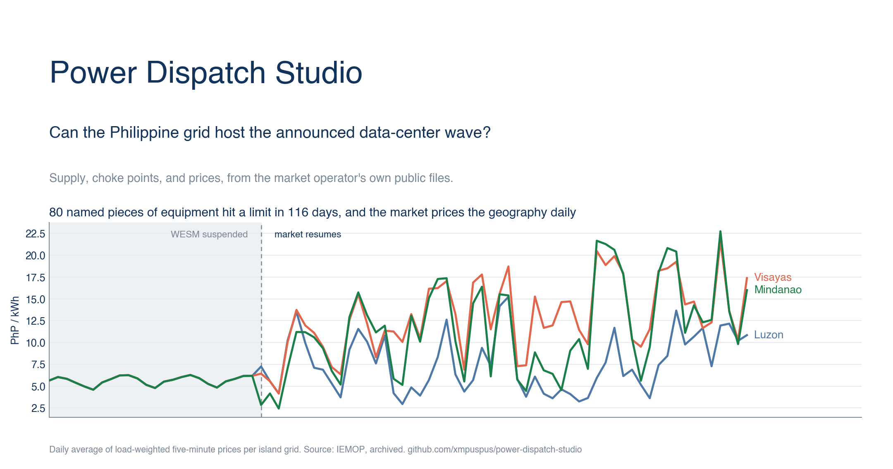

# Power Dispatch Studio

Power Dispatch Studio replays and stress-tests the Philippine wholesale power
market with public records. The repository keeps a daily archive of the
market operator's files. The browser and Python package run dispatch scenarios
and compare backcasts with recorded prices. Browser use needs no account or
local installation.

[](https://github.com/xmpuspus/power-dispatch-studio/actions/workflows/ci.yml)
[](LICENSE)
[](https://www.python.org/downloads/)
[](https://pypi.org/project/power-dispatch-studio/)

[](https://power-dispatch-studio.vercel.app)

## Use the Studio in five minutes

The browser needs no account or installation. Start with a recorded day, then
save the base run before changing assumptions.

### Replay a recorded market day

1. Open [Hourly market replay](https://power-dispatch-studio.vercel.app/studio/#v=chronology).
2. Under **Observed day**, choose a recorded day and island grid. Click an hour in
   the 24-hour strip to read its recorded price, replay price, demand, and
   price-setting block.
3. Under **Replay method**, switch between **Cost-model replay** and
   **Offer-book replay**. The offer option is available only on days with a
   published offer book.
4. Open **Evidence and sources** before using a result. It names the source,
   date, resolution, and whether the value was recorded or calculated.
5. Use **Copy link** to share the same date, grid, window, and scenario. Use
   **Export CSV** for the hourly rows.

[](docs/studio-shell.mp4)

[Download the market-day recording as MP4](docs/studio-shell.mp4).

### Run, save, and compare a scenario

1. In **Hourly market replay**, press **Save run** to keep the base case.
2. Open [Scenario builder](https://power-dispatch-studio.vercel.app/studio/#v=quick-scenario).
   Start from a task preset or change only the needed inputs. Name the scenario
   before you run it.
3. Press **Run _N_ changes**. Do not use the scenario result until the top bar
   says **Results current**.
4. Return to **Hourly market replay**, choose **Day** or **Week ending**, wait for
   the day totals to update, enter a useful run name, and press **Save run** again.
5. Open [Saved runs](https://power-dispatch-studio.vercel.app/studio/#v=saved-runs).
   Read the summary above the table first. It names the changed assumption, the
   most affected grid, the price movement, unserved energy, and any link at its
   limit.
6. Use **Export case** for one portable file with assumptions, dates, the
   calculation version, sources, results, and chart data. Use **CSV** for hourly
   data or **Report** for a standalone HTML report.

[](docs/analyst-walkthrough.mp4)

[Download the scenario recording as MP4](docs/analyst-walkthrough.mp4).

Saved scenarios and runs stay in that browser. Exported case files give a
durable copy. **Local usage diagnostics** record only workflow counts in that
browser and send nothing over the network.

### Read the status before reading the number

| Label | Meaning |
|---|---|
| **Recorded** | Published market or grid record. The evidence panel names the file and period. |
| **Modeled** or **replay** | Calculated by the simplified dispatch model. Compare it with the recorded value where one exists. |
| **Estimated** | Built from a stated assumption, such as an unpublished line rating. It is not confirmed site connection capacity. |
| **User-supplied** | Loaded from your CSV and kept in your browser. |
| **Unavailable** | The required public value was not found. The Studio does not replace it with zero. |

Prices are shown in pesos per kilowatt-hour (₱/kWh), power in megawatts (MW),
and energy over time in megawatt-hours (MWh).

## Choose a view by task

| Task | Start here |
|---|---|
| Review a recorded market day | [Open Market day](https://power-dispatch-studio.vercel.app/studio/#v=chronology) for prices, dispatch, demand, constraints, and replay results. |
| Test a change to demand or supply | [Open Scenario builder](https://power-dispatch-studio.vercel.app/studio/#v=quick-scenario), run the change, and compare it with the base case. |
| Check outages and supply risk | [Open Supply and risk](https://power-dispatch-studio.vercel.app/studio/#v=adequacy) for scheduled outages, N-1 results, and shortfall probability. |
| Review a connection site | [Open Grid and connection](https://power-dispatch-studio.vercel.app/studio/#v=siting) for estimated site headroom, transfer limits, and recorded connection-point price differences. |
| Inspect the geographic record | [Open the public map](https://power-dispatch-studio.vercel.app) for supply, constraints, prices, and named infrastructure. |
| Run from Python or a script | Install `power-dispatch-studio`, then run `power-dispatch run --date 2026-06-17`. See the [worked examples](examples/). |

## What the project includes

- **Nightly IEMOP archive.** The market operator publishes a rolling 90-day
  window. This repository fetches it every night, and Git history keeps files
  after they leave the public window.
- **Recorded grid constraints.** Five-minute dispatch records name the transmission
  equipment that reached a limit, on which day, for how long.
- **Published replay error.** The model replays recorded days with a cost stack
  and with the operator's published offer books. It reports the error against
  recorded prices for both calculations.
- **Shared optimization model.** The browser and the Python package write the same
  linear program, byte for byte, pinned by a hash in `tests/test_lp_parity.py`.
- **Automated claim checks.** `scripts/verify_claims.py` compares guarded statements
  with the data build and fails when a value drifts.

**[Read the eleven findings](docs/findings.md)** for the supporting evidence.
The **[Studio view catalog](docs/studio-views.md)** lists every deep link.

The README downloads 3.9 MB of media across 3 files. The findings and Studio
catalog link to the remaining media instead of embedding it here.

## Related power-system tools

| Project | Scope | Capabilities outside this project | Included in Power Dispatch Studio |
|---|---|---|---|
| [PyPSA-PH](https://github.com/arizeosalac/PyPSA-PH) | Philippine PyPSA model | 192 nodes, 425 units, and 236 lines | Nightly IEMOP archive, replay-error reporting, and a browser workspace |
| [PyPSA](https://github.com/PyPSA/PyPSA) | Power-system analysis toolbox | Capacity expansion and unit commitment | Philippine market data and a browser interface |
| [PowerSimulations.jl](https://github.com/NREL-Sienna/PowerSimulations.jl) | NREL's power-system simulation library | Security-constrained unit commitment and production-simulation workflows | A browser interface and bundled Philippine system data |

## Model scope

The model is a simplified three-zone dispatch calculation. It does not include
security-constrained unit commitment or nodal power flow. It tests how added
demand, plant outages, storage, and inter-island limits change the calculation.
See the [six documented model limits](docs/findings.md) and the
[scope guidance for production-cost analysts](web/for-analysts.html).


## Archive operation

- **The daily archive preserves IEMOP files after the public window closes.**
  IEMOP's public window rolls by about 90 days per dataset.
  `pipeline/archive_iemop.py` plus a GitHub Actions cron turns that window into a
  permanent public archive under `data/raw/` (the git history is the archive).
  It holds named binding constraints (RTD + DAP), regional summaries (demand, curtailment,
  reserve slack), load-weighted average prices, HVDC limits, outage schedules. The
  archiver and scheduled job fail if the archive stops growing.
- **The map reads calculated data files.** `pipeline/build_data.py` calculates
  the site results in `web/data/*.json`. `web/index.html` is a single-file
  MapLibre map with a findings
  drawer (each computed finding moves the map to its evidence) and URLs that
  preserve the active search and finding.
- **Each fixed input cites a source.** `pipeline/constants_ph.py` defines five
  choke points on routed lines, 14 data-center sites, and each market input.
  Eleven sites publish capacity figures, totaling 591.3 MW.

## Model limitations

- The project does not claim that data centers raised Philippine electricity prices. Fuel,
  outages, weather, and the market restart drive the window's prices.
- The figures do not forecast brownouts. They show recorded curtailment in dispatch schedules,
  recorded reserve shortfalls, and arithmetic on published margins.
- The model does not forecast prices. It uses a simplified merit-order stack
  compared with recorded prices. It shows what a competitive cost stack does and
  does not explain, and is not a predictor. Each plant entry cites its source.
  The project labels fuel-availability and per-grid-split assumptions.
- The data-center list is not complete. Cushman counts 24 operational facilities,
  and DataCenterMap lists 44. The map shows only publicly sourced sites, at city precision.
- The grid lines do not reproduce NGCP's network model. They follow real routes as mapped
  in OpenStreetMap (community data, ODbL), geometry only, no ratings.
- It does not calculate a nodal congestion premium. WESM's published nodal congestion component
  is zero through the market suspension and small and intermittent afterward (the
  market re-prices a minority of intervals under a substitution method (16
  percent of the derived archive, against 22 percent administered and 8 percent
  security-limited) and expresses
  inter-island congestion as regional price separation instead of a per-node charge).
  The map and studio display the recorded price difference per node and do not
  label it as a congestion
  premium. Full resolution in
  [`docs/source-notes.md`](docs/source-notes.md).

## Where the data comes from

The project reads and archives the Philippine sources below. The method page
marks calculated results and assumptions separately.

- [IEMOP market data](https://www.iemop.ph/market-data/) gives named binding
  equipment per 5-minute interval, regional summaries, load-weighted average
  prices, high-voltage direct-current limits, and outage schedules.
  `pipeline/archive_iemop.py` preserves the rolling 90-day public window.
- [IEMOP monthly reports](https://www.iemop.ph/news/) explain which links reached
  their limits, the price drivers, and the remaining supply margin.
- [NGCP's Transmission Development Plan](https://www.ngcp.ph/tdp) lists planned
  grid links, upgrades, and completion dates from 2025 to 2050.
- [DOE Power Statistics](https://doe.gov.ph/electric-power/electric-power-statistics)
  gives installed and dependable capacity by grid and fuel, plus the list of
  existing power plants. The dispatch fleet must match these totals.
- [WESM and PEMC](https://www.wesm.ph/) publish spot-market rules and governance.
  These rules define WESM as an energy-only market and explain regional settlement.
- [ICSC's Philippine Power Outlook](https://icsc.ngo/tag/philippine-power-outlook/)
  reports reserve margins, alert risk, and high-voltage direct-current limits
  based on NGCP and DOE plans.
- [DataCenterMap](https://www.datacentermap.com/philippines/) and
  [Cushman & Wakefield APAC updates](https://www.cushmanwakefield.com/en/singapore/insights/apac-data-centre-update).
  give the public facility lists used to place and check named data-center sites.

## Reproduce locally

Needs Python 3.11+ and curl. No accounts, no keys.

```bash
git clone https://github.com/xmpuspus/power-dispatch-studio
cd power-dispatch-studio
pip install -r requirements.txt   # the HiGHS solver the dispatch model runs on
make backfill    # pull the full public window from iemop.ph (~15 min, ~50 MB)
make data        # prepare web/data/ from the archive + sourced constants
make qa          # data and language checks
make serve       # http://127.0.0.1:8789
make e2e         # behavioral checks against the running map
```

The clone carries the archive, so `make data` works with no network. `make help`
lists every target.

### Use another system data directory

The package reads a directory holding `dispatch.json` and `profiles.json`.
Create both files and pass that directory to the command line.

```bash
power-dispatch run --data-dir /path/to/your/build --date 2030-01-01
export POWER_DISPATCH_DATA=/path/to/your/build   # same effect, for a session
```

[`docs/data-contract.md`](docs/data-contract.md) lists every key those two files
must carry, with a 30-line system that runs.
`tests/test_data_contract.py` builds that system, solves it, and fails if the
document stops matching the calculation.

The committed `data/raw/` means `make data` works offline from a clean clone.
`make backfill` tops up any days the archive is missing (fetches are sequential and
throttled out of courtesy to IEMOP's servers). `make archive` is the daily
incremental the cron runs. `python3 pipeline/archive_iemop.py --check` is the
staleness check that fails the scheduled job if the archive stops growing.

## Data products

| File | What it is |
|---|---|
| `data/raw/RTDCV/`, `data/raw/DAPCV/` | IEMOP "congestions manifesting" daily CSVs with equipment, station, binding limit, MW flow, and overload per 5-minute interval or hour |
| `data/raw/RTDSUM/` | Real-time regional energy and reserve rows per grid, including demand bids, curtailed load, reserve need, and scheduled reserve |
| `data/raw/LWAPF/` | Load-weighted average prices, final, per grid per 5-minute interval (PhP/MWh) |
| `data/raw/HVDCRTD/`, `data/raw/OUTRTD/` | High-voltage direct-current limits and outage schedules used in real-time dispatch |
| `web/data/congestion.json` | Constraint league ranked by day, with separate real-time and day-ahead counts plus records joined to each inter-island link |
| `web/data/prices.json` | Daily regional price series, the administered-vs-market regime split, and the widest-spread day |
| `web/data/findings.json` | Calculated finding cards and the map location for each card |
| `web/data/*.json` | Calculated reliability series, the three answers, constrained equipment, data-center sites, and reference figures |
| `web/data/exports/*.csv` | Nightly CSVs for constraints, replay results, and daily market records. See `web/data/exports/index.json` |

## Method

The sources, assumptions, unit conversions, calculations, and limits are in
[`web/methodology.html`](web/methodology.html). The WESM price-method and dated
market-event notes are in [`docs/source-notes.md`](docs/source-notes.md).

## License and attribution

The code is MIT. The calculated data products are CC-BY-4.0. See [`LICENSE`](LICENSE),
[`DATA-LICENSE.md`](DATA-LICENSE.md) for which terms cover which files, and
[`CITATION.cff`](CITATION.cff). Upstream market data belongs to its publishers
(IEMOP, NGCP, Meralco). This repository mirrors public files as-is for research with
attribution, and will honor any takedown request from the publisher.

Use this attribution when you redistribute the calculated data. *Power Dispatch Studio (2026), IEMOP
public market data archive, https://github.com/xmpuspus/power-dispatch-studio*.

`CITATION.cff` carries the machine-readable citation.

## Public-record disclaimer

Recorded inputs cite public records from IEMOP, NGCP, Meralco, PCIJ, and company
announcements. The pages label calculated results and model assumptions separately.
This tool computes statistical indicators only. Patterns may have legitimate
explanations. Specific allegations need independent investigation and
supporting evidence.
