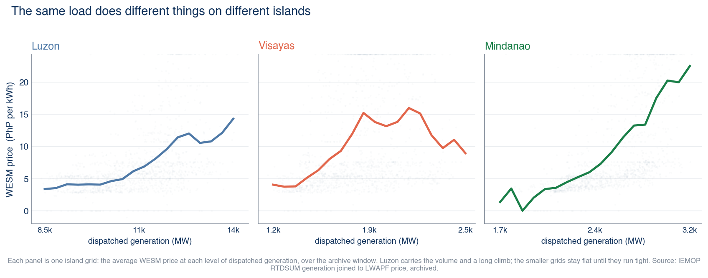

# Power Dispatch Studio

**Can the Philippine grid host the announced data-center wave?** A map, a 39-view
browser dispatch studio, and a daily archive, all built on the market operator's
own public files. Where transmission already binds, named equipment on 5-minute
receipts. Where the announced megawatts would land. What that does to the spot
market and to the Meralco bill.

It is **free**, runs in your browser with no license and no install, and every
number traces to a public source. The studio replays market days two ways, on a
calibrated cost stack and on the operator's own published offer books. So the
offer premium in the wholesale price is a measured series, not a guess. Every
input and every number rebuilds from a clean clone.

Think of it as a small, open, browser-based counterpart to the licensed
production-cost tools grid planners use. It is not a replacement for a planning
suite. It does model the what-ifs that matter here. New data centers, the choke
points behind them, and how the market prices those constraints. Formerly
gridbill-ph.

[](https://github.com/xmpuspus/power-dispatch-studio/actions/workflows/ci.yml)
[](LICENSE)
[](https://www.python.org/downloads/)
[](https://pypi.org/project/power-dispatch-studio/)

[](https://power-dispatch-studio.vercel.app)

The map, through its five modes. The last beat runs live: a data-center load
re-clears the merit order from coal at P6.00 to oil at P12.00, in the browser.

| Start here | What it gives you |
|---|---|
| **[Open the map](https://power-dispatch-studio.vercel.app)** | Five modes over the archive, plus an in-browser simulate |
| **[Open the studio](https://power-dispatch-studio.vercel.app/studio/)** | 39 analyst views, a command palette, and scenarios that travel as a link |
| **[Every number and its source](web/methodology.html)** | The full method, the unit conversions, and every caveat |
| **`pip install power-dispatch-studio`** | The same LP engine, offline, with a bundled archive snapshot |

The pip package runs the engine the browser runs:
[power-dispatch-studio on PyPI](https://pypi.org/project/power-dispatch-studio/),
then `power-dispatch run --date 2026-06-17` writes an hourly CSV, or
`import power_dispatch as pd; pd.run_scenario(...)` in a notebook. Or open
`web/index.html` after `make data`.

## Contents

- [The grid names its own choke point](#the-grid-names-its-own-choke-point)
- [Luzon reserves fell short on 73 of the window's 116 days](#luzon-reserves-fell-short-on-73-of-the-windows-116-days)
- [The three grids priced within P0.015 while suspended, then split to P15.72](#the-three-grids-priced-within-p0015-while-suspended-then-split-to-p1572)
- [Luzon and Mindanao validate the loss surface, and Visayas fails](#luzon-and-mindanao-validate-the-loss-surface-and-visayas-fails)
- [Every column in the day-by-day feed comes from the archive, not the model](#every-column-in-the-day-by-day-feed-comes-from-the-archive-not-the-model)
- [A cost stack clears near flat P6, and the evening gap is offers, not new load](#a-cost-stack-clears-near-flat-p6-and-the-evening-gap-is-offers-not-new-load)
- [The offer-book replay tracks the market's own prices at 0.68 to 0.87](#the-offer-book-replay-tracks-the-markets-own-prices-at-068-to-087)
- [The studio is 39 views, and every one of them is a URL you can send](#the-studio-is-39-views-and-every-one-of-them-is-a-url-you-can-send)
- [IEMOP's public window rolls at 90 days, so the git history is the archive](#iemops-public-window-rolls-at-90-days-so-the-git-history-is-the-archive)
- [What it is not](#what-it-is-not) · [Where the data comes from](#where-the-data-comes-from) · [Reproduce locally](#reproduce-locally) · [Data products](#data-products) · [Method](#method)

The whole argument in four charts: the grid names its own choke point, the price
is a shape a data center barely moves with room and jumps when full, one plant
trip takes a fifth of the margin, and a WESM swing is only a slice of the Meralco
bill.

![Four-panel summary: a constraint league of named 230 kV lines at a binding limit on most days of the archive window with the Leyte-Cebu corridor topping it; the Luzon price-versus-load curve where a 300 MW data center adds about P0.32/kWh with room but far more when the grid is full; the May 2026 system margin of 3,629 MW with one 647 MW Sual unit marked as 18 percent of it; and the Meralco June 2026 bill split showing the WESM spot slice at about a twentieth of the whole rate, because only a tenth of the energy behind the generation charge was bought on the spot market](docs/story-montage.gif)

## The grid names its own choke point

The choke points are not inferred. IEMOP publishes a "congestions manifesting" file
that names the exact transmission equipment sitting at its binding limit, per
5-minute interval, and this repo archives and ranks them. A row **literally named
`LEYTE_TO_CEBU`** shows up in the day-ahead runs on **92 of the window's 116 days**.
The 230 kV lines that carry that corridor, Tabango (Leyte) to Daanbantayan (Cebu),
top the league: at a binding limit in the hourly day-ahead runs on **113 of 116
days**, and binding in the 5-minute real-time dispatch, the run settlement
actually sees, on **23 days** of the window. Both columns are in the table; the
day-ahead count measures how persistently the constraint reappears across re-runs,
the real-time count how often it actually bound. The same corridor IEMOP's December
2025 report names in prose; here it is the receipts behind the prose.


The same league as plain ranked bars, with no map, is [docs/constraint-league.gif](docs/constraint-league.gif).

Across the 116-day window, **80 distinct pieces of equipment** hit a limit at least
once, in **95 monitored constraints** (a transformer is listed under each winding
voltage and a line at each terminal, so one physical asset can hold several limits).
The map ranks the constraints by days at a limit (a day counts once, so a day-ahead
re-run cannot inflate it) and keeps the real-time and day-ahead counts in separate
columns, because the day-ahead projection re-prices hourly and its raw row count
measures re-run persistence, not time at the limit. Per-equipment receipts:
[`web/data/congestion.json`](web/data/congestion.json); rebuild with `make data`.

The operator also publishes the same story with unit names, and the map now
carries it: the PSM constrained-on list names, per 5-minute interval, every
generator that network or security constraints forced to run out of merit,
with the administered price it was paid. Across the window that is **269
named generators**, the Visayas leading by intervals, batteries topping the
list at the P32 offer cap (`constrained_on` in
[`web/data/market_ops.json`](web/data/market_ops.json)). Beside it sit the
security limits used in real-time dispatch: per-resource operating points
the archived files pin to a single MW value in 99.3 percent of windows
(regulating hydro, the Agus units, is the exception), the physical record
of which units the grid's security constraints held and where
(`security_limits` in the same file).

The instruction log behind both closes the causal loop. Across the 113
daily logs the System Operator's own dispatch instructions carry a remark
citing a line limitation **1,740 times, and 1,713 of those name the
Leyte-Cebu corridor** ("Advise to discharge under MOT Raise due to
Leyte-Cebu Line Limitation"), the same corridor the constraint league
ranks first by shadow-price days: one corridor carries 98 percent of
every line-limitation instruction the operator wrote down. The full out-of-merit record rides
beside it: **108,842 MOT-raise instructions** across the window at a **55
MW** median, where the must-run subset the methodology measured out sits
at 5.7 (`so_instructions` in the same file; the administered-dispatch
overlay it sizes is a named queued build).

## Luzon reserves fell short on 73 of the window's 116 days

In the operator's own real-time dispatch schedules, **Luzon scheduled reserves fell
below the stated requirement on 73 of the window's 116 days**, and load was curtailed
in the dispatch schedules on **105 grid-days (5,221.0 MWh)** across the three grids.
This is observed curtailment in published schedules and observed reserve shortfall,
not a brownout forecast. The Visayas grid ran **52 consecutive days on
grid alert (May 11 to July 1, 2026)**, yellow on most of them and RED on three
(May 13, 14 and 15, in the operator advisories archived here). Red alert is the
more severe state: supply itself no longer covers demand plus the regulating
reserve, so manual load dropping is expected. (Yellow is the lesser state,
supply still meets demand but the operating margin has fallen below the
contingency reserve requirement.) The streak ended
when one 150 MW unit returned, with 935.3 MW still unavailable that day.

Against that thin margin, the announced data-center wave is the size of the margin
itself: DICT's forecast is **1,500 MW by 2028** (a labeled forecast, not a
measurement) and Meralco has committed **1,000 MW for 10 data centers**, while the
whole system's May 2026 supply margin was **3,629 MW**. A data center is near-flat
24/7 load, so it consumes margin in every interval, not just at the evening peak.
Per-day reserve and curtailment series:
[`web/data/reliability.json`](web/data/reliability.json).


## The three grids priced within P0.015 while suspended, then split to P15.72

WESM is one market on paper and three prices in practice. While the market was
suspended under administered pricing (through May 1, 2026), the three island grids
priced within **P0.015/kWh** of each other. Once trading resumed, they split: over
the market-priced days the average was **Luzon P7.65, Visayas P12.96, Mindanao
P11.52 per kWh**, with **28 days spreading beyond P5/kWh** and a widest daily spread
of **P15.72/kWh on June 8**. The links between the islands are the reason the numbers
differ, and the map keeps the two regimes labeled so the suspension is never folded
into a market-outcome claim.


Under those three regional averages, DIPCEF prices about 1,200 individual nodes,
and the map draws each node's persistent deviation from its own region's price
(Prices mode; the studio's Nodal prices view carries the full searchable table).
The walkthrough below runs four real decisions through that lens, every figure
read live from the current bake at recording time: which consumers sit behind a
radial line and persistently pay above their region; what the same 100 MW data
center pays behind a premium delivery point versus beside generation; what the
same MWh earns a plant behind an export constraint; and the honest nodal
forward, the regional forward band plus the node's persistent adder, held
constant and labeled. Deviations are labeled observed locational deviations,
never congestion premiums: the published nodal congestion component is zero
through the market suspension window and small and intermittent after prices
resumed on 2026-05-01, so the deviation stays loss-dominated. Recipe: `python3 build/record_nodal_walkthrough.py` against the
combined serve; a [smoother MP4 is here](docs/nodal-walkthrough.mp4).

The four decisions run end to end in [docs/nodal-walkthrough.mp4](docs/nodal-walkthrough.mp4), and as a gif in [docs/nodal-walkthrough.gif](docs/nodal-walkthrough.gif). Or open the [Nodal prices view](https://power-dispatch-studio.vercel.app/studio/#v=nodal-prices) and read the table yourself.

## Luzon and Mindanao validate the loss surface, and Visayas fails

WESM decomposes every published LMP into an energy, a loss, and a congestion
part, and the congestion part is small and sparse (zero through the market
suspension, nonzero on 1.18 percent of clean-day node-hours afterward), so the
within-region nodal price structure the market reports is loss-dominated:
about a thousand resources report per clean day, and the ones that resolve to a
mapped bus become the validation target. That is a target a closed planning
suite cannot match in public, because its network dataset is private and its
per-node accuracy is unpublished. So the model is
checked against it: marginal loss factors from the OpenStreetMap-geometry
backbone are compared, grid by grid, against each node's observed deviation
from its regional price. Luzon ranks at Spearman **+0.72** over 314 nodes (72
independent buses, 95% CI +0.58 to +0.81) and Mindanao at **+0.83** over 118
(37 buses, +0.69 to +0.91); Visayas fails with a stable negative rank
correlation (**-0.57**, negative on all 15 clean days) and is shown failing,
not dropped, with the sign reversal not yet diagnosed. The comparison
recomputes nightly as clean market days accumulate
(`data/derived/loss_surface.json`), and the studio carries the same three
panels under Analysis, Loss validation.


That wholesale price passes into the Meralco bill monthly, and only on the share
of energy actually bought on the spot market. The June 2026 advisory paid
**P7.03/kWh** for the **10%** of supply it drew from WESM, so about
**P0.70/kWh** of the **P9.07/kWh** generation charge and of the **P14.48/kWh**
total rate. The other 90% sits under bilateral contracts whose prices do not
move with the spot market, which is why a spot spike is never a one-for-one
bill move. One Sual unit (**647 MW**) equals **18% of the May system
margin**, which is why the loss of one large unit is felt system-wide; the map's toggle does that
subtraction in the open, as arithmetic on the published margin, not a dispatch
simulation.


The price is a shape, not a number. The same data center draws the same power every
hour, but what it does to the WESM price depends on how busy the grid already is:
almost nothing when there is room, a jump when the grid is full. This is the Luzon
grid's own price-vs-load curve, every faint dot a 5-minute interval from the
archive.


The map never claims data centers set today's prices. Current data-center load is
small against a roughly 15 GW Luzon peak, and the window's prices are driven by fuel,
outages, weather, and the market restart. What the map shows is the pricing machinery
that any new flat 24/7 load plugs into. Daily price series, the regime split, and the
generation-price join: [`web/data/prices.json`](web/data/prices.json) and
[`web/data/price_load.json`](web/data/price_load.json).

### The same load, three different islands

Each island grid answers a new load differently. Luzon carries the volume and climbs
a long way; the smaller grids stay flat until they run tight. WESM is an energy-only
market: generators are paid for the energy they dispatch, and since the reserve
market went to full commercial operations on 26 January 2024, for the reserve
they hold. What energy-only means is that there is no forward capacity auction to
price, which is why this project has no capacity-market chart. The reserve layer
is modelled separately below.




## Every column in the day-by-day feed comes from the archive, not the model

The Drivers mode is the analyst's Monday-morning view: one row per archive day
joining the observed daily LWAP per grid, recorded curtailment, the operator's
matched scheduled-out MW, HVDC and alert advisories from the NSO stream, the
day's binding constraints, and the dearest regional reserve price. A week-ahead
block on top carries the operator's own projection outage schedule (WAPOS), the
one forward-looking file in the archive. Every column is observed data; nothing
in this mode is modeled. The Simulate panel also now shows **who actually set
the price**: the marginal resource IEMOP names per 5-minute interval (market
clearing price files), beside the model's own marginal-block table, never
merged with it.

## A cost stack clears near flat P6, and the evening gap is offers, not new load

The map's Simulate mode is a simplified merit-order model of the grid. It stacks a
sourced generator fleet by marginal cost against the archive's own dispatched
generation, per grid, and reads off the marginal clearing price.

The longer walkthrough, which trips both Sual units and then relieves the feeding corridor, is [docs/dispatch-demo.gif](docs/dispatch-demo.gif).

Coal
marginal cost is the ERC administered price of **P6.00/kWh** and Malampaya gas is
**P4.80/kWh**, both sourced; the availability derates and the split of the fleet
across grids are labeled model assumptions, except hydro, whose split now follows
the DOE plant lists directly. The split reconciles exactly to the
DOE national fuel totals and never exceeds a grid's published total (tests pin
every column and every row). A short hour prices at the **P32/kWh WESM offer
cap** (the market's own ceiling, permanent since December 2015), in every
engine: a published rule, not a fitted value.

A competitive cost stack predicts a nearly flat **~P6/kWh**
line. Calibrated on the market-priced window only (the 56 days after WESM resumed on
May 1; the suspension's administered prices are excluded), the stack over-prices the
overnight trough, because real units bid below cost to stay committed, and
under-prices the evening peak. That evening gap is scarcity and offer behavior, not
data-center load. On the Visayas grid, tight through the 52-day yellow-alert streak,
the evening residual runs **P14.85/kWh** above the cost stack. The daily shape and the
island spread are commitment, scarcity, and offers, not new load.

A minimal unit-commitment layer takes the first bite out of the overnight miss.
Committed baseload coal does not shut down overnight; it keeps its minimum stable load
online (about **40%** of capacity, a sourced technical minimum) and offers it down to
the H1 2025 WESM average of **P4.14/kWh**, below the P6.00 administered price. Both
numbers are sourced, not fitted to the trough. The effect never worsens the fit and
lifts correlation where a grid's demand dips below the committed tranche. At the current bake, with the observed water budgets, the fleet-derived
hydro split, and native-load demand (each grid's generation plus its net market
imports) all in the stack, Visayas sits at a correlation of **0.35** with an MAE
of **P8.43**; Luzon at **0.16** with an MAE of **P4.47**; and the grid whose light
load now dips below the committed tranche is Mindanao, the big net exporter, which
commitment takes from a flat, undefined correlation to **0.18**. After the layer,
Luzon averages a modeled **P5.99/kWh** against an observed **P7.65/kWh**. The evening-peak residual is untouched: commitment only bites at light
load, so the scarcity signal stays exactly where it was.

The adequacy number is the checkable one, and it has to keep one clock. Luzon's gross
peak of **14,539 MW** is a mid-afternoon event, when solar is generating; the firm
evening peak, when solar is gone, is **13,275 MW**. Against the evening (solar-out)
stack of **15,682 MW** that is an **18.1%** reserve margin. Add the DICT forecast
of **1,500 MW** of data centers by 2028 (a labeled DICT forecast, October 2025) and the
firm margin falls to **6.1%**, on zero solar and one clock. Crediting the modeled
clear-sky solar profile, the tightest 5-minute interval of the whole window (a
late-afternoon shoulder hour, when demand is near its peak and only midday solar fills
the gap) still holds **3.2%** with the DICT wave, and no interval goes short against
that hour-matched stack. The headroom is thin, not negative.

That reserve margin is a single number; a forced outage is a coin toss, so the model
also runs it as a distribution. A Monte Carlo of **20,000** draws trips the 11 named
units at their sourced forced-outage rates (NERC GADS for coal ~10% and gas ~5%; the
rest labeled industry-typical) and draws an evening-peak load each time. Today Luzon
loses load in only **0.09%** of tight evenings, with the worst draw shedding
**956 MW** when a big unit trips into a high load. Add the DICT 1.5 GW wave and the
loss-of-load probability climbs more than tenfold to **2.2%**: a 1-in-100 draw sheds
**481 MW**, and the expected unserved energy over the evening-peak window is
**3,946 MWh**. The point estimate says the margin stays thin but positive; the
distribution says how often a forced outage lands on that thin margin, and how hard.

Storage is how the grid shaves those peaks. Luzon already has **634 MW** of batteries
(DOE) and **685 MW** of Kalayaan pumped hydro (CBK Power), and both are time-shifters:
they charge off-peak near the P4.14 commitment offer and discharge at the evening peak
at about **P5.17/kWh** after round-trip loss. At a tight evening under the DICT wave the
cost stack clears on oil at **P12.00/kWh**; the **1,319 MW** of storage on the grid
shaves that back to coal at **P6.00**. It buys back most of the adequacy gap too: the
DC-wave loss-of-load probability falls from **2.40%** to **0.17%** and the expected
unserved energy from **4,143 MWh** to **217 MWh**. Energy is limited, so this firms the
peak interval, not a multi-day event, and existing storage is already inside the
observed prices, so this is a forward scenario against the modeled wave, not a
calibration change.

Two views show the whole calibration at a glance. The **price-duration curve**
sorts every 5-minute market interval high to low and overlays modeled against observed:
the cost stack is a low, flat plateau from about **P4.80 to P12**, while the observed
curve runs from a **P35** scarcity spike on the left down to a negative oversupply tail
on the right. A competitive cost model reaches neither end. Those raw tails are real
IEMOP prints, not a cap or floor this project imposed: regional LWAP carries congestion
and loss components, so it climbs above the energy offer cap when supply is tight and
turns negative during midday oversupply. The daily means in `prices.json` average those
5-minute extremes away, which is why that series sits in a tighter band. The **who-sets-the-
price** table counts the marginal block: on Luzon coal is on the margin **98%** of
the time (why the modeled line is so flat); with native-load demand the committed
overnight tranche is rarely the MARGINAL block anywhere (**2.0%** of Mindanao
intervals, less elsewhere), and the commitment layer's work now shows in the
calibration table instead, where it takes Mindanao from an undefined correlation
to **0.18**. Block dispatch cannot name the individual plant, so both stay at the fuel
level.

The panel re-clears the baked stack in the browser. Move the levers (add a data
center as flat 24/7 load, trip any of the 11 named units for an N-1, add firm
capacity, relieve a choke point, discharge storage) and the clearing price and any
supply shortfall update live, on the same stack the Python engine produced. The named-generator layer,
the N-1 table, and the full model: [`web/data/dispatch.json`](web/data/dispatch.json)
and [`web/data/generators.geojson`](web/data/generators.geojson); the engine is
`pipeline/dispatch.py` on the sourced fleet in `pipeline/fleet_ph.py`.

### Pax Silica needs more power than the whole Visayas grid and up to twice as much water as everyone in Makati

[](web/pax-silica.html)

The eight charts on the companion page also run as one montage, in [docs/pax-silica-scale.gif](docs/pax-silica-scale.gif) and [docs/pax-silica-scale.mp4](docs/pax-silica-scale.mp4).

BCDA's own figures for the campus at New Clark City: **3,000 MW** of power at full
development and **65 to 90 million liters** of water a day. Numbers that size mean
nothing on their own, so [a companion page](web/pax-silica.html) draws each one
against something checkable: the campus alone out-demands every island grid's
highest recorded 5-minute peak in this project's 105-day archive, including
Visayas at **2,744 MW**; the signed 500 MW solar farm covers **4.1%** of a day on
a cloudless model and nothing at the 7pm peak, and running the campus on sun
alone would need **122 km²** of panels, more than six times the area of
Makati; the two 230 kV
lines into the site carry about **770 MW** of the 3,000 in this project's own
model, and NGCP's most recent 500 kV and HVDC builds each took years between
first power and full service; served from the market anyway, the campus as flat
load flips the Luzon marginal block from coal to oil in all 24 hours of the
same replayed day, **P6.00 to P12.00 per kWh** on the calibrated cost stack,
with the inter-island links earning **P38 million** of congestion rent in that
single modeled day; and the announced fix, an on-site power station,
still loses **331 MW** to no source the moment a single 600 MW unit trips,
because the backup runs down the same two lines. Every number is either BCDA's
own, or computed here from a stated source, with the full ledger and every
caveat on the page itself.

### Coupling alone explains 0.5% of the island price gap, and the recorded outage explains 87.9%

The single-grid model clears each island alone. The next step couples them: cheap
Luzon power flows south over the Leyte-Luzon HVDC (a sourced **250 MW** operating
limit, below its 440 MW nameplate) and the Mindanao-Visayas HVDC (its 450 MW
nameplate used as the cap), and the three clearing prices solve together. On a radial
path the cost-minimizing dispatch equalizes adjacent prices across an open corridor
and, across a saturated one, prices the downstream island higher by the congestion
rent. A brute-force optimality test pins the solver.

Demand here is native load (each grid's generation plus its net market imports,
straight from the same IEMOP files), so the replay has to move real MW over the
corridors to serve the Visayas, which imports roughly a quarter of what it
consumes. Run over the market window with the full fleet available, and scaling
the Leyte-Luzon cap by the operator's own hourly corridor-availability record
(the corridor was blocked for **9.5%** of intervals, and it saturates on
**0.0%** of the window: a blocked link carries no flow and earns no congestion
rent, which is a different thing from a link that binds because it is full),
the coupled model still reproduces almost
**none** of the observed **P5.31/kWh** Visayas-Luzon spread (**0.5%**). Cost
stacks price the three islands nearly identically, so the observed spread is the
scarcity and offer premium of the 52-day yellow-alert streak, which a cost model
cannot see.

One number to carry into every what-if below: the scenario deltas on this
page come from the COST model, and the offer books say the true answer is
bigger. On the widest-swing market day in the window, the same DICT
1.5 GW wave raises the Luzon daily mean by **+P4.50/kWh** on the cost
stack but **+P12.01/kWh** replayed on the market's own bids, and the
as-bid shock reaches the Visayas (**+P2.29**) and Mindanao (**+P2.29**)
where the cost stack shows no change at all (both engines' runs are
pinned in the baked golden cases; flip the studio's Chronology engine to
"Observed offers" to reproduce them). Read every cost-mode delta as a
floor. One flag travels with it, and it moved AGAINST this project's
earlier claim. Under the secondary price cap's stated numbers (P7.423/kWh
imposed when the 72-hour rolling GWAP breaches P12.413, ERC Res. 26
s.2025), the widest-swing day now lands just UNDER the threshold: the
as-bid wave lifts the computed 72-hour rolling series to P12.23 against
the P12.413 trigger. An earlier version of this section reported that a
day like that tripped the trigger. It did, on the day the old hourly
binning selected; correcting that binning to the operator's clock moved
the widest-swing day and the flag with it. So the as-bid spike is close
to price-mitigation exposure the cost floor does not carry, but on this
window it does not reach it.

The raw observed series does cross the threshold, and that finding is
weaker than it looks. Those crossings are driven by intervals priced
above the market's own P32/kWh offer cap, which are violation and
scarcity coefficients rather than clears. Held at the offer cap, Luzon
breaches zero windows and its peak falls below the trigger outright.

That does not clear the whole board, and the honest version says so.
Held at the same cap the System row still breaches, and so does the
combined Luzon-Visayas row; Visayas and Mindanao run hot either way,
and those two only bind while an interconnection is on outage, which is
the condition ERC Res. 26 s.2025 attaches to the regional cap. So the
correction removes the breach story for Luzon and narrows it elsewhere
rather than ending it. The price record, which shows no day pinned at
the cap anywhere, still sits on the other side of that gap. The computed
series both ways, the above-cap counts, and the clamp scan are in the
methodology.

The offer books close most of the rest. IEMOP publishes every resource's
actual offer curve (and the self-scheduled capacity that submits none), and
replaying the same days with those books instead of the cost proxy moves the
corridors like the real grid: **99%** direction agreement on Visayas-Mindanao
against a 375 MW mean observed flow, now scored against the operator's own
per-interval HVDC schedule (RTDHS) rather than only the net-import identity
the demand is built from, the Visayas settlement bias collapsing from
**-P6.96** to **-P0.64/kWh**, Mindanao clearing-price correlation **0.87**.
The operator's congestion flags add a target the replay still misses in one
direction, and the tables say so: the real corridors bound in 45 to 61
percent of intervals, the offer replay binds them in 33 to 35, the cost
stack almost never. The reserve books are consumed the same way: every
derived reserve book cleared at the operator's scheduled MW reproduces the
official reserve price within half a centavo in 45 to 88 percent of hours
per pool, and the residual is one-signed in all twelve pools, the measured
co-optimisation opportunity-cost wedge. The operator's own final
per-resource cleared reserve (DIPC reserve results final, **196 resources**
across 76 days) confirms it: the book replay under-prices the authoritative
final clearing on every one of the twelve pools too, and the final re-solve
moves the reserve schedule by only a few MW, scattered across the
regulation products and the tight island dispatchable reserve.
Registered ancillary-services capacity sizes each reserve book against its
registration base. The gap between the cost-mode and
offer-mode tables is the offer premium, measured per hour instead of
asserted; all sets are published in the
[studio's validation tables](studio/README.md).

The mechanism the thesis names takes over under the documented outage. Re-clear the
streak window with the **935 MW** of Visayas capacity NGCP recorded unavailable on
July 1 and the 250 MW corridor saturates in **93.2%** of intervals at a mean
congestion rent of **P5.74/kWh**, and the coupled model now reproduces **87.9%** of
the observed spread endogenously: the constraint, plus the outage the operator
itself recorded, IS most of the streak's price geography. That is a labeled
scenario, kept out of the calibration. And the forward question the map exists to
ask: at a typical evening, just **275 MW** of added Visayas load binds the
corridor, less than three of the ten data centers Meralco has committed to
serve (1,000 MW for 10, per PCIJ) and far below the DICT 1.5 GW national
forecast. The full decomposition is the `coupling` block in
[`web/data/dispatch.json`](web/data/dispatch.json); the coupled solver is
`pipeline/coupled_dispatch.py`.

A forward battle-test reaches the same knee from the other direction.
Eight what-ifs an energy analyst would run, driven through the dispatch engine
(site a data center in Cebu versus Manila, build a gigawatt of solar, switch
Malampaya gas to imported LNG, trip both 647 MW Sual units): six moved the way
the analyst would predict, two moved a way that first looked wrong until the
flow data showed the engine was right (a Manila data center saturates the link
by *importing* cheap Visayas power; a gigawatt of solar cuts fuel and emissions
but leaves the 7pm peak untouched), and the dated 935 MW outage backcast lands
at 87.9%. Full scorecard in [studio/README.md](studio/README.md).

## The offer-book replay tracks the market's own prices at 0.68 to 0.87

Yes, and the check runs against the operator's own published prices, not a
synthetic benchmark. The studio replays every full-coverage market day and
scores the clear two ways. The simple cost model is a floor: it clears near the
**P6 coal baseline** and under-prices scarcity, so read its levels as a lower
bound. Replay the operator's own offer book instead and the model tracks the
real price shape hour by hour, reaching **0.68 to 0.87 correlation** with
observed prices across the quarter and **87 to 99 percent** of the inter-island
flow direction. A dated event closes it: the **935 MW** Visayas outage of July 1
reproduces **87.9 percent** of the observed island price gap, with the
constraint kept out of the calibration. The gap between the cost floor and the
offer-book replay is not hidden; it is itself a measured series, the offer
premium the market bids over cost.


Every number here recomputes from the current archive each morning: a backtest
that keeps scoring itself against yesterday's actual prices, not a one-time
result frozen in a slide. Full per-grid accuracy tables for both engines, plus
the corridor-flow scores, are in [studio/README.md](studio/README.md). It is a
calibrated congestion-and-siting model, not a price forecaster, and it never
claims to predict prices or brownouts.

## The studio is 39 views, and every one of them is a URL you can send

The full authoring surface lives at
[/studio/](https://power-dispatch-studio.vercel.app/studio/). It takes the
working shape of a commercial production-cost tool: an object model in a
properties grid, scenarios as tagged overrides, a Run gate, a solution browser,
chronological replay of archived market days, and a backcast that scores the
model against the actual price tape.

The July 2026 pass added the planning layers. The DOE's committed and indicative
build pipeline on a horizon slider (LT Plan), and the operator's own scheduled
outages re-priced as adequacy (PASA). A load sweep that walks the announced wave
in MW steps, and a window band that replays a scenario across every archived
market day. Per-hour binding-constraint naming, operational CO2 accounting, and a
self-contained HTML run report.

Every planning layer computes from the archive or a sourced list, and no
optimizer chooses builds. The dispatch itself solves as a HiGHS linear program in
the browser. Storage optimises across the day's hours, and hydro stays
energy-limited to each day's recorded water where the archive carries the
operator's per-resource schedules. Prices come from the duals. The model's scope
and its accuracy statement live in [studio/README.md](studio/README.md).

The Backcast opens on the offer-book replay by default, the calibrated view, with
the cost model one click away as the counterfactual you subtract. A companion
**Explain a day** view takes any past market day and breaks its evening peak into
what the fundamentals set (the cost model), the offer premium the market bid on
top (the offer replay minus the cost model), and the named equipment the
operator's real-time dispatch held at a limit that day, and hands the whole
decomposition to CSV. The archive itself is take-away too: tidy CSVs of the
congestion league, both backcast engines per grid, and the day-by-day feed bake
to [`web/data/exports/`](web/data/exports/) every night, linked from the map's
Drivers panel and documented in
[`web/data/exports/index.json`](web/data/exports/index.json).

### You get between the 39 views by asking, not by hunting a menu

The shell is built around the analyst's question rather than the model's object
classes. Three parts carry it, and the clip below runs all three.

- **A command palette.** Cmd K, then type what you want to know. The ranker
  matches the label, the hint and a per-view alias list, so "price setter"
  finds Marginal units.
- **A question rail.** The 39 views sit in 8 groups, and each group is a
  question: Tonight's market, Is there headroom, Where it can sit, Prices and
  bills, The build-out, My scenarios, Is the model right, Model inputs.
- **A pinned run dock.** It holds the clearing price and the reserve margin for
  all three grids while you move around. Drag a lever and it re-prices live,
  labelled a preview until you press Run.


**Every view is a URL.** The shell writes `#v=<slug>` as you move, beside the
`#m=` scenario share, so
[`/studio/#v=backcast&g=visayas`](https://power-dispatch-studio.vercel.app/studio/#v=backcast&g=visayas)
opens the Visayas backcast for whoever you send it to. That is what lets this
README carry all 39 views as links rather than 39 clips. GitHub applies no lazy
loading, and 39 clips would weigh about 200 MB.

Here are all 39 in one frame, each tile a real screenshot of the running app.
Click it to open the sheet full size, because inline the tile names read and
the numbers inside them do not. `build/shoot_view_sheet.py` opens each view by
its deep link. It checks that the shell landed on the view it asked for, and
fails on any mismatch. So the sheet doubles as the only end-to-end test the 39
deep links have.

[](docs/views-contact-sheet.png)

<details>
<summary><b>Open any of the 39 views directly, and what each one answers</b></summary>

<!-- views:start -->

| Question | View | What it answers |
|---|---|---|
| Tonight's market | [Chronology](https://power-dispatch-studio.vercel.app/studio/#v=chronology) | Every hour of one observed day, three grids cleared together |
|  | [Explain a day](https://power-dispatch-studio.vercel.app/studio/#v=explain-a-day) | What set the price on a chosen day, hour by hour |
|  | [5-minute replay](https://power-dispatch-studio.vercel.app/studio/#v=five-minute-replay) | The operator's own 5-minute dispatch intervals, replayed |
|  | [Merit order](https://power-dispatch-studio.vercel.app/studio/#v=merit-order) | The stack that clears, cheapest unit to the marginal one |
|  | [Marginal units](https://power-dispatch-studio.vercel.app/studio/#v=marginal-units) | Which plant sets the price, and how often |
|  | [Native week](https://power-dispatch-studio.vercel.app/studio/#v=native-week) | 168 hours solved as one program, storage carried across midnight |
| Is there headroom | [Reliability](https://power-dispatch-studio.vercel.app/studio/#v=reliability) | Loss-of-load probability from forced-outage Monte Carlo |
|  | [Adequacy](https://power-dispatch-studio.vercel.app/studio/#v=adequacy) | Whether supply covers demand across the outage schedule |
|  | [N-1 contingency](https://power-dispatch-studio.vercel.app/studio/#v=n-1) | What the margin does when the largest unit trips |
|  | [Load sweep](https://power-dispatch-studio.vercel.app/studio/#v=load-sweep) | Price against demand, swept across the whole range |
|  | [Window band](https://power-dispatch-studio.vercel.app/studio/#v=window-band) | The price band the archive window actually produced |
|  | [Price duration](https://power-dispatch-studio.vercel.app/studio/#v=price-duration) | Hours at or above each price, sorted |
| Where it can sit | [Siting a new load](https://power-dispatch-studio.vercel.app/studio/#v=siting) | What a named site can draw, hour by hour, over its own lines |
|  | [Coupled flows](https://power-dispatch-studio.vercel.app/studio/#v=coupled-flows) | What moves over the HVDC links, and when they bind |
|  | [Nodal prices](https://power-dispatch-studio.vercel.app/studio/#v=nodal-prices) | Locational deviation from the regional price, per bus |
|  | [Regional split](https://power-dispatch-studio.vercel.app/studio/#v=regional-split) | How the solved dispatch divides across the three grids |
| Prices and bills | [Bill impact](https://power-dispatch-studio.vercel.app/studio/#v=bill-impact) | What a WESM move does to a Meralco household bill |
|  | [Capture prices](https://power-dispatch-studio.vercel.app/studio/#v=capture-prices) | What each fuel earns against the average, by shape |
|  | [Forward prices](https://power-dispatch-studio.vercel.app/studio/#v=forward-prices) | The forward band the archive window supports |
|  | [Market power](https://power-dispatch-studio.vercel.app/studio/#v=market-power) | How concentrated the clearing stack is, and who cannot be replaced |
|  | [Reserve market](https://power-dispatch-studio.vercel.app/studio/#v=reserve-market) | What co-clearing reserves costs the energy price |
|  | [Emissions](https://power-dispatch-studio.vercel.app/studio/#v=emissions) | Tonnes per hour from the solved stack, and what a carbon price moves |
| The build-out | [Long-term](https://power-dispatch-studio.vercel.app/studio/#v=long-term) | Capacity the long horizon needs, against the announced pipeline |
|  | [Expansion mix](https://power-dispatch-studio.vercel.app/studio/#v=expansion-mix) | Which technology the least-cost build picks, and why |
|  | [Multi-year path](https://power-dispatch-studio.vercel.app/studio/#v=multi-year-path) | The price and margin path across years, not one day |
|  | [Portfolio](https://power-dispatch-studio.vercel.app/studio/#v=portfolio) | What one owner holds, and what it earns |
| My scenarios | [Quick scenario](https://power-dispatch-studio.vercel.app/studio/#v=quick-scenario) | Drag a lever, the three grids re-clear live, no Run needed |
|  | [Compare scenarios](https://power-dispatch-studio.vercel.app/studio/#v=compare) | Two scenarios side by side, property by property |
|  | [Saved runs](https://power-dispatch-studio.vercel.app/studio/#v=saved-runs) | Runs kept in this browser, ready to restore |
|  | [Cross-run](https://power-dispatch-studio.vercel.app/studio/#v=cross-run) | One measure tracked across every saved run |
|  | [Ensembles](https://power-dispatch-studio.vercel.app/studio/#v=ensembles) | Many draws of the same scenario, and the spread they give |
| Is the model right | [Backcast](https://power-dispatch-studio.vercel.app/studio/#v=backcast) | Every market day replayed against the observed price |
|  | [Loss validation](https://power-dispatch-studio.vercel.app/studio/#v=loss-validation) | Whether the loss surface reproduces the observed nodal spread |
|  | [Assumptions](https://power-dispatch-studio.vercel.app/studio/#v=assumptions) | Every constant, its source, and the date it was read |
| Model inputs | [Generators](https://power-dispatch-studio.vercel.app/studio/#v=generators) | Every sourced unit: capacity, fuel price, forced outage |
|  | [Fuels](https://power-dispatch-studio.vercel.app/studio/#v=fuels) | Fuel prices and how much of each is available per grid |
|  | [Interfaces](https://power-dispatch-studio.vercel.app/studio/#v=interfaces) | The corridor flow limits the solve must respect |
|  | [Regions](https://power-dispatch-studio.vercel.app/studio/#v=regions) | Evening load and peak for each of the three grids |
|  | [Storage](https://power-dispatch-studio.vercel.app/studio/#v=storage) | Battery power and energy on each grid |

<!-- views:end -->

</details>

The whole flow in one longer pass, from opening the studio to tripping both Sual
units, runs in [docs/studio-e2e.mp4](docs/studio-e2e.mp4) and
[docs/studio-e2e.gif](docs/studio-e2e.gif). Four single what-ifs sit beside it,
each a recorded studio session:
[Explain a day](studio/docs/view-explain.gif),
[the DICT 1.5 GW data-center build](studio/docs/workflow-1-datacenter.gif),
[tripping both 647 MW Sual units](studio/docs/workflow-2-contingency.gif), and
[repricing Malampaya gas to imported LNG](studio/docs/workflow-3-malampaya.gif).
[studio/README.md](studio/README.md) carries one recorded clip per deep analysis,
14 in all.

**What this page weighs.** Opening this README downloads 13.4 MB of media across
15 files. It was 87.2 MB across 22. GitHub adds no lazy-load attribute, and a
closed details block does not defer a fetch either. I measured both in a real
browser. So every embedded byte arrives whether you scroll to it or not. The long
walkthroughs are links for that reason, and the 39 views are one contact sheet
plus 39 deep links.

`python3 tests/test_readme_views.py` re-measures that total against the files on
disk and fails when the stated number drifts.

**Every recording, in full quality.** The gifs above are previews. Each has an
mp4 beside it, two to four times smaller and sharper.

- [The whole platform in one pass](docs/reel.mp4), map to studio, and its [gif](docs/reel.gif)
- [The map hero](docs/hero.mp4), and [the studio shell](docs/studio-shell.mp4)
- [The studio end to end](docs/studio-e2e.mp4), and [the nodal walkthrough](docs/nodal-walkthrough.mp4)
- [Siting a load at Pax Silica](docs/siting-walkthrough.mp4), and its [gif](docs/siting-walkthrough.gif)
- [The Pax Silica montage](docs/pax-silica-scale.mp4), and [the map's Simulate walkthrough](docs/dispatch-demo.gif)

Two files stay in `docs/` on purpose and appear nowhere above.
`scripts/og_card.py` writes `docs/hero.png` from the bake, beside the social
preview card. `docs/pax-silica-social.gif` and `docs/pax-silica-social.mp4` are
the square crop for posting.

## IEMOP's public window rolls at 90 days, so the git history is the archive

- **A daily archive.** IEMOP's public window is a rolling ~90 days per dataset.
  `pipeline/archive_iemop.py` plus a GitHub Actions cron turns that window into a
  permanent public archive under `data/raw/` (the git history is the archive):
  named binding constraints (RTD + DAP), regional summaries (demand, curtailment,
  reserve slack), load-weighted average prices, HVDC limits, outage schedules. The
  archiver fails loud and a staleness gate turns the cron red if the archive stops
  growing, because losing a day is permanent once the public window rolls past it.
- **A baked, checkable map.** `pipeline/build_data.py` computes every number the site
  shows into `web/data/*.json`; the page renders only baked artifacts, so copy cannot
  drift from data. `web/index.html` is a single-file MapLibre map with a findings
  drawer (each computed finding flies the map to its evidence) and deep-linkable
  `?q=&finding=` URLs.
- **A sourced constants layer.** Choke-point corridors (drawn on the real routed
  geometry between the named converter stations and substations, with their archive
  receipts joined on), 14
  data-center sites with a citable source each (public MW on 11 of them, 591.3 MW
  named total), and every market anchor with its primary source, in
  `pipeline/constants_ph.py`.

## What it is not

- Not a claim that data centers raised Philippine electricity prices. The window's
  prices are driven by fuel, outages, weather, and the market restart.
- Not a brownout forecast. It shows observed curtailment in dispatch schedules,
  observed reserve shortfalls, and arithmetic on published margins.
- Not a price forecast. The dispatch model is a simplified merit-order stack
  calibrated against observed prices; it shows what a competitive cost stack
  does and does not explain, and is not a predictor. Every plant number is sourced;
  the fuel-availability and per-grid-split assumptions are labeled as such.
- Not a complete data-center inventory (Cushman counts 24 operational facilities;
  DataCenterMap lists 44; only publicly-sourced sites are pinned, at city precision).
- Not NGCP's own network model: corridor and grid lines follow real routes as mapped
  in OpenStreetMap (community data, ODbL), geometry only, no ratings.
- Not a nodal congestion-premium layer. WESM's published nodal congestion component
  is zero through the market suspension and small and intermittent afterward (the
  market re-prices a minority of intervals under a substitution methodology (16
  percent of the derived archive, against 22 percent administered and 8 percent
  security-limited) and expresses
  inter-island congestion as regional price separation, not a per-node charge). What the map and studio DO display is the
  observed locational deviation per node, labeled as such, never as a congestion
  premium. Full resolution in
  [`docs/research-launch-20260705.md`](docs/research-launch-20260705.md).

## Where the data comes from

The primary Philippine sources this project reads, archives, or reconciles against.
Every number on the map traces back to one of these.

- [IEMOP market data](https://www.iemop.ph/market-data/). the Independent Electricity
  Market Operator's public files: congestions manifesting (named binding equipment per
  5-minute interval), regional summaries, load-weighted average prices, HVDC limits,
  outage schedules. The rolling ~90-day window is what `pipeline/archive_iemop.py`
  turns into a permanent archive.
- [IEMOP monthly reports](https://www.iemop.ph/news/). the operator's narrative on each
  billing month: which links bound, why prices moved, supply-and-demand margins. The
  prose the archive turns into receipts.
- [NGCP Transmission Development Plan](https://www.ngcp.ph/tdp). the system operator's
  2025-2050 plan: the corridors, the reinforcement projects, and the schedule that
  says when a choke point is meant to be relieved.
- [DOE Power Statistics](https://doe.gov.ph/electric-power/electric-power-statistics).
  the Department of Energy's installed and dependable capacity by grid and by fuel,
  and the list of existing power plants; the reference the dispatch fleet is
  reconciled to.
- [WESM / PEMC](https://www.wesm.ph/). the spot market rules and the Philippine
  Electricity Market Corporation's governance; why WESM is energy-only and how the
  regional price separation this map shows is settled.
- [ICSC Philippine Power Outlook](https://icsc.ngo/tag/philippine-power-outlook/).
  the Institute for Climate and Sustainable Cities' annual PH grid-adequacy analysis
  (reserve margins, alert risk, HVDC constraints) built on NGCP and DOE outlooks; the
  neighbor to the supply question, in static-report form.
- [DataCenterMap](https://www.datacentermap.com/philippines/) and
  [Cushman & Wakefield APAC updates](https://www.cushmanwakefield.com/en/singapore/insights/apac-data-centre-update).
  the public facility inventories the data-center layer is drawn and cross-checked
  against (named sites with a citable source each).

## Reproduce locally

Requires Python 3.11+ and curl. No accounts, no keys.

```bash
git clone https://github.com/xmpuspus/power-dispatch-studio
cd power-dispatch-studio
make backfill    # pull the full public window from iemop.ph (~15 min, ~50 MB)
make data        # bake web/data/ from the archive + sourced constants
make qa          # data-integrity pins + banned-framing gate
make serve       # http://localhost:8789
make e2e         # behavioral checks against the running map
```

The committed `data/raw/` means `make data` works offline from a clean clone;
`make backfill` tops up any days the archive is missing (fetches are sequential and
throttled out of courtesy to IEMOP's servers). `make archive` is the daily
incremental the cron runs; `python3 pipeline/archive_iemop.py --check` is the
staleness gate that fails the cron if the archive stops growing.

## Data products

| File | What it is |
|---|---|
| `data/raw/RTDCV/`, `data/raw/DAPCV/` | IEMOP "congestions manifesting" daily CSVs: named equipment, station, binding limit, MW flow, overload, per 5-minute interval (RTD) or hourly (DAP) |
| `data/raw/RTDSUM/` | RTD regional summaries: energy and reserve rows per grid (demand bids, load curtailed, reserve requirement vs scheduled) |
| `data/raw/LWAPF/` | Load-weighted average prices, final, per grid per 5-minute interval (PhP/MWh) |
| `data/raw/HVDCRTD/`, `data/raw/OUTRTD/` | HVDC limits imposed in RTD; outage schedules used in RTD |
| `web/data/congestion.json` | Constraint league (ranked by days, RT and DAP counts separate) plus per-corridor receipts joined to the choke-point lines |
| `web/data/prices.json` | Daily regional price series, the administered-vs-market regime split, and the widest-spread day |
| `web/data/findings.json` | The findings drawer: computed cards, each with the map focus that flies to its evidence |
| `web/data/*.json` | The rest of the baked layers: reliability series, the three answers, choke points, data-center sites, anchors |
| `web/data/exports/*.csv` | Analyst-ready CSVs baked every night: the congestion league, both backcast engines per grid, and the day-by-day feed (LWAP, spread, curtailment, alerts, binding equipment). Documented in `web/data/exports/index.json` |

## Method

Every number, source, unit conversion, and caveat:
[`web/methodology.html`](web/methodology.html). The launch research (prior art, the
WESM price-determination resolution, the news sweep) is in
[`docs/research-launch-20260705.md`](docs/research-launch-20260705.md). Working notes
and the non-negotiable stance (no attribution claims, no prophecy, labeled forecasts,
OSM-labeled line routes, city-precision pins): [`CLAUDE.md`](CLAUDE.md).

## License and attribution

Code: MIT. Baked data products: CC-BY-4.0. See [`LICENSE`](LICENSE) and
[`CITATION.cff`](CITATION.cff). Upstream market data belongs to its publishers
(IEMOP, NGCP, Meralco); this repository mirrors public files as-is for research with
attribution, and will honor any takedown request from the publisher.

Attribution when redistributing the baked data: *Power Dispatch Studio (2026), IEMOP
public market data archive, https://github.com/xmpuspus/power-dispatch-studio*.

## Public-record disclaimer

All data sourced from public records (IEMOP market files, NGCP publications, Meralco
advisories, PCIJ reporting, company announcements). This tool computes statistical
indicators only. Patterns may have legitimate explanations. Specific allegations, if
any, require independent investigation and corroboration.
