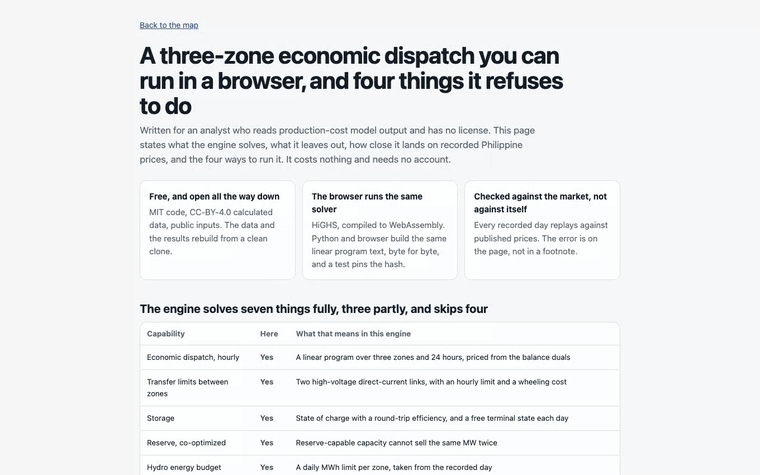
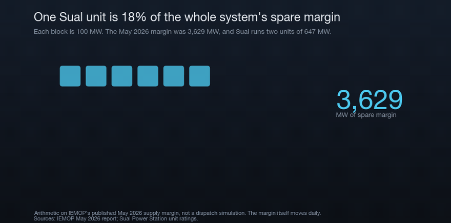
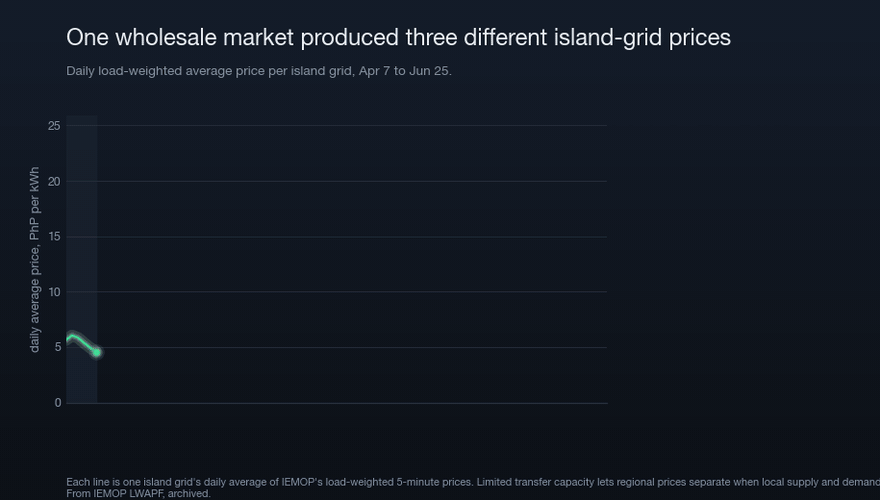
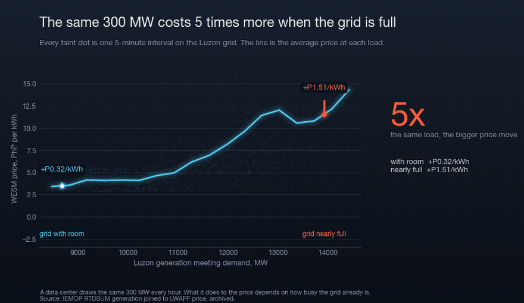
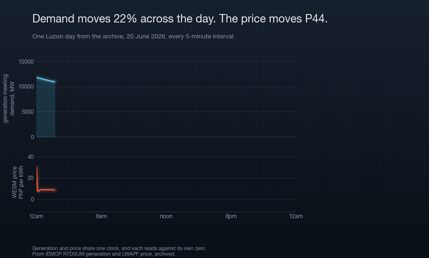
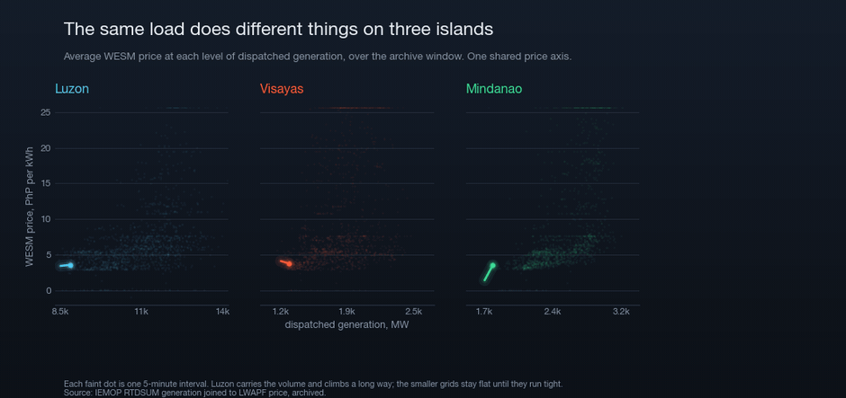
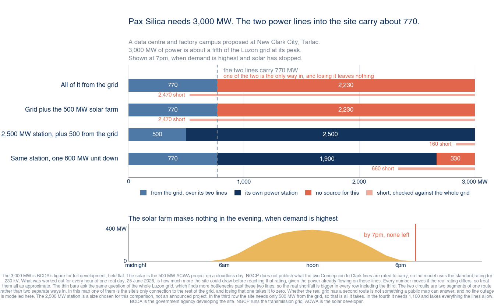

# Eleven findings the archive supports

Each one states what the data build shows, and every rolling figure in this file
is checked against that build by `scripts/verify_claims.py`. The archive window
rolls forward each night, so these numbers move on their own.

Back to [the project front door](../README.md). The map and the studio are at
https://power-dispatch-studio.vercel.app.

## Contents

- [Save, compare, and export a scenario in the browser](#save-compare-and-export-a-scenario-in-the-browser)
- [The Leyte-Cebu link reached a binding limit on 141 of 144 days](#the-leyte-cebu-link-reached-a-binding-limit-on-141-of-144-days)
- [Luzon reserves fell short on 76 of the window's 144 days](#luzon-reserves-fell-short-on-76-of-the-windows-144-days)
- [The three grids priced within P0.015 while suspended, then split to P15.72](#the-three-grids-priced-within-p0015-while-suspended-then-split-to-p1572)
- [Modeled loss ranks agree in Luzon (+0.72) and Mindanao (+0.85) but reverse in Visayas (-0.58)](#modeled-loss-ranks-agree-in-luzon-072-and-mindanao-085-but-reverse-in-visayas--058)
- [The day-by-day feed uses market records only](#the-day-by-day-feed-uses-market-records-only)
- [The cost stack stays near P6 while recorded evening prices include scarcity and offer premiums](#the-cost-stack-stays-near-p6-while-recorded-evening-prices-include-scarcity-and-offer-premiums)
- [Offer-book replay correlations range from 0.69 to 0.86](#offer-book-replay-correlations-range-from-069-to-086)
- [The committed build list covers all 366 days of 2028, and it retires nothing](#the-committed-build-list-covers-all-366-days-of-2028-and-it-retires-nothing)
- [Both Sual units out gains a 350 MW contract book more than it costs the open position](#both-sual-units-out-gains-a-350-mw-contract-book-more-than-it-costs-the-open-position)
- [Naming all 141 units changes no daily energy, so the model keeps its fuel blocks](#naming-all-141-units-changes-no-daily-energy-so-the-model-keeps-its-fuel-blocks)
- [Unit commitment lowered the price correlation in all five scored series, so the linear model stays](#unit-commitment-lowered-the-price-correlation-in-all-five-scored-series-so-the-linear-model-stays)

## Save, compare, and export a scenario in the browser

The recording saves the recorded-day base run, then adds a 4,000 MW flat-load
stress test to Visayas. That deliberately large input makes the saved daily
difference easy to see. It is a demonstration, not a demand forecast; the
1,500 MW DICT marker on the slider is only a reference scale. The recording
saves the changed run and opens the automatic comparison. The saved-run table
gives hourly CSV, standalone HTML report, restore, and archive export actions.
The hourly comparison chart starts on the grid with the largest mean-price
change and has a grid selector.

[](analyst-walkthrough.mp4)

Recorded from the running app by
[`build/record_analyst_walkthrough.py`](../build/record_analyst_walkthrough.py).
The script checks that the edit reaches the Run button, the results become
current, two runs are saved, and the comparison appears. Sharper as
[MP4](analyst-walkthrough.mp4).

## The Leyte-Cebu link reached a binding limit on 141 of 144 days

IEMOP publishes a "congestions manifesting" file that names transmission
equipment at its binding limit for each 5-minute interval. This project archives
and ranks those records. A row **literally named
`LEYTE_TO_CEBU`** shows up in the day-ahead runs on **118 of the window's 144 days**.
The 230 kV lines that carry that link, Tabango (Leyte) to Daanbantayan (Cebu),
top the league. They are at a binding limit in the hourly day-ahead runs on **141 of 144
days**, and binding in the 5-minute real-time dispatch, the run settlement
actually sees, on **23 days** of the window.

Both columns are in the table. The
day-ahead count measures how persistently the constraint reappears across re-runs,
the real-time count how often it actually bound. IEMOP's December 2025 report
discusses the same link. The archived rows show the dates and equipment
behind that statement.


The same league as plain ranked bars, with no map, is [docs/constraint-league.gif](constraint-league.gif).

Across the 144-day window, **90 distinct pieces of equipment** hit a limit at least
once, in **107 monitored constraints** (a transformer is listed under each winding
voltage and a line at each terminal, so one physical asset can have more than one limit ID).
The map ranks the constraints by days at a limit (a day counts once, so a day-ahead
re-run cannot inflate it) and keeps the real-time and day-ahead counts in separate
columns, because the day-ahead projection re-prices hourly and its raw row count
measures how often the constraint reappears. It does not measure time at the limit. Per-equipment records sit in
[`web/data/congestion.json`](../web/data/congestion.json). Rebuild them with `make data`.

The price-substitution method (PSM) constrained-on list names each generator that
network or security constraints forced to run out of merit for each 5-minute interval. Each row has the
administered price paid to each unit.

Across the window, it names **269
generators**. Visayas leads by intervals, and batteries top the list at the P32
offer cap (`constrained_on` in
[`web/data/market_ops.json`](../web/data/market_ops.json)).

The same file has the security limits used in real-time dispatch. These are
per-resource operating points.

The archived files pin them to one MW value in
99.4 percent of windows. Regulating hydro at the Agus units is the exception.

They record which units the grid's security constraints held and where
(`security_limits` in the same file).

The System Operator's instruction log states why it changed dispatch. Across 141
daily logs, its instructions carry a remark
citing a line limitation **2,466 times, and 2,439 of those name the
Leyte-Cebu link** ("Advise to discharge under MOT Raise due to
Leyte-Cebu Line Limitation"), the same link the constraint league
ranks first by shadow-price days. This link appears in 99 percent of
every line-limitation instruction the operator wrote down.

"MOT Raise" is the operator's label for this out-of-merit redispatch.

The full record has
**167,462 MOT-raise instructions** across the window at a **24
MW** median.

The must-run subset has a **6½ MW** median.

The `so_instructions` section in the same file has both records.

## Luzon reserves fell short on 76 of the window's 144 days

In the operator's real-time schedules, **Luzon reserves fell below the stated need
on 76 of the window's 144 days**. Across the three grids, the schedules curtailed
load on **143 grid-days (9,923.9 MWh)**. These figures describe published
schedules and do not forecast brownouts.

The Visayas grid ran **52 consecutive days on grid alert from May 11 to July 1,
2026**. Most alerts were yellow. The operator recorded red alerts on May 13, 14,
and 15. A red alert means supply no longer covers demand plus regulating reserve,
and the operator expects manual load dropping. A yellow alert means supply still
covers demand, but the operating margin falls below the contingency reserve need.
The streak ended when one 150 MW unit returned, with 935.3 MW still unavailable.

Against that thin margin, announced data-center demand is a large share of the
margin itself. The Department of Information and Communications Technology
(DICT) forecasts **1,500 MW by 2028**. This is a labeled forecast. Meralco
committed **1,000 MW for 10 data centers**, while the
whole system's May 2026 supply margin was **3,629 MW**. A data center is near-flat
24/7 load, so it consumes margin throughout the day, including the evening peak.
Per-day reserve and curtailment series sit in
[`web/data/reliability.json`](../web/data/reliability.json).



## The three grids priced within P0.015 while suspended, then split to P15.72

WESM settles separate prices for the three island grids. While the market was
suspended under administered pricing (through May 1, 2026), the three island grids
priced within **P0.015/kWh** of each other. Once trading resumed, they split.

Over
the market-priced days the average was **Luzon P7.53, Visayas P12.38, Mindanao
P11.13 per kWh**, with **38 days spreading beyond P5/kWh** and a widest daily spread
of **P15.72/kWh on June 8**. Constrained inter-island links contribute to regional
price separation, alongside local offers, outages, losses, and settlement rules.
The map keeps the two regimes labeled so the suspension is never folded into a
market-outcome claim.



Under those three regional averages, IEMOP's final per-node dispatch results
price about 1,200 individual grid connection points. The map draws each
point's average difference from its own region's price
(Prices mode. The studio's Prices at grid connection points view carries the
full searchable table).
The walkthrough below runs four decisions through that lens. Its figures come
from the calculated data at recording time.

- Which consumers pay above their region on average at the end of a radial line.
- What the same 100 MW data center pays at two different delivery points.
- What a plant earns behind an export constraint.
- How a node's recorded average difference changes a regional future price range.

The future calculation holds the recorded node difference constant and labels
that assumption. The interface calls them recorded location differences.

The published nodal congestion component is zero
through the market suspension window and small and intermittent after prices
resumed on 2026-05-01, so the deviation stays loss-dominated.

The repository has the recording recipe, an MP4, a GIF, and the interactive
Prices at grid connection points view.

## Modeled loss ranks agree in Luzon (+0.72) and Mindanao (+0.85) but reverse in Visayas (-0.58)

WESM decomposes every published locational marginal price (LMP) into an energy, a loss, and a congestion
part, and the congestion part is small and sparse (zero through the market
suspension, nonzero on 1.15 percent of clean-day node-hours afterward), so the
within-region nodal price structure the market reports is loss-dominated.
About a thousand resources report per clean day, and the ones that resolve to a
mapped bus become the comparison set.

Public users cannot make the same check with a licensed planning suite because
its network data and per-node accuracy are not published.

So the model is
checked against it. Marginal loss factors from the OpenStreetMap-geometry
backbone are compared, grid by grid, against each node's recorded deviation
from its regional price. Luzon ranks at Spearman **+0.72** over 314 nodes (72
distinct buses, 95% confidence interval +0.59 to +0.82) and Mindanao at **+0.85** over 118
(37 buses, +0.72 to +0.92). Visayas fails with a stable negative rank
correlation (**-0.58**, negative on all 15 clean days). The report keeps Visayas
as a failed check, with the sign reversal not yet diagnosed. The comparison
recomputes nightly as clean market days accumulate
(`data/derived/loss_surface.json`), and the studio carries the same three
panels under Check the model against market records, Transmission-loss check.


The wholesale price affects the Meralco bill through the share of energy bought
on the spot market. The June 2026 advisory paid
**P7.03/kWh** for the **10%** of supply it drew from WESM, so about
**P0.70/kWh** of the **P9.07/kWh** generation charge and of the **P14.48/kWh**
total rate. The other 90% sits under bilateral contracts whose prices do not
move with the spot market, which is why a spot spike is never a one-for-one
bill move. One Sual unit (**647 MW**) equals **18% of the May system
margin**, so losing one large unit changes the national margin. The map's toggle does that
subtraction directly from the published margin. This toggle does not run a
dispatch simulation.


The price effect of added demand depends on how much supply remains available.
The same data center has a small modeled effect during low demand and a much
larger effect when the grid is near its limit. The Luzon price-load curve below
uses one dot for each archived 5-minute interval.





The map never claims data centers set today's prices. Current data-center load is
small against a roughly 15 GW Luzon peak. Fuel, outages, weather, and the market
restart drive the window's prices.

The map shows the pricing system that any new flat 24/7 load enters. Calculated
files hold the daily prices, regime split, and generation-price comparison.

### Luzon prices rise across the range. Visayas and Mindanao stay flat until supply tightens

Each island grid changes differently with added demand. Luzon carries more demand,
and its average price rises across the recorded range. Visayas and Mindanao stay
flatter until available supply becomes tight.

WESM is an energy-only market. It pays generators for dispatched energy and, since
26 January 2024, for reserve capacity. WESM has no forward capacity auction, so
this project has no capacity-market chart. The reserve calculation appears below.




## The day-by-day feed uses market records only

The Drivers mode gives one row per archive day. It joins the recorded daily
load-weighted average price (LWAP) per grid, recorded curtailment, the operator's
matched scheduled-outage MW, high-voltage direct-current (HVDC) link and alert
advisories from the National System Operations stream, the
day's binding constraints, and the dearest regional reserve price. A week-ahead
block on top carries the operator's own week-ahead projection of outage schedules, the
one forward-looking file in the archive. Every column is recorded data. The
Simulate panel shows **who actually set
the price**. That is the marginal resource IEMOP names per 5-minute interval (market
clearing price files), beside the model's own marginal-block table, never
merged with it.

## The cost stack stays near P6 while recorded evening prices include scarcity and offer premiums

The map's Simulate mode is a simplified merit-order model of the grid. It stacks a
sourced generator fleet by marginal cost against the archive's own dispatched
generation, per grid, and reads off the marginal clearing price.

The longer walkthrough, which trips both Sual units and then raises the feeding link's limit, is [docs/dispatch-demo.gif](dispatch-demo.gif).

Coal
marginal cost is the ERC administered price of **P6.00/kWh** and Malampaya gas is
**P4.80/kWh**, both sourced. The availability derates and the split of the fleet
across grids are labeled model assumptions, except hydro, whose split now follows
the DOE plant lists directly. The split reconciles exactly to the
DOE national fuel totals and never exceeds a grid's published total (tests pin
every column and every row). A short hour prices at the **P32/kWh WESM offer
cap** in every calculation. WESM applies this published ceiling since
December 2015.

A competitive cost stack predicts a nearly flat **~P6/kWh**
line. Checked only against the 56 market-priced days after WESM resumed on
May 1, the stack over-prices the
overnight trough, because real units bid below cost to stay committed, and
under-prices the evening peak. The calculation excludes the suspension's administered prices.

Scarcity and generator offers explain the evening gap in this historical period.
The model does not attribute it to data-center load. On the Visayas grid, tight through the 52-day yellow-alert streak,
the evening gap runs **P14.93/kWh** above the cost stack. The model attributes the
daily shape and island spread to commitment, scarcity, and generator offers.

A simple unit-commitment calculation cuts the overnight error.
Committed baseload coal does not shut down overnight. It keeps its minimum stable load
online (about **40%** of capacity, a sourced technical minimum) and offers it down to
the H1 2025 WESM average of **P4.14/kWh**, below the P6.00 administered price.
Both numbers come from published sources rather than a fit to the overnight prices.
The change never worsens the fit and lifts correlation where a grid's demand dips
below the committed tranche.

In the current calculated data, with the recorded water budgets, the fleet-derived
hydro split, and native-load demand (each grid's generation plus its net market
imports) all in the stack, Visayas sits at a correlation of **0.36** with an MAE
of **P8.04**. Luzon is **0.17** with an MAE of **P4.42**.

The grid whose light
load now dips below the committed tranche is Mindanao, the big net exporter, which
commitment takes from a flat, undefined correlation to **0.20**.

After the layer,
Luzon averages a modeled **P5.97/kWh** against a recorded **P7.53/kWh**. The evening-peak gap is unchanged. Commitment affects only light
load, so the scarcity signal stays exactly where it was.

The adequacy number is the checkable one, and it has to keep one clock. Luzon's gross
peak of **14,539 MW** is a mid-afternoon event, when solar generates. The firm
evening peak, when solar is gone, is **13,275 MW**. Against the evening (solar-out)
stack of **15,682 MW** that is an **18.1%** reserve margin.

Add the DICT forecast
of **1,500 MW** of data centers by 2028 (a labeled DICT forecast, October 2025) and the
firm margin falls to **6.1%**, on zero solar and one clock. Crediting the modeled
clear-sky solar profile, the tightest 5-minute interval of the whole window (a
late-afternoon shoulder hour, when demand is near its peak and only midday solar fills
the gap) still holds **3.2%** with the DICT forecast, and no interval goes short against
that hour-matched stack. The smallest margin stays positive at **3.2%**.

That reserve margin is a single number. Unit outages are uncertain, so the model
calculates a range of outcomes from sourced outage rates.

A Monte Carlo of **20,000** draws trips the 11 named
units at their sourced forced-outage rates (NERC GADS for coal ~10% and gas ~5%. The
rest is labeled industry-typical) and draws an evening-peak load each time. Today Luzon
loses load in only **0.10%** of tight evenings. The worst draw sheds
**991 MW** when a big unit trips into a high load.

Add the DICT 1.5 GW demand forecast and the
loss-of-load probability climbs more than tenfold to **1.8%**. A 1-in-100 draw sheds
**344 MW**, and the expected unserved energy over the evening-peak window is
**4,274 MWh**. The single reserve-margin value stays positive. The simulation
estimates how often a forced outage produces a shortfall and how large it becomes.

Storage can serve demand during peak hours. Luzon already has **634 MW** of batteries
(DOE) and **685 MW** of Kalayaan pumped hydro (CBK Power), and both are time-shifters.
They charge off-peak near the P4.14 commitment offer and discharge at the evening peak
at about **P5.17/kWh** after round-trip loss. At a tight evening with the DICT forecast the
cost stack clears on oil at **P12.00/kWh**. The **1,319 MW** of storage on the grid
shaves that back to coal at **P6.00**.

Storage decreases the power-shortfall risk. The
loss-of-load probability with the added demand falls from **1.86%** to **0.14%** and the expected
unserved energy from **4,286 MWh** to **289 MWh**. Limited stored energy supports
the peak interval only. Existing storage is already inside the recorded prices,
so this scenario changes future demand without changing the fit to past prices.

Two views compare the model with market records. The **price-duration curve**
sorts every 5-minute market interval high to low and overlays modeled against recorded.
The cost stack is a low, flat plateau from about **P4.80 to P12**, while the recorded
curve runs from a **P35** scarcity spike on the left down to a negative oversupply tail
on the right. A competitive cost model reaches neither end. IEMOP records those
tails directly. Regional LWAP carries congestion
and loss components, so it climbs above the energy offer cap when supply is tight and
turns negative during midday oversupply.

The daily means in `prices.json` average those
5-minute extremes away, which is why that series sits in a tighter band. The **who-sets-the-
price** table counts the marginal block. On Luzon coal is on the margin **97%** of
the time (why the modeled line is so flat). With native-load demand the committed
overnight tranche is rarely the MARGINAL block anywhere (**2.3%** of Mindanao
intervals, less elsewhere), and the commitment layer's work now shows in the
accuracy table instead, where it takes Mindanao from an undefined correlation
to **0.18**. Block dispatch cannot name the individual plant, so both stay at the fuel
level.

The panel recalculates the sourced supply stack in the browser. Move the controls (add a data
center as flat 24/7 load, trip any named unit for an N-1, add firm
capacity, relieve a choke point, discharge storage) and the clearing price and any
supply shortfall update live, on the same stack the Python engine produced.

The dispatch data files include the named generators, outage table, and model
inputs. The pipeline has the calculations and sourced fleet.

### Pax Silica needs more power than the whole Visayas grid and up to twice as much water as everyone in Makati

[](../web/pax-silica.html)

The nine charts on the companion page are available as a GIF and MP4 montage in
the `docs` directory.

BCDA's figures for the campus at New Clark City are **3,000 MW** of power at full
development and **65 to 90 million liters** of water a day. A
[companion page](../web/pax-silica.html) compares each figure with a familiar scale.
The campus alone exceeds every island grid's
highest recorded 5-minute peak in this project's 117-day archive, including
Visayas at **2,744 MW**. The signed 500 MW solar farm covers **4.1%** of a day on
a cloudless model and nothing at the 7pm peak, and running the campus on sun
alone would need **122 km²** of panels, more than six times the area of Makati.

The one modeled 230 kV route into Pax Silica uses two circuits and carries about
**770 MW** of the 3,000 in this project's own
model, and NGCP's most recent 500 kV and HVDC builds each took years between
first power and full service. Served from the market anyway, the campus as flat
load flips the Luzon marginal block from coal to oil in 16 of the 24 hours of the
same replayed day, **P6.00 to P12.00 per kWh** on the cost model checked against recorded prices,
with the inter-island links earning **P38 million** of congestion rent in that
single modeled day. And the announced fix, an on-site power station,
still leaves **331 MW** unmet the moment a single 600 MW unit trips. The remaining
1,900 MW from the station plus 769 MW from the grid cannot meet the 3,000 MW draw.
The page separates BCDA's
published figures, calculated results, and model assumptions.

### The base model explains 0.4% of the Visayas-Luzon price difference. The recorded outage explains 89.9%

The coupled calculation clears all three island grids together. Lower-cost Luzon
power can flow south over the Leyte-Luzon HVDC (a sourced **250 MW** operating
limit, below its 440 MW nameplate) and the Mindanao-Visayas HVDC (its 450 MW
nameplate used as the cap), and the three clearing prices solve together. On a radial
path the cost-minimizing dispatch equalizes adjacent prices across an open link
and, across a saturated one, prices the downstream island higher by the congestion
rent. A brute-force comparison checks the calculated result.

Demand here is native load. It equals each grid's generation plus its net market imports
from the same IEMOP files. The replay so moves power over the links
to serve Visayas, which imports roughly a quarter of what it consumes.

The operator blocked the Leyte-Luzon link for **9.9%** of market-window
intervals.

With the full fleet available, the link reaches its limit in **0.0%** of the
window.

A blocked link carries no flow and earns no congestion rent. A full link can
earn congestion rent.

The coupled model explains only **0.4%** of the recorded **P4.85/kWh**
Visayas-Luzon difference. The cost stacks price the three islands nearly alike,
so they do not capture the scarcity and offer premium during the 52-day alert
streak.

The scenario changes below come from the cost model. The published-offer
calculation produces larger changes for the widest-swing day. On that day, the same DICT
1.5 GW demand increase raises the Luzon daily mean by **+P3.25/kWh** on the cost
stack but **+P13.27/kWh** replayed on the market's own bids, and the
published-offer change reaches the Visayas (**+P9.44**) and Mindanao (**+P7.45**),
where the cost stack shows no change. Reference cases check both calculations.
Choose "Observed offers" in Hourly market replay to reproduce them. For this
case, the cost result is the lower of the two estimates.

Correcting the hourly grouping changed an earlier result. Under the secondary
price cap's stated numbers (P7.423/kWh
imposed when the 72-hour rolling GWAP breaches P12.413, ERC Res. 26
s.2025), the widest-swing day now lands just under the threshold.

The published-offer case lifts the computed 72-hour rolling series to P11.33
against the P12.413 trigger.

An earlier version reported that this day tripped the trigger. The old hourly
grouping chose a different day. Using the operator's clock changed the
widest-swing day and the flag with it. The published-offer spike is close
to price-mitigation exposure the cost floor does not carry, but on this
window it does not reach it.

The raw recorded series crosses the threshold, but the result is weaker than it
looks. Violation and scarcity coefficients above the P32/kWh offer cap drive
those crossings. Ordinary market clears do not. Held at the offer cap, Luzon
breaches zero windows and its peak falls below the trigger outright.

That does not remove all threshold crossings. Held at the same cap, the system
row and joint Luzon-Visayas row still cross.

Visayas and Mindanao cross either way. Those two regional caps apply only when
an interconnection is on outage, as ERC Resolution 26, series of 2025 states.

The correction removes the breach for Luzon and narrows it elsewhere. The price
record still shows no day fixed at the cap. The method page has both calculated
series, the above-cap counts, and the capped-price comparison.

IEMOP publishes every resource's offer curve and the self-scheduled capacity
that submits no offer. Replaying the same days with those records gives **99%**
direction agreement on Visayas-Mindanao
against a 375 MW mean recorded flow, now scored against the operator's own
per-interval high-voltage direct-current schedule rather than only the net-import identity
the demand is built from, the Visayas settlement bias collapsing from
**-P6.38** to **-P0.80/kWh**, and Mindanao clearing-price correlation **0.86**.

The operator's congestion flags add a target the replay still misses in one
direction, and the tables say so. The real links reached a limit in 45 to 61
percent of intervals. The offer replay reaches a limit in 33 to 35 percent. The cost
stack almost never.

The reserve books use the same comparison. Every
derived reserve book cleared at the operator's scheduled MW reproduces the
official reserve price within half a centavo in 45 to 88 percent of hours
per grid and product. The offer-book average is lower than the official average
in all twelve groups. Official prices can include the energy revenue a plant
gives up while holding capacity in reserve. The public summary data cannot
calculate that part plant by plant.

The operator's own final
per-resource cleared reserve (DIPC reserve results final, **196 resources**
across 76 days) shows the same pattern. The book replay under-prices the authoritative
final clearing on every one of the twelve pools too, and the final re-solve
moves the reserve schedule by only a few MW, scattered across the
regulation products and the tight island dispatchable reserve.

Registered ancillary-services capacity sizes each reserve book against its
registration base. The difference between the cost and published-offer replays
is a model-derived offer premium reported for each hour. Both results appear in
the [studio's comparison tables](../studio/README.md).

The recorded outage explains most of the modeled regional price difference.
Recalculate the streak window with the
**935 MW** of Visayas capacity that NGCP recorded as unavailable on
July 1 and the 250 MW link saturates in **93.2%** of intervals at a mean
congestion rent of **P5.74/kWh**, and the coupled model now reproduces **89.9%** of
the recorded spread. This labeled scenario was not used to tune the model.

At a typical evening, just **275 MW** of added Visayas load fills the
link, less than three of the ten data centers Meralco committed to
serve (1,000 MW for 10, per PCIJ) and far below the DICT 1.5 GW national
forecast. The full decomposition is the `coupling` block in
[`web/data/dispatch.json`](../web/data/dispatch.json). The coupled solver is
`pipeline/coupled_dispatch.py`.

Eight scenario checks test whether the model moves in the expected direction.
The checks site a data center in Cebu or Manila, add 1 GW of solar, replace
Malampaya gas with imported LNG, and trip both 647 MW Sual units. Six produce
the expected direction.

The two other results follow from the modeled flows. A Manila data center
saturates the link by importing lower-cost Visayas power. Adding 1 GW of solar
cuts fuel use and emissions but does not change the 7 pm peak.

The dated 935 MW outage historical replay explains 89.9% of the price
difference. The studio README has the full scorecard.

## Offer-book replay correlations range from 0.69 to 0.86

The check uses the operator's published prices rather than a synthetic benchmark. The
studio replays every full-coverage market day and scores each calculation two
ways. The simple cost model is a floor. It clears near the **P6 coal baseline**
and under-prices scarcity, so read its levels as a lower bound.

Replaying the operator's offer book tracks the recorded price shape hour by hour.
The correlation ranges from **0.69 to 0.86** across the quarter, and modeled
inter-island flow matches the recorded direction **84 to 100 percent** of the time.

The **935 MW** Visayas outage on July 1 reproduces **89.9 percent** of the recorded
island price gap. The model did not use this constraint to tune its inputs. The
difference between the cost floor and the offer-book replay is a model-derived
offer premium based on the market's published bids.


The scheduled build recalculates each result from the current archive every
morning and compares the historical replay with the latest recorded prices.
Full per-grid accuracy tables for both calculations, plus
the inter-island flow scores, are in [studio/README.md](../studio/README.md). It is a
congestion-and-siting model checked against recorded prices. It does not forecast
prices or brownouts.

## The committed build list covers all 366 days of 2028, and it retires nothing

The archive holds this year. A planner asks about 2028. `make future YEAR=2028`
builds that year as its own data directory, then the same engine solves every
date in it. Nothing in the engine changes, because `--data-dir` already points at
any directory holding `dispatch.json` and `profiles.json`.

The year builder combines four published inputs. It uses DOE peak demand and
committed projects, NGCP transmission upgrades, and recorded hourly shapes.
Every date uses a recorded weekday or weekend shape of the same type.

| Luzon in 2028 | Value | Where it comes from |
|---|---|---|
| Peak demand | **16,180 MW** | recorded shape, grown **11.6 percent** by the DOE path |
| Dispatchable capacity added | **2,543 MW** | committed projects with a target year at or before 2028 |
| Solar added | **5,942 MW** | the same list, carried apart and derated hour by hour |
| Mean price across the year | **P5.46/kWh** | this model, cost mode |
| Mean price 6pm to 9pm | **P6.00/kWh** | solar is near zero here, so firm capacity sets it |
| Days that leave load unserved | **0 of 366** | on the assumptions below |

Read that last row against its four assumptions before quoting it. The build
applies **no retirements**, because no public Philippine retirement schedule is
archived here. It counts committed projects only. It takes the DOE's demand path
as given. And each day solves on its own, so storage resets at midnight and the
hydro budget caps one day at a time. A fleet that never retires reads optimistic
about supply, so treat that zero as a ceiling rather than a finding.

The year is a scenario built from published plans. It is not a forecast. The
studio shows it at
[#v=future-year](https://power-dispatch-studio.vercel.app/studio/#v=future-year),
and `tests/test_future_year.py` checks the calendar, the growth ratios, the
project cut-off, and that a 2028 day actually solves.

```bash
make future YEAR=2028
power-dispatch run --data-dir data/derived/future/2028 --date 2028-06-17
```

## Both Sual units out gains a 350 MW contract book more than it costs the open position

The model produces an hourly spot price. The contract-position view applies
those prices to a buyer's, supplier's, or plant owner's contract book.

A worked case, on the archive's most recent day. The book holds a 250 MW power
supply agreement struck at P6.40/kWh and a 100 MW evening block at P9.00/kWh,
against a declared Luzon load of 400 MW, which leaves the book **67 percent**
covered. Trip both 647 MW Sual units and the mean Luzon spot rises from
P6.00/kWh to P6.00/kWh.

| Line | Change for the day |
|---|---|
| The contracts gain | **+P15,000** |
| The uncontracted load costs more | **+P9,000** |
| Net | **+P6,000** |

Read the sign carefully. The supply agreement is a buy at a strike above spot, so
a higher spot makes it worth more against buying at spot. The one third of the
load with no cover costs more at the same time. The net is positive here only
because the covered volume is larger than the open volume.

```bash
power-dispatch run --scenario mybook.json --position
```

The studio holds an editable book at
[#v=contract-position](https://power-dispatch-studio.vercel.app/studio/#v=contract-position),
and it stays in the browser. `studio/src/studio/contracts.ts` and
`src/power_dispatch/contracts.py` run the same arithmetic, and both suites check
the same worked numbers.

It marks energy against modeled spot and stops there. No capacity fee, no
wheeling charge, no tax, no take-or-pay, and no credit terms. A settlement
statement carries more lines than this.

## Naming all 141 units changes no daily energy, so the model keeps its fuel blocks

The engine holds one block per fuel per grid, so it cannot say which plant ran.
The obvious next step is one variable per unit.
[`pipeline/unit_probe.py`](../pipeline/unit_probe.py) measured what that buys
instead of arguing about it.

Every plant in the DOE fleet list gets its own variable, **141 units** across the
three grids, with each grid's per-fuel capacity scaled to match the block model
exactly. The two runs then hold the same MW at the same costs, cut into different
pieces.

Across ten sampled market days the two runs burn the same daily energy of every
fuel on every grid, to **0.0 MWh**, and no hour's price differs by more than
**P0.004/kWh**. The hour an energy-limited fuel lands in does move, by up to
**1,408 MW**, across hours that cost the same, because the epsilon that makes the
optimum unique rides the variable index and the two models number their variables
differently.

The Mindanao market clearing price correlation is the one score that moves. It
rises from 0.133 to 0.243. This change warns about the metric rather than showing
a gain. The
cost model clears near flat, and a correlation against a moving recorded series
is hypersensitive when the modeled series barely varies. Four tenths of a centavo
reorders it.

A per-unit model buys attribution and not accuracy. Every unit of a fuel carries
that fuel's cost here, so splitting a block into units cannot reorder the stack.
A per-unit heat rate or a per-unit offer would change that, and no public
Philippine source publishes either.

## Unit commitment lowered the price correlation in all five scored series, so the linear model stays

A licensed production-cost tool commits each thermal unit as a binary decision,
with a minimum-stable level and a start cost. This project built that variant,
priced the committed schedule the way a market operator does, and scored it
against the same recorded prices. The correlation fell everywhere.

| Recorded series | Linear model | With commitment | Change |
|---|---|---|---|
| Luzon load-weighted average price | 0.297 | 0.128 | -0.169 |
| Visayas load-weighted average price | 0.442 | -0.003 | -0.445 |
| Mindanao load-weighted average price | 0.109 | -0.011 | -0.120 |
| Luzon market clearing price | 0.437 | 0.137 | -0.300 |
| Mindanao market clearing price | 0.113 | -0.006 | -0.119 |

Mean absolute error moves by less than **P0.03/kWh** in every series, so only the
correlation falls. The Visayas market clearing price has no paired hours in the
window, so five series carry the test.

The minimum-stable levels are generic thermal values, applied per fuel block and
labeled generic. No public Philippine unit registry publishes a per-unit floor or
heat rate, so a per-unit test needs data that does not exist yet. A fuel-block
floor is coarser than a per-unit floor, and that coarseness is the most likely
reason the committed run scores worse.

The linear model stays the default because the measurement chose it.
`pipeline/uc_probe.py` writes the rows, `tests/test_data.py` pins them, and the
studio shows them at
[#v=commitment-test](https://power-dispatch-studio.vercel.app/studio/#v=commitment-test).
