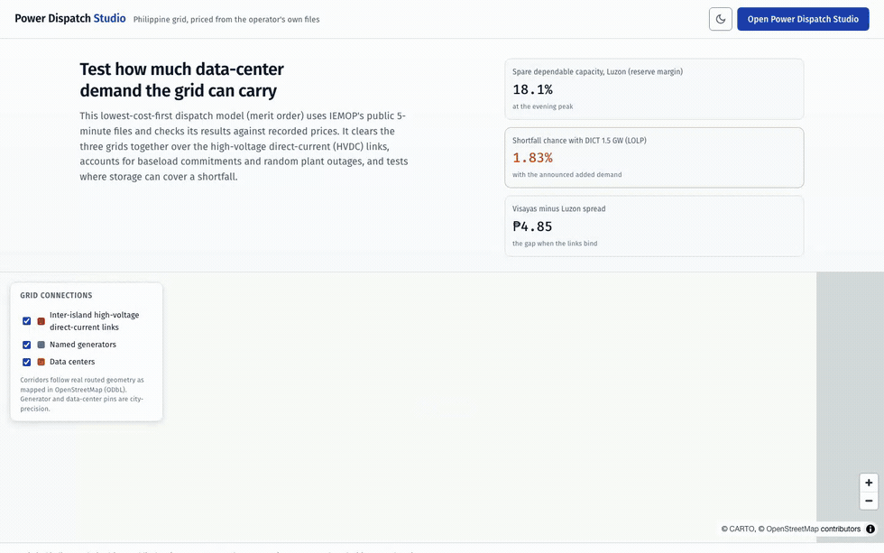

# Pax Silica needs 3,000 MW and the one route that feeds it carries 770


On 24 July 2026 the Bases Conversion and Development Authority said Pax Silica at
New Clark City will build its own power station on site rather than lean on the
grid for the whole 3,000 MW, and said it will not compete with household supply.
BCDA has not turned grid supply down: in June its president said it was also
looking outside New Clark City for power, and NGCP is building a dedicated
substation. The 3,000 MW is BCDA's figure at full development, which it puts 10
to 15 years after construction starts in 2028. This checks the on-site plan
against the network.

## Each bar is the same 3,000 MW, split by where it would come from

Each bar is the same length, because each one is the 3,000 MW Pax Silica needs. The
colours split that 3,000 into where it would come from. Red is the part with no source
at all.

Everything is drawn at 7pm, because that is when demand is highest and when the solar
farm has stopped for the day. The small chart underneath shows the solar day, so you
can see the evening zero rather than take it on trust.

The dashed line at 770 MW is the only number the model works out. Pax Silica sits on
two 230 kilovolt routes, each carrying two circuits on shared towers, and only one
of the two actually feeds it. The 770 is the most that one route can carry, and it
is why the blue segment stops where it does.

## No row covers the full 3,000 once the whole grid is checked

| how it is supplied | over the feeding route | no source | wider check |
|---|---|---|---|
| all of it from the grid | 769 MW | 2,231 MW | 2,471 MW |
| grid plus the 500 MW solar farm | 769 MW | 2,231 MW | 2,471 MW |
| its own 2,500 MW station, plus 500 from the grid | 500 MW | none | 163 MW |
| same station, one 600 MW unit down | 769 MW | 331 MW | 661 MW |

Rows one and two are identical because the sun has set by 7pm. The solar farm fills the
middle of the day and adds nothing in the evening, which is the part of the
announcement that does the least.

Row three is the plan working against that route alone, and it still takes 500 MW
from the grid. Making its own power covers most of what it needs but never all of it.
Checked against the whole grid it is 163 MW short, so no row here is fully covered.

Row four is the one that matters. Lose a single 600 MW unit and 331 MW has no
source. Both the 2,500 MW station and the 600 MW unit are chosen illustrations,
not announced figures: at 417 MW, the largest unit in the outage record, the gap
is 148 MW instead.
Building your own station moves the problem from supplying the campus to backing it up,
and the backup comes down that same single route.

The last column is a wider check that looks at the whole Luzon grid instead of that
route alone. It finds more bottlenecks, so every shortfall gets bigger, including
row three, which the picture shows as covered.

## Which numbers the model produced, and which are inputs

| number | where it comes from |
|---|---|
| what the feeding route carries, 770 MW | worked out by the model, on recorded grid data for 25 June 2026 |
| 3,000 MW of demand | BCDA's announced figure at full development, 10 to 15 years after 2028, held flat here from day one |
| 500 MW solar | the ACWA lease, announced |
| how solar output varies through the day | an assumption used across this project, a cloudless day |
| 2,500 MW of its own station | chosen for the scenario, so the mix covers 3,000 |
| the 600 MW unit that fails | chosen for the scenario, a normal size for one unit |
| the red amounts | arithmetic, demand minus what the feeding route carries |

## The line ratings are class defaults, the model connects 8.6 km away, and demand is held flat

Nobody publishes what these lines carry. NGCP does not, so the model rates each 230
kilovolt circuit at a class default of 400 MW, which makes 800 MW for a two-circuit
route. Every number here moves with that default.

The model connects Pax Silica to a bus 8.6 km away, which is not the connection
anyone will actually build.

One of the two routes turns out to be Pax Silica's only connection to the rest of
the grid, so losing it takes Pax Silica to zero. Losing a route there means losing
both of its circuits at once, not one. That is what the mapped network shows. The
real grid may have a second route that OpenStreetMap does not carry, and no line
outage is modelled in the picture itself.

Demand is held flat at 3,000 MW all day and from the first day. That is close to
right for a data centre, only roughly right for the factories beside it, and it
ignores the 10 to 15 year build. The solar assumes a cloudless day, which
flatters it, and matters for the separate sum showing 500 MW covers 4.1% of what a
3,000 MW draw uses.

## The studio answers this for any announced site, without a script



Siting a new load, in the studio's Analysis list, answers this for any of the
announced sites without running a script. The picture above is the same question
driven through that view.

## Rebuilding the picture

```bash
python3 scripts/pax_silica_figure.py
```

It works out the line capacity on the first run, saves it, and writes
`docs/pax-silica-embedded.png`. It sits outside `make viz`, since the nightly rebuild
does not need it.
