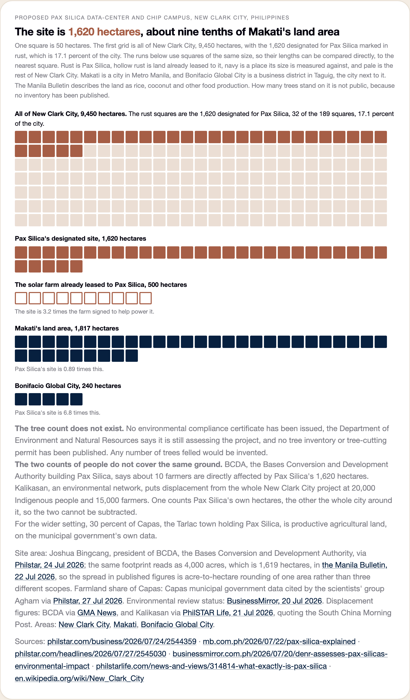

# Nine charts compare Pax Silica with the power, land, water, and grid it would use

The live page is `web/pax-silica.html`. Each section below states what one chart
shows, where its figures come from, and which inputs stay uncertain.

## The 35-second recording shows all nine charts from the live page

The recorder opens each live chart at full size and plays its animation once.
Run `make serve` and `python3 build/record_pax_silica_scale.py` to rebuild it.

## Pax Silica would use more power than the entire Visayas grid

The island areas show the highest five-minute demand recorded across 117 days.
The 3,000 MW Pax Silica block is larger than the Visayas or Mindanao block.
BCDA announced the project figure. It is future demand and sits outside the
recorded Luzon total.

## The modeled 500 MW solar component produces 4.1% of Pax Silica's daily electricity on a cloudless day

ACWA Power leased 500 hectares for a project announced as solar with batteries.
The chart models only the stated 500 MW solar component because no battery power
or energy rating was published. The daily solar energy equals 4.1 percent of a
flat 3,000 MW load.

## Running Pax Silica on solar power alone would need 122 km² of panels

A flat 3,000 MW load needs at least 12,200 MW of panels under the stated solar
profile. MTerra Solar supplies the land-density reference. The resulting 122
square kilometers exceeds New Clark City's 94.5 square kilometers. The map uses
Metro Manila only as a familiar area comparison.

## An assumed circuit rating produces 769 MW of modeled headroom, not a site connection limit

The illustration uses a 400 MW class rating for each circuit because NGCP does
not publish the actual ratings. The 769 MW result is an arithmetic sensitivity,
not available service or an interconnection recommendation.

## NGCP's two most recent long-distance builds took 13 and 9 months between first power and full service

Hermosa-San Jose took 13 months from first power to full service. The
Mindanao-Visayas link took 9 months. BCDA targets the Pax Silica substation for
the end of 2028. The comparison does not predict its completion date.

## The stated cost-stack assumptions move the modeled result from coal to oil

The cost model places a typical 12,018 MW evening on the ₱6.00/kWh coal block.
Adding 3,000 MW moves the last needed supply to the assumed ₱12.00/kWh oil
block. This is a flat-block cost sensitivity, not a market-price or bill
forecast.

## A chosen 2,500 MW station and 600 MW unit produce a 331 MW gap in this illustration

The 2,500 MW station and 600 MW unit are examples chosen for this case. They are
not BCDA announcements. With the unit unavailable, the local station and 769 MW
route leave 331 MW unmet. A 417 MW outage leaves 148 MW unmet.

## Pax Silica's stated water demand is 1.4 to 1.9 times Makati's household planning benchmark

BCDA states 65 to 90 million liters per day. The Makati comparison applies 150
liters per resident to 309,770 residents and excludes offices and industry. It
sets an upper bound. It does not replace a site water study.

## The site is 1,620 hectares, about nine tenths of Makati's land area

BCDA states a 1,620-hectare project area. That equals 17.1 percent of New Clark
City, 0.89 times Makati, and 6.8 times Bonifacio Global City. No published tree
inventory supports a tree-count claim for the site.

## Unpublished line ratings, connection details, and site studies limit every chart

The model uses a class line rating and connects Pax Silica to a mapped bus 8.6
km away. The final connection point is not public. The solar profile assumes a
cloudless day, and the demand stays flat.

BCDA supplies the announced power, water, and land figures. No independent study
in the cited public record checks all three. Read
`docs/pax-silica-embedded.md` for the whole-Luzon supply calculation.
