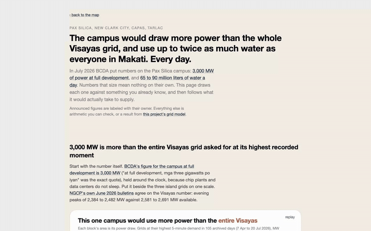
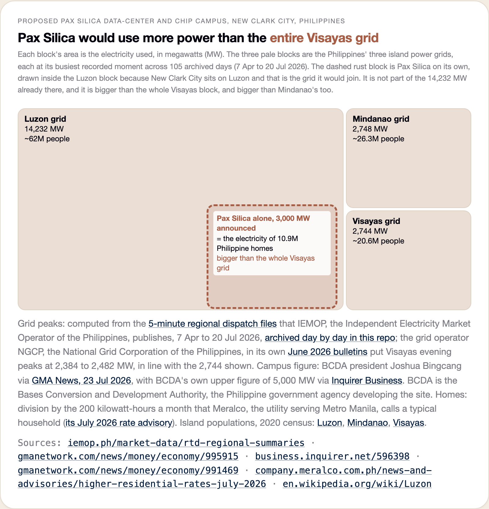
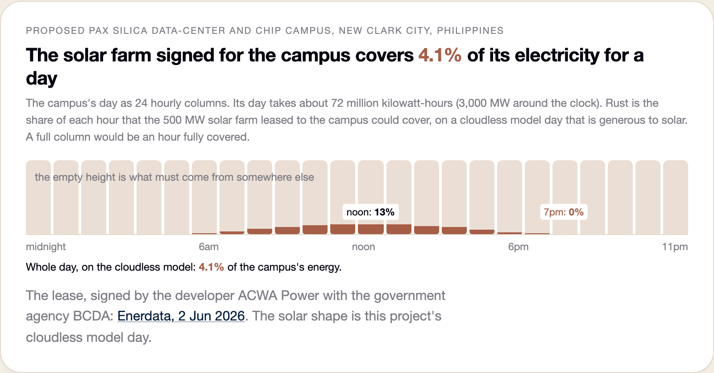
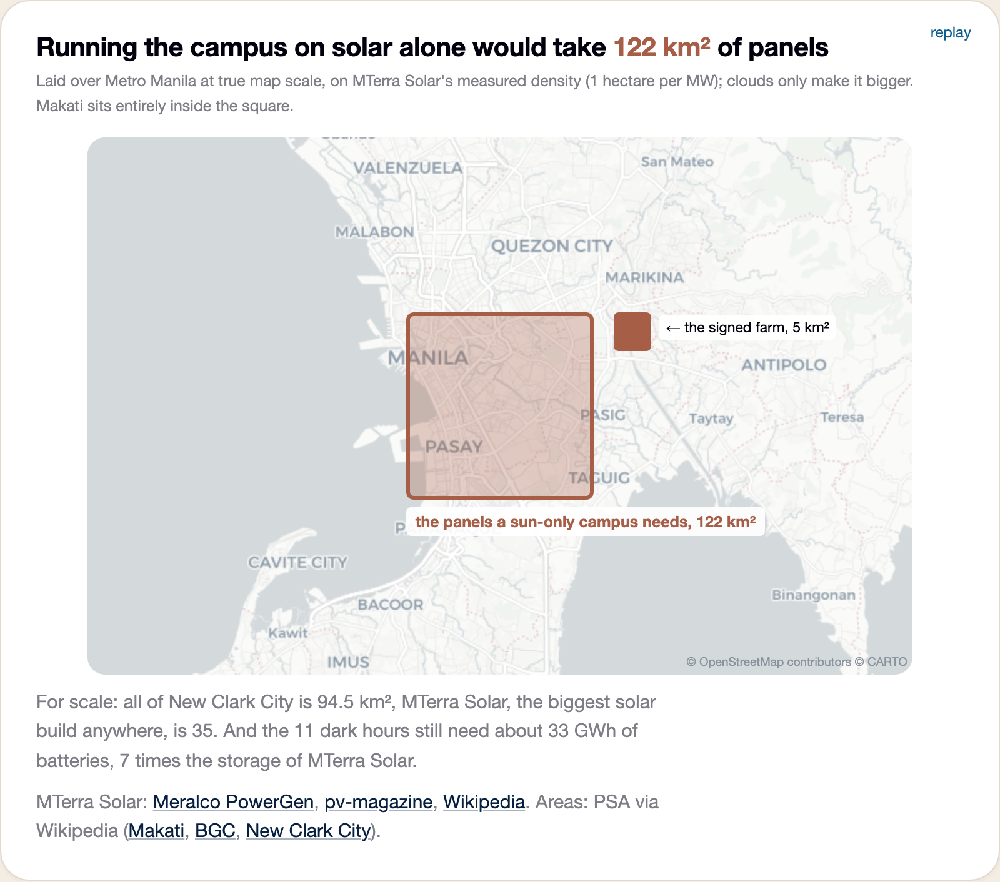
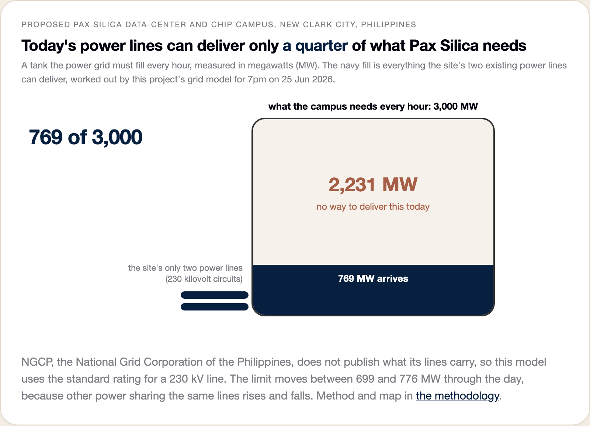
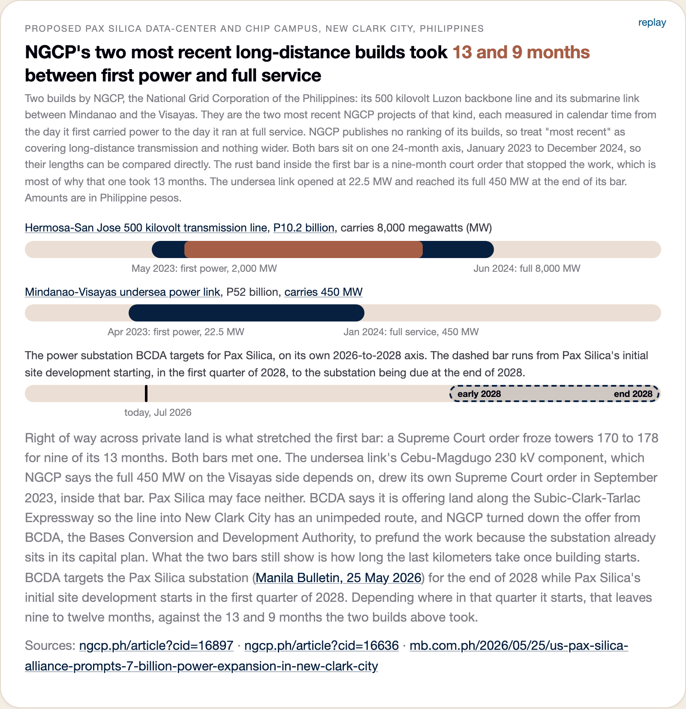
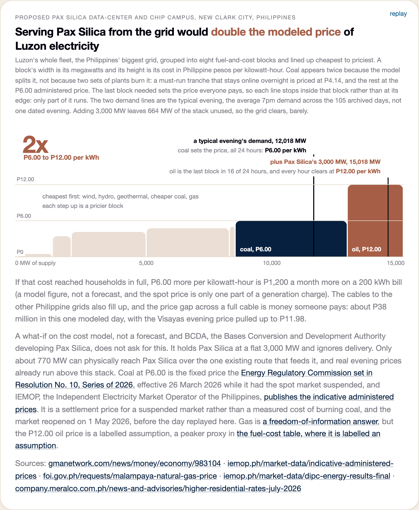
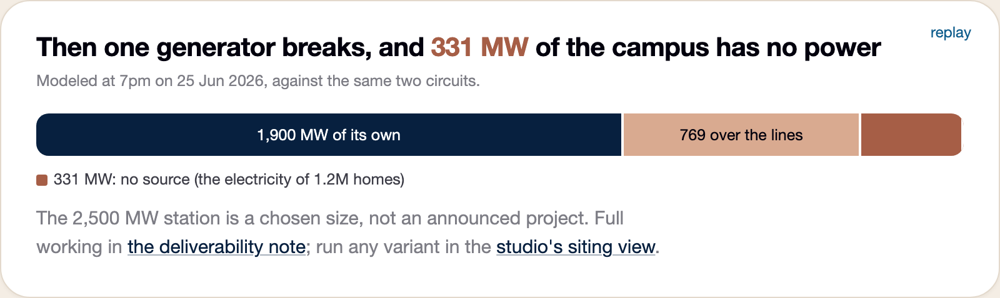
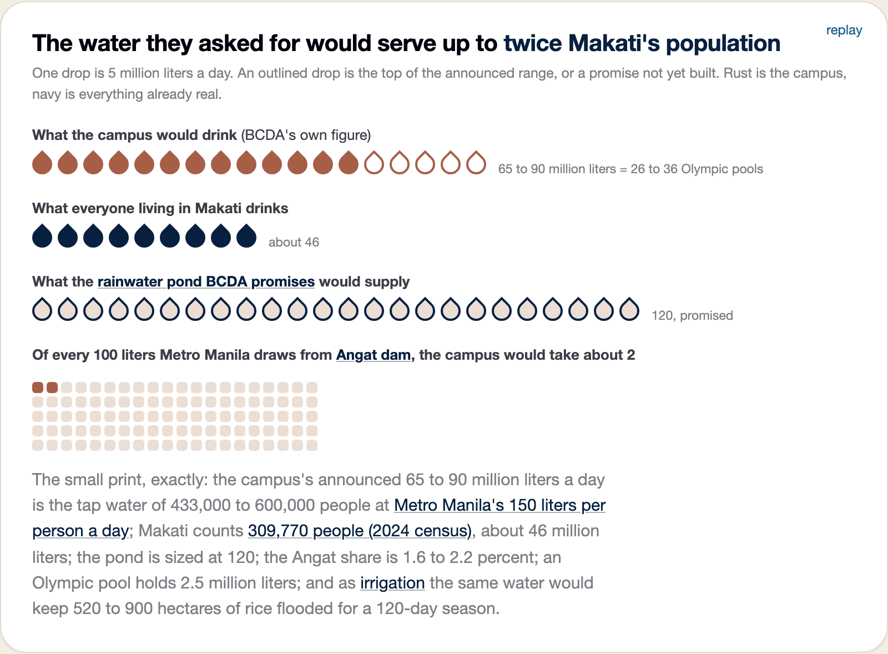

# The Pax Silica visuals, each one shown with what it says in plain words

The live page is `web/pax-silica.html`. Below, first the moving version, then
every chart on the page, each with what it shows, where its numbers came
from, and the one thing worth double-checking.

## All eight charts animating, in 31 seconds

A montage rather than a page scroll. It opens on a title card, because a feed
renders frame one as the thumbnail, then gives each chart its own beat. The
recorder drives the live page. It lifts one card onto a centered stage,
magnifies it to fill the frame, rebuilds it at that size, plays it from
empty, holds while it finishes, then cuts to the next. The own-station card
gets the longest beat because it flips to its broken-generator state partway
through. Nothing is drawn separately, so the clip cannot show a figure the
site does not. The smoother file to share is `docs/pax-silica-scale.mp4`. To
re-make it after a page change, run `make serve`, then
`python3 build/record_pax_silica_scale.py`.

## This one campus would use more power than the entire Visayas

The whole Philippine grid as one rectangle, tiled like a jigsaw. Every
piece's area is the most power that grid actually used in any 5-minute
stretch of 105 days of the market operator IEMOP's published files, and
each piece names the people it serves (about 62 million on Luzon, 26 on
Mindanao, 21 in the Visayas, 2020 census). Luzon is the giant piece, and
Mindanao and Visayas share the right column. The
dashed rust square is Pax Silica at the same scale, laid on top so you
can compare directly. It covers the entire Visayas piece and still pokes
into Mindanao. The chip carries the translation, since 3,000 MW around the
clock is the electricity of 10.9 million homes at Meralco's 200 kWh a
month typical household. One thing to remember when reading it is that the
grid pieces were measured while the dashed square is a promise on paper,
and BCDA has said it could go as high as 5,000 MW.

## The solar farm they signed covers 4.1% of one day

A real solar deal exists. ACWA Power leased 500 hectares in June 2026 to
build up to 500 MW of solar with batteries. This chart draws the campus's
day as 24 columns, one per hour, and fills each with rust up to the share
of that hour the farm would cover on a perfect cloudless day. The columns
stay almost empty. Even at noon the farm covers 13 percent of the hour, and
from 7pm, exactly when the grid is busiest, it covers nothing. The gray is
named right on the chart as what still has to come from somewhere else, and
the whole day adds up to 4.1 percent.

## Running the campus on solar alone would take 122 km² of panels

This one is drawn on a real map. To average 3,000 MW around the clock you
would need at least 12,200 MW of panels. At the land density of a real
Philippine solar farm (MTerra Solar, 3,500 MW on 3,500 hectares) that is
122 square kilometers. The rust square is that area at true map scale,
laid over Metro Manila, and it swallows Manila, Pasay, all of Makati, and part
of Taguig. The small solid rust square beside it is the farm they actually
signed, 5 km². For scale, all of New Clark City is 94.5 km² and MTerra
Solar itself, the biggest solar build anywhere, is 35. After sunset you
would still need about 33 GWh of batteries, 7 times MTerra Solar's. The
basemap is OpenStreetMap and CARTO, the same one the project's grid map
uses.

## Today's lines can bring in only a quarter of what the campus needs

The need drawn as a tank the grid must fill every hour. The water line is
everything today's two circuits can deliver, 769 MW at the modeled 7pm on
a real day (25 June 2026), so the tank sits a quarter full. The empty
three quarters, 2,231 MW, has no way to arrive at all. The two small
pipes feeding the tank are the two 230 kV circuits, the only lines into
the site. It reads like a fuel gauge. One look says how short the supply falls.

## The last two big grid projects took years to finish

The promised fix for the campus is a P6.95 billion substation due by the end
of 2028. These two timelines show how NGCP's two most recent big builds
actually went. On top, the Hermosa-San Jose line turned on in May 2023 at a
quarter of its capacity and reached full capacity only in June 2024, because
a court order over nine towers stopped work for nine months (the rust
stretch). Below it, the Mindanao-Visayas link, first power April 2023, full
service January 2024. The third strip is the campus substation's own
promised window on a 2026 to 2029 axis, with today marked, so you can see
the runway shrinking toward the dashed end-2028 target.

## Serving the campus from the grid would double the price of power in this model

This is the actual price mechanism, drawn. Every Luzon plant is lined up
cheapest to priciest. Each block's width is its megawatts, its height is
its cost, and the most expensive plant that has to run sets the price for
everyone. The dark line is this evening's demand, 12,018 MW. It lands on
the navy coal block, so coal sets the price at P6.00 per kWh. The white line
adds Pax Silica, 15,018 MW. It lands on the rust oil block, so oil sets the
price at P12.00, for every buyer on Luzon, all 24 hours of the replayed day.
The small print adds what that means at home. If generation cost were
passed through, P6.00 more per kWh is P1,200 a month more for the typical
200 kWh household, a model figure rather than a forecast. The links between
islands go from about zero to P38 million of congestion rent in the
modeled day. A what-if inside
a model rather than a forecast, and it ignores that the wires to the site
cap out at 770 MW in the first place.

## Then one generator breaks, and 331 MW of the campus has no power

BCDA's actual plan is for the campus to build its own power station instead
of drawing from the grid. The chart plays that plan through an ordinary bad
day. Say the campus builds 2,500 MW of its own and takes the last 500 over
the lines. It works. Then one 600 MW generator breaks, a unit about the
size of one of Sual's two, the most routine thing that happens in a power
system. The lines are already carrying everything they
can, so 331 MW of the campus has nothing behind it, the electricity of
1.2 million homes. Building your own
power does not remove the grid. It turns the grid into your backup, and
the backup runs down the same two lines.

## The water they asked for would serve up to twice Makati's population

No model needed here. BCDA itself said the campus will use 65 to 90 million
liters of water a day, which is 26 to 36 Olympic pools every single day,
and the chart makes it countable. One drop is 5 million liters a day. The campus's row has 13 solid rust drops and 5
outlined ones (the top of BCDA's own range). Everyone living in Makati is 9
navy drops. The rainwater pond BCDA promises is 24 outlined
drops, a promise not yet built. And the last row zooms out. Of every 100 liters
Metro Manila draws from Angat dam, the campus would take about 2, the two
colored squares in the grid. The small print carries the exact figures,
including that the same water would keep 520 to 900 hectares of rice
flooded. The government's water board says local sources are enough. Farmer
groups and Aeta communities on the land dispute that, and nobody has
published an independent study of the site's water.

## Every chart rests on at least one number nobody has published, whether line ratings, the connection point, or the site's water

NGCP does not publish what its lines can carry, so the 770 MW limit is a
standard assumption and everything built on it moves with it. The map puts
the campus 8.6 km from the real site, because the real connection point is
not public. The solar day is cloudless and the campus's demand is held
flat, both of which are generous to the supply side. The water arithmetic
uses a per-person standard rather than a study of the site. And every announced
number is one side's announcement. Nobody has independently checked BCDA's
power or water figures, including us.

An earlier, deeper look at the supply question (four ways of powering the
campus, each checked against the whole Luzon grid) is described in
`docs/pax-silica-embedded.md`.
