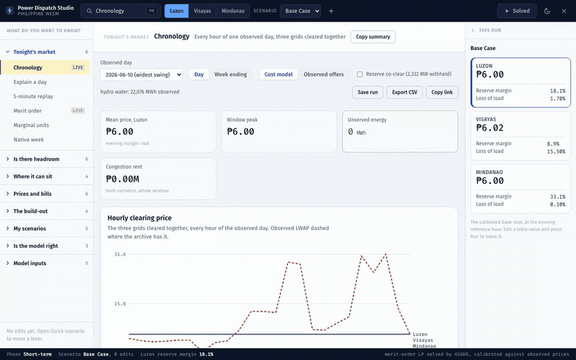
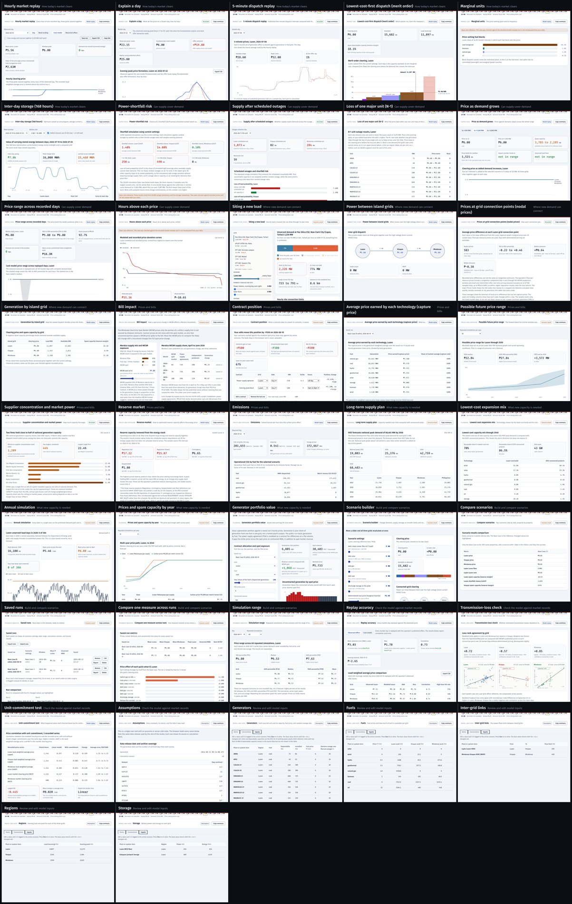

# Studio view catalog

Each row below links directly to one Studio view. The navigation presents six
analyst workflows plus a Model and data area. Search remains available for the
complete catalog. Back to [the project front door](../README.md).


The browser interface is at
[/studio/](https://power-dispatch-studio.vercel.app/studio/). It includes
editable model inputs, saved scenario changes, chronological market replay,
scenario comparison, and replay accuracy against published prices.

The July 2026 update added planning functions. The long-term view places DOE
committed and indicative projects on a year slider. The adequacy view applies the
operator's scheduled outages. Other views step demand through the announced
range, repeat a scenario across all archived market days, report hourly binding
constraints and carbon dioxide, and export a self-contained HTML report.

Every planning layer computes from the archive or a sourced list, and no
optimizer chooses builds. The dispatch itself solves as a HiGHS linear program in
the browser. Storage optimises across the day's hours, and hydro stays
energy-limited to each day's recorded water where the archive carries the
operator's per-resource schedules. Prices come from the duals. The model's scope
and its accuracy statement live in [studio/README.md](../studio/README.md).

Replay accuracy opens on the published-offer calculation by default because it
follows recorded prices more closely. The cost model remains available for comparison. The
**Explain a day** view takes any past market day and breaks its evening peak into
the cost-model result, the offer premium implied by published bids
on top of it (the offer replay minus the cost model), and the named equipment the
operator's real-time dispatch held at a limit that day. It exports the breakdown
as CSV. The project exports separate CSV files for the congestion league,
both replay calculations per grid, and the day-by-day feed. The
scheduled build writes them to [`web/data/exports/`](../web/data/exports/), linked from the map's
Drivers panel and documented in
[`web/data/exports/index.json`](../web/data/exports/index.json).

### Workflow navigation and search

The navigation groups views by the question they answer. The clip below shows
three ways to move through the studio.

- **Search.** Press Cmd K, then type a task or market term. The ranker
  matches the label, the hint and a per-view alias list, so "price setter"
  finds Marginal units.
- **Workflows.** Market day, Scenario analysis, Supply risk, Connection study,
  Prices and exposure, and Planning have the main analyst tasks. Model and
  data has validation, assumptions, and editable inputs.
- **Market context.** The date and grid stay in the top bar. The market-day
  strip aligns recorded price, model replay, demand, transfer limits, and
  shortfalls on one 24-hour axis.
- **Results and evidence.** The side panel keeps regional results, source type,
  archive coverage, and model status visible while the view changes.



**Every view has a URL.** The interface writes `#v=<slug>` as you move, beside the
`#m=` scenario share, so
[`/studio/#v=backcast&g=visayas`](https://power-dispatch-studio.vercel.app/studio/#v=backcast&g=visayas)
opens Visayas replay accuracy. The catalog uses direct links instead of one
recording per view.

Here are all 42 in one frame, each tile a real screenshot of the running app.
Click it to open the sheet full size, because inline the tile names read and
the numbers inside them do not. `build/shoot_view_sheet.py` opens each view by
its deep link. It checks that the shell landed on the view it asked for, and
fails on any mismatch. The sheet checks all 42 links in one run.

[](views-contact-sheet.png)

<details>
<summary><b>Open any of the 42 views directly</b></summary>

<!-- views table start -->

| Source group | View | What it answers |
|---|---|---|
| How today's market clears | [Hourly market replay](https://power-dispatch-studio.vercel.app/studio/#v=chronology) | Every hour of one recorded day, three grids cleared together |
|  | [Explain a day](https://power-dispatch-studio.vercel.app/studio/#v=explain-a-day) | What set the price on a chosen day, hour by hour |
|  | [5-minute dispatch replay](https://power-dispatch-studio.vercel.app/studio/#v=five-minute-replay) | Published five-minute dispatch intervals compared with the replay |
|  | [Lowest-cost-first dispatch (merit order)](https://power-dispatch-studio.vercel.app/studio/#v=merit-order) | Which plants run, from the cheapest through the price-setting unit |
|  | [Marginal units](https://power-dispatch-studio.vercel.app/studio/#v=marginal-units) | The price-setting plant and its frequency |
|  | [Inter-day storage (168 hours)](https://power-dispatch-studio.vercel.app/studio/#v=native-week) | 168 hours solved as one program, storage carried across midnight |
| Can supply cover demand | [Power-shortfall risk](https://power-dispatch-studio.vercel.app/studio/#v=reliability) | Chance of a shortfall (LOLP) across simulated random plant outages |
|  | [Supply after scheduled outages](https://power-dispatch-studio.vercel.app/studio/#v=adequacy) | Whether supply covers demand across the outage schedule |
|  | [Loss of one major unit (N-1)](https://power-dispatch-studio.vercel.app/studio/#v=n-1) | What the price does when any one unit trips at the evening peak |
|  | [Price as demand grows](https://power-dispatch-studio.vercel.app/studio/#v=load-sweep) | Price against demand, swept across the whole range |
|  | [Price range across recorded days](https://power-dispatch-studio.vercel.app/studio/#v=window-band) | The price band the model produces when it replays every recorded day |
|  | [Hours above each price](https://power-dispatch-studio.vercel.app/studio/#v=price-duration) | Hours at or above each price, sorted |
| Where new demand can connect | [Siting a new load](https://power-dispatch-studio.vercel.app/studio/#v=siting) | Hourly load a named site can draw through its own lines |
|  | [Power between island grids](https://power-dispatch-studio.vercel.app/studio/#v=coupled-flows) | What moves over the high-voltage direct-current links and when a link reaches its limit |
|  | [Prices at grid connection points (nodal prices)](https://power-dispatch-studio.vercel.app/studio/#v=nodal-prices) | How each connection point differs from its regional price |
|  | [Generation by island grid](https://power-dispatch-studio.vercel.app/studio/#v=regional-split) | How the solved dispatch divides across the three grids |
| Prices and bills | [Bill impact](https://power-dispatch-studio.vercel.app/studio/#v=bill-impact) | How a spot-price change in WESM affects a Meralco household bill |
|  | [Contract position](https://power-dispatch-studio.vercel.app/studio/#v=contract-position) | What a scenario does to a book of contracts, in pesos |
|  | [Average price earned by each technology (capture price)](https://power-dispatch-studio.vercel.app/studio/#v=capture-prices) | What each technology earns compared with the market average |
|  | [Possible future price range](https://power-dispatch-studio.vercel.app/studio/#v=forward-prices) | The forward band the archive window supports |
|  | [Supplier concentration and market power](https://power-dispatch-studio.vercel.app/studio/#v=market-power) | How much capacity the largest suppliers control and whether the grid can replace them |
|  | [Reserve market](https://power-dispatch-studio.vercel.app/studio/#v=reserve-market) | How co-optimized reserve capacity affects the energy price |
|  | [Emissions](https://power-dispatch-studio.vercel.app/studio/#v=emissions) | Solved tonnes per hour plus the carbon-price effect |
| What new capacity is needed | [Long-term supply plan](https://power-dispatch-studio.vercel.app/studio/#v=long-term) | Capacity needed over time compared with announced projects |
|  | [Lowest-cost expansion mix](https://power-dispatch-studio.vercel.app/studio/#v=expansion-mix) | Technology chosen by the least-cost build and its cost basis |
|  | [Annual simulation](https://power-dispatch-studio.vercel.app/studio/#v=future-year) | Every date in a target year, on the published demand path and build list |
|  | [Prices and spare capacity by year](https://power-dispatch-studio.vercel.app/studio/#v=multi-year-path) | The price and margin path across years |
|  | [Generator portfolio value](https://power-dispatch-studio.vercel.app/studio/#v=portfolio) | Assets and earnings for one owner |
| Build and compare scenarios | [Scenario builder](https://power-dispatch-studio.vercel.app/studio/#v=quick-scenario) | Change demand, supply, storage, or transfer limits and recalculate all three grids |
|  | [Compare scenarios](https://power-dispatch-studio.vercel.app/studio/#v=compare) | Two scenarios side by side, property by property |
|  | [Saved runs](https://power-dispatch-studio.vercel.app/studio/#v=saved-runs) | Runs kept in this browser, ready to restore |
|  | [Compare one measure across runs](https://power-dispatch-studio.vercel.app/studio/#v=cross-run) | One measure tracked across every saved run |
|  | [Simulation range](https://power-dispatch-studio.vercel.app/studio/#v=ensembles) | Repeated simulations of one scenario and the range of results |
| Check the model against market records | [Replay accuracy](https://power-dispatch-studio.vercel.app/studio/#v=backcast) | Every market day replayed against the observed price |
|  | [Transmission-loss check](https://power-dispatch-studio.vercel.app/studio/#v=loss-validation) | Whether estimated transmission losses reproduce recorded price differences between connection points |
|  | [Unit-commitment test](https://power-dispatch-studio.vercel.app/studio/#v=commitment-test) | What happened when each thermal block had to commit and hold a floor |
|  | [Assumptions](https://power-dispatch-studio.vercel.app/studio/#v=assumptions) | Every constant, its source, and the date it was read |
| Review and edit model inputs | [Generators](https://power-dispatch-studio.vercel.app/studio/#v=generators) | Each sourced unit and its capacity, fuel price, and random-outage rate |
|  | [Fuels](https://power-dispatch-studio.vercel.app/studio/#v=fuels) | Fuel prices and how much of each is available per grid |
|  | [Inter-grid links](https://power-dispatch-studio.vercel.app/studio/#v=interfaces) | The power-flow limits between island grids |
|  | [Regions](https://power-dispatch-studio.vercel.app/studio/#v=regions) | Evening load and peak for each of the three grids |
|  | [Storage](https://power-dispatch-studio.vercel.app/studio/#v=storage) | Battery power and energy on each grid |

<!-- views table end -->

</details>

The
[analyst walkthrough](findings.md#analyst-workflow-covers-replay-accuracy-scenarios-and-exports)
shows the full workflow.
[`build/record_analyst_walkthrough.py`](../build/record_analyst_walkthrough.py)
rebuilds it from the running app. Four shorter recordings cover specific tasks.
[Explain a day](../studio/docs/view-explain.gif),
[the DICT 1.5 GW data-center build](../studio/docs/workflow-1-datacenter.gif),
[tripping both 647 MW Sual units](../studio/docs/workflow-2-contingency.gif), and
[repricing Malampaya gas to imported LNG](../studio/docs/workflow-3-malampaya.gif).
[studio/README.md](../studio/README.md) carries one recorded clip per analysis view,
14 in all.

### Export formats

The browser exports saved runs in the formats below.

| Exit | Where | What you get |
|---|---|---|
| Run report | [Saved runs](https://power-dispatch-studio.vercel.app/studio/#v=saved-runs) | Self-contained HTML with inputs, sources, and the hourly result |
| Hourly CSV | The same view, plus six analysis views | One row per hour with price, demand, shortfall, flows, and storage |
| Archive CSVs | [/data/exports/](https://power-dispatch-studio.vercel.app/data/exports/index.json) | `market_by_day.csv`, `congestion_league.csv`, `backcast_by_grid.csv`, rebuilt nightly |
| Scenario file | Scenario builder, "Take this scenario to Python" | The run settings as JSON, which the command line reads back |

The HTML report is self-contained and does not depend on browser storage. The
archive CSVs carry a CC-BY-4.0 license. Their `index.json` documents each column.

### Run a browser scenario from the command line

The browser and command line both read the `pds-scenario/1` schema.

```bash
power-dispatch validate myscenario.json   # names every problem, one per line
power-dispatch run --scenario myscenario.json -o out.csv
```

The validator reports each problem in a broken file. It suggests a valid setting
for an unknown name, finds a misspelled grid, and finds text where a number is
needed. [`docs/scenario-schema.md`](scenario-schema.md) lists the
keys and the three settings that a browser round trip drops. The Python and
browser tests both read `tests/fixtures/scenario_example.json`.

**This page downloads 4.1 MB of media across 2 files.** Longer recordings are
links. The view catalog uses one contact sheet and 42 direct links.

`python3 tests/test_readme_views.py` re-measures that total against the files on
disk and fails when the stated number drifts.

**Long recordings have MP4 versions.** Short chart and analysis previews stay
GIF-only. The list below links to each longer browser recording.

- [The analyst walkthrough](analyst-walkthrough.mp4), and its [GIF](analyst-walkthrough.gif)
- [The map and studio](reel.mp4), and its [GIF](reel.gif)
- [The map hero](hero.mp4) and [the studio shell](studio-shell.mp4)
- [The nodal walkthrough](nodal-walkthrough.mp4), and its [gif](nodal-walkthrough.gif)
- [Siting a load at Pax Silica](siting-walkthrough.mp4), and its [gif](siting-walkthrough.gif)
- [The Pax Silica montage](pax-silica-scale.mp4), and its [gif](pax-silica-scale.gif)
- [The map's Simulate walkthrough](dispatch-demo.gif)

Three files stay in `docs/` on purpose and appear nowhere above.
`scripts/og_card.py` writes `docs/hero.png` from the calculated data, beside the social
preview card. `docs/pax-silica-social.gif` and `docs/pax-silica-social.mp4` are
the square crop for posting.
