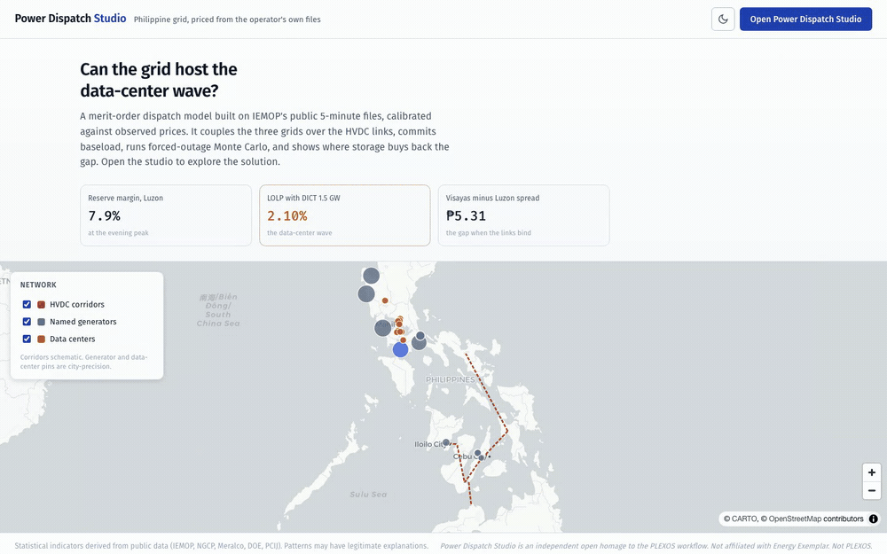

# Power Dispatch Studio

Power Dispatch Studio is a free,
open, browser-based dispatch studio for the Philippine wholesale electricity
market (WESM). It carries the working shape of a commercial production-cost
tool: an object model you edit in a properties grid, scenarios as tagged
overrides, a Run gate, a solution browser, chronological simulation over
observed market days, and a backcast that scores the model against the actual
price tape. Everything runs client-side on baked public data. There is no
license server, no import wizard, and no project file: a scenario and its run
window encode into the URL.

It is free and open, built on public data, with no license, no install, and no
account.

The model is checked against what actually happened. Every observed market day is
re-priced by the model and compared to the real WESM price, with the error shown
for each of the three grids and nothing tuned to make it fit. That comparison,
called the backcast, is how you tell whether the model is worth anything, and the
studio shows it:


And here it is in use, opening the studio, editing a generator, running the model,
and replaying an observed day:


## What the studio does

Every surface a WESM analyst needs, browser-side on baked public data:

| Surface | What it is |
| --- | --- |
| System tree: Generators, Fuels, Interfaces, Regions, Storage | Generators are the DOE List of Existing Power Plants at unit level (355 units, 2025 editions); Interfaces are the two HVDC corridors (Leyte-Luzon, MVIP) |
| Properties grid with scenario tagging | Edit a cell and the edit is tagged to the active scenario, revert per cell; base values return with the x on a changed cell |
| Run | One HiGHS linear program clearing the three grids together (the browser runs the same wasm solver build commercial tools embed); milliseconds per solve, so the Run gate is authentic without the queue |
| Chronology (Short-term) | Hour-by-hour replay of an observed market day, or the week ending on it, from the IEMOP archive, on your edited model |
| Long-term | The DOE's committed and indicative project lists (reconciled to the DOE's own subtotals) as build candidates on a horizon slider; Apply writes them into the scenario as ordinary edits |
| Adequacy | The operator's own outage schedules (OUTRTD), sized against the DOE fleet, with the reliability Monte Carlo re-run on the day's scheduled-out MW |
| Load sweep | The snapshot solve stepped over added flat load on one grid: where the corridor binds, where the marginal fuel flips, where unserved load begins |
| Window band | The scenario replayed across every full-coverage market day in the archive; per-hour price percentiles and the daily-mean distribution. The sample is the observed days, nothing synthetic |
| What set the price | Every Chronology hour classified: marginal fuel block, saturated corridor on the importing side, or unserved load |
| Solution views | Merit order, Chronology, Load sweep, Window band, Coupled flows, N-1, Regions, a seeded Monte Carlo reliability, plus scenario compare |
| Saved runs | Frozen solves (scenario snapshot, window, engine version, hourly results): diff two runs, export hourly CSV or a self-contained HTML report, restore as a scenario |
| Emissions | Dispatched energy priced in operational tCO2 with sourced per-technology factors; biomass reported uncounted rather than assigned a contested factor |
| Baked JSON artifacts | Produced by the Python pipeline from archived IEMOP files; the frontend never computes a number the pipeline cannot reproduce |
| Backcast | Every full-coverage market day replayed against observed hourly LWAP, error stated per grid, nothing tuned. Opens on the offer-book replay (the calibrated view); the cost model is the counterfactual you subtract |
| Explain a day | Any past market day's evening peak split into fundamentals (cost model), the offer premium (offer replay minus cost model), and the named equipment that bound the grid that day; exportable to CSV |
| Exports | Tidy CSVs baked nightly to `web/data/exports/` (congestion league, both backcast engines per grid, the day-by-day feed), plus per-view CSV download buttons |

What it does not do: it finds the cheapest way to meet demand each hour, but it
does not decide which individual plants switch on or off (no start-up costs, no
minimum-run rules), does not enforce transmission contingency limits, and does not
model the grid node by node. It also does not choose what to build. The Long-term
view just applies the DOE's own project lists, and the separate Expansion mix view
runs a least-cost buildout as a rough direction check, not a recommendation. The
scope table below spells out exactly what it solves.

## The model and its scope

Three zonal regions (Luzon, Visayas, Mindanao) with per-fuel merit-order
blocks, cleared together over the two HVDC corridors as one HiGHS linear
program with a small wheeling cost. Prices are the balance duals, real
locational marginal prices: a saturated corridor prices the downstream grid
above the upstream one by the congestion rent, and an unsaturated corridor
holds neighbours within the wheeling cost, so an importing grid can price at
its neighbour's marginal block instead of its own. Coal splits into a
committed must-run tranche (offered at the observed commitment level) and a
marginal tranche at the administered price. Chronology solves each observed
day as a single 24-hour LP: demand is the archive's dispatched generation per
hour, solar follows a stated 24-hour shape, storage is optimised across the
hours (it cycles only when the price spread beats the round-trip loss, and
idles on a flat day) with daily state-of-charge reset, and the reserve toggle
withholds the scheduled requirement from the dispatchable stack instead of
inflating demand.

| Included | Excluded (by design) |
| --- | --- |
| Coupled zonal dispatch with congestion rent | Nodal LMPs (the public PH LMP congestion component is structurally zero) |
| Per-unit fleet from the DOE list, unit-level N-1 | Security-constrained unit commitment, ramp rates, min up/down times |
| Chronological replay of observed days, with each day's scheduled-outage deviation applied (OUTRTD via the PASA mapping) | Load or price forecasting |
| Shortage priced at the P32/kWh WESM offer cap (published rule), labeled 'shortage' | Offer-behavior pricing below the cap (per-participant strategy) |
| Storage optimised over the day's hours (HiGHS LP); the Native week view adds inter-day carryover in a native 168-hour LP | Inter-day storage carryover in the default day mode |
| Reserve as a withheld-capacity constraint; OBSERVED official regional reserve prices shown beside it | Reserve co-optimisation inside the LP (the observed reserve books, RTDOR, are archived as daily derived files since July 2026; the joint clear scored against RSVPR is the queued build) |
| Monte Carlo adequacy on forced-outage rates, with the day's scheduled outages removable (PASA lite) | Maintenance-schedule optimisation |
| DOE build pipeline as sourced candidates on a horizon (LT Plan lite) | Expansion optimisation, build-cost economics |
| Load sweep, window band, per-hour binding classification, operational CO2 | Build-cost economics |
| Energy-limited hydro: the day LP caps hydro at the day's OBSERVED water (DIPCEF per-resource schedules, derived daily; scaled with edits and the hydrology lever) | Inter-day water management (each day's budget stands alone) |

The model's honesty gate is calibration against two observed targets: the
load-weighted average price (LWAP, the settlement-side series) and the
regional market clearing price (MCP, the ex-ante series commensurate with a
dispatch dual). A competitive cost stack under-prices tight hours; that
residual is the scarcity and offer premium a cost model cannot see, and it is
reported, not tuned away.

## Validation

The Backcast view replays every full-coverage market day with the base model
against the observed hourly LWAP. At the July 2026 bake (window 2026-05-01 to
2026-06-25, 56 market days, 24 hourly points each per grid):

Against the settlement-side LWAP (1,344 hours per grid):

<!-- bc-lwap: generated from profiles.json by scripts/verify_claims.py --write; do not hand-edit -->
| Grid | Observed mean | Modeled mean | MAE | Bias | Correlation | High-hour hit |
| --- | --- | --- | --- | --- | --- | --- |
| Luzon | P7.65/kWh | P6.00/kWh | P4.35 | -P1.64 | 0.38 | 42% |
| Visayas | P12.95/kWh | P6.00/kWh | P8.70 | -P6.95 | 0.48 | 49% |
| Mindanao | P11.51/kWh | P6.00/kWh | P7.61 | -P5.51 | 0.07 | 7% |
<!-- /bc-lwap -->

Against the observed regional clearing price (MCP, the ex-ante series
commensurate with a dispatch dual; tied intervals averaged per interval
before the hourly mean). Coverage is stated because it is uneven: the MCP
files name a price in fewer Visayas intervals than Luzon ones, and if the
missing intervals skew toward substituted extremes the observed means here
are subset statistics:

<!-- bc-mcp: generated from profiles.json by scripts/verify_claims.py --write; do not hand-edit -->
| Grid | Coverage | Observed mean | Modeled mean | MAE | Bias | Correlation | High-hour hit |
| --- | --- | --- | --- | --- | --- | --- | --- |
| Luzon | 1,310 of 1,344 h | P7.03/kWh | P6.00/kWh | P4.01 | -P1.03 | 0.38 | 43% |
| Visayas | 777 of 1,344 h | P14.78/kWh | P6.00/kWh | P10.91 | -P8.78 | 0.33 | 31% |
| Mindanao | 1,196 of 1,344 h | P11.58/kWh | P6.00/kWh | P8.21 | -P5.58 | 0.06 | 15% |
<!-- /bc-mcp -->

And the corridors themselves, the third table (modeled flow vs the observed
net market imports and exports in the same files):

<!-- bc-flows: generated from profiles.json by scripts/verify_claims.py --write; do not hand-edit -->
| Corridor | Observed mean | Modeled mean | MAE | Direction agreement |
| --- | --- | --- | --- | --- |
| Luzon to Visayas | 46 MW | -1 MW | 91 MW | 8% |
| Visayas to Mindanao | -373 MW | -4 MW | 369 MW | 4% |
<!-- /bc-flows -->

The fourth set replays the same days with the operator's own OFFER BOOKS
(every resource's priced curve from the real-time generation offers, plus
self-scheduled capacity as price-takers) instead of the cost proxy: no
storage or water layers, because the books already embody unit behavior
(reserve withholding stays available as a stated whole-book
approximation). 55 derived days; the 56th, 2026-06-09, was refused by the
coverage gate and is named rather than hidden. Two framing caveats travel
with the set: the whole window sits inside the post-suspension restart
regime, so this validates one market quarter, not a climatology; and the
corridor DIRECTION agreement partly follows from native-load demand
construction (a net exporter's load sits below its book by construction),
so the load-bearing flow statistics are the MAE and the binding-share
pair. The flows are no longer scored only against the net-import identity
the demand is built from: the operator's own per-interval HVDC schedule
(RTDHS) is an independent published record (it agrees with the identity
flows to within half a MW on hourly means), and its congestion flag gives
a per-interval binding-share target that no demand construction can
imply.

<!-- bc-offer-target: generated from profiles.json by scripts/verify_claims.py --write; do not hand-edit -->
| Grid | Target | MAE | Bias | Correlation | High-hour hit |
| --- | --- | --- | --- | --- | --- |
| Luzon | LWAP | P2.96 | +P1.46 | 0.73 | 53% |
| Visayas | LWAP | P5.12 | -P0.60 | 0.68 | 51% |
| Mindanao | LWAP | P4.31 | -P1.07 | 0.73 | 47% |
| Luzon | MCP | P2.82 | +P1.97 | 0.78 | 69% |
| Visayas | MCP | P6.19 | -P5.32 | 0.74 | 49% |
| Mindanao | MCP | P3.03 | -P2.43 | 0.88 | 69% |
<!-- /bc-offer-target -->

<!-- bc-offer-flows: generated from profiles.json by scripts/verify_claims.py --write; do not hand-edit -->
| Corridor (offer mode) | Observed mean | Modeled mean | MAE | Direction agreement |
| --- | --- | --- | --- | --- |
| Luzon to Visayas | 45 MW | 111 MW | 101 MW | 88% |
| Visayas to Mindanao | -375 MW | -336 MW | 58 MW | 99% |
<!-- /bc-offer-flows -->

A fifth set scores the same modeled flows against the operator's own
per-interval HVDC schedule (RTDHS), the corridor record the operator
publishes rather than the net-import identity the demand is built from,
and adds the binding-share pair: the share of intervals the operator
flagged the corridor congested against the share of modeled hours at the
corridor cap. The offer book moves real MW in the observed direction but
still binds the corridors less often than the operator did; the cost
proxy barely binds them at all. That under-binding is the standing gap
this table exists to show.

<!-- bc-rtdhs: generated from profiles.json by scripts/verify_claims.py --write; do not hand-edit -->
| Corridor (vs operator record) | Observed mean | Modeled mean | MAE | Direction | Observed binding share | Modeled at-cap share |
| --- | --- | --- | --- | --- | --- | --- |
| Luzon to Visayas, cost mode | 46 MW | -1 MW | 91 MW | 8% | 61% | 2% |
| Visayas to Mindanao, cost mode | -373 MW | -4 MW | 369 MW | 4% | 45% | 0% |
| Luzon to Visayas, offer mode | 45 MW | 111 MW | 101 MW | 88% | 61% | 35% |
| Visayas to Mindanao, offer mode | -375 MW | -336 MW | 58 MW | 99% | 46% | 33% |
<!-- /bc-rtdhs -->

At-cap counts a modeled hour only when the hour's cap is nonzero: a
fully blocked corridor hour cannot bind in the congestion sense.

Five engine steps sit inside these numbers, all reported rather than tuned:
the LP swap, the observed water budgets, the fleet-derived hydro split, the
observed layers (curtailment in demand, scheduled-outage deviations, the
P32/kWh offer cap on short hours), and now NATIVE-LOAD demand: generation
plus net market imports, so each grid carries the load it actually served
rather than a series that self-balances by construction. That last step
moved three things at once, in different directions, and the tables say so.
The Visayas finally has a rankable settlement-price shape (correlation
0.48, hit rate 49 percent, from unrankable) and its adequacy margin drops
to 1.6 percent at peak, which is what a grid living through a 52-day
yellow-alert streak should look like. The same change CUT the Visayas MCP
agreement (correlation 0.65 to 0.33, hit 93 to 31 percent): the old
self-balanced demand had flattered the sparse-coverage MCP subset, and
that flattery is gone.

The offer-mode set is the sixth step and the payoff. With the market's own
bids, the corridors move like the real grid (99 percent direction
agreement on Visayas-Mindanao, 58 MW MAE against a 375 MW mean flow,
where the cost proxy's three near-identical stacks agree with the
observed direction in under 10 percent of decisive hours), the Visayas
settlement bias collapses from -P6.95 to -P0.60, and Mindanao's
clearing-price correlation reaches 0.88. Subtract the two modes and the
offer premium stops being a residual and becomes a measured series. What
remains: Luzon OVER-prices settlement by P1.46 (the ex-ante book clears
above what substitution-shaved settlement pays, the same wedge the LWAP
vs MCP tables show), and the sparse Visayas MCP subset keeps a -P5.32
bias with its coverage stated.

The two engines also disagree about the marquee what-if, and that
disagreement is a published number, not a footnote: on the widest-swing
market day, the DICT 1.5 GW wave costs +P4.75/kWh on the cost stack but
+P9.14/kWh on the observed bids, with +P6.37 reaching the Visayas and
+P3.18 Mindanao where the cost stack moves nothing (both runs are pinned
in the golden cases; the Chronology engine toggle reproduces them). Read
every cost-mode scenario delta as a floor. One flag travels with the
+P9.14: under the secondary cap's stated numbers (P7.423/kWh imposed when
the 72-hour rolling GWAP breaches P12.413, ERC Res. 26 s.2025), a day
like that pushes the computed rolling series past the threshold (P13.59
against P12.413), so the as-bid spike carries price-mitigation exposure
the cost floor does not. The same computed arithmetic also crossed the
threshold inside the OBSERVED window with no day pinned at the cap
anywhere in the price record, so the flag reads as exposure under the
rule's stated numbers, not a predicted clamp; the full series, breach
counts, and clamp
scan are in market_ops.json and the methodology.

The reserve replay closes the last unconsumed archive dataset. Each
derived reserve book (RTDOR, the hour's opening 5-minute interval, per
grid and commodity) is cleared at the MW the operator actually scheduled
at that exact interval, and the marginal offer is scored against the
official reserve price (RSVPR) at the same interval: 92 days, twelve
grid-commodity pools, no tuning. Every pool's mean residual is negative,
and the hours where the marginal offer sits above the official price are
noise-level (8.3 percent of the ~26,444 scored hours, by at most
P0.033/kWh). That one-signed pool residual IS the co-optimisation
opportunity-cost wedge: WESM pays reserves the forgone energy margin on
top of the reserve offer, biggest on regulation products and the tight
islands, near zero on dispatchable reserve. Scarcity hours (scheduled MW
under the stated requirement, where administrative pricing can sit above
any offer) are counted per pool and excluded from the right-hand MAE.

<!-- reserve-table: generated from market_ops.json by scripts/verify_claims.py --write; do not hand-edit -->
| Pool | Hours | Observed mean | Modeled mean | Bias | Exact hours | Scarcity hours | MAE outside scarcity |
| --- | --- | --- | --- | --- | --- | --- | --- |
| Luzon contingency (Fr) | 2,208 | P6.39 | P2.15 | -P4.24 | 45.2% | 504 | P3.77 |
| Luzon dispatchable (Dr) | 2,205 | P2.51 | P1.69 | -P0.82 | 79.6% | 418 | P0.56 |
| Luzon regulation up (Ru) | 2,208 | P9.67 | P6.30 | -P3.38 | 63.9% | 956 | P2.70 |
| Luzon regulation down (Rd) | 2,208 | P9.03 | P6.45 | -P2.58 | 55.3% | 947 | P2.97 |
| Visayas contingency (Fr) | 2,202 | P10.84 | P4.18 | -P6.66 | 47.7% | 290 | P6.08 |
| Visayas dispatchable (Dr) | 2,165 | P5.23 | P1.68 | -P3.55 | 66.3% | 311 | P1.04 |
| Visayas regulation up (Ru) | 2,208 | P15.48 | P9.75 | -P5.73 | 45.2% | 301 | P5.39 |
| Visayas regulation down (Rd) | 2,208 | P13.38 | P10.92 | -P2.46 | 60.7% | 300 | P2.38 |
| Mindanao contingency (Fr) | 2,208 | P5.42 | P1.26 | -P4.16 | 53.7% | 306 | P3.46 |
| Mindanao dispatchable (Dr) | 2,208 | P0.97 | P0.07 | -P0.91 | 88.4% | 365 | P0.23 |
| Mindanao regulation up (Ru) | 2,208 | P16.24 | P12.43 | -P3.82 | 70.4% | 267 | P3.81 |
| Mindanao regulation down (Rd) | 2,208 | P14.39 | P13.59 | -P0.80 | 86.5% | 262 | P0.73 |
<!-- /reserve-table -->

Exact hours match the official price within half a centavo: on Luzon
dispatchable reserve the book alone reproduces the official price in four
of five hours, and on Mindanao regulation down in six of seven. Closing
the wedge needs a per-resource joint energy+reserve clear, and the
compacted public artifacts drop resource identity on both sides; that
build stays named in the methodology with its exact missing input.

Read these tables before trusting any scenario: the cost model explains
the cost floor and the congestion geometry and under-prices scarcity; the
offer mode prices what the market as bid would do, one observed quarter
deep. The high-hour hit rate reports n/a when a flat model cannot rank
hours, instead of a fake 100%. The live view recomputes these numbers
from the current archive window.

Engine correctness is pinned by a two-layer parity harness. Both engines
build the SAME linear program as the same text, byte for byte (every
coefficient serialized from integer micro-units), and the fixtures pin its
sha256: a model-construction drift on either side fails the hash before any
solver runs. On top of that, the Python solve (highspy) bakes input/output
fixtures (five snapshot cases, six chronological day-runs) that the browser
solve (the HiGHS wasm build) must reproduce to P0.02/kWh and 1 MW, including
exact price-setter labels. Any change to one engine that does not land in the
other fails the suite, and the retired coordinate-descent clear stays in the
pipeline test suite as a cost cross-oracle.

The parity harness proves the two engines build the same program; a second
check proves the program RESPONDS the way an energy-market analyst would
predict. Eight counterfactuals an analyst would run to battle-test a dispatch
model, each driven through the chronology engine (the harness is
`pipeline/scenario_validation.py`): six moved in the predicted
direction on the first pass, two moved in a direction I had not predicted and
the flow data showed the engine was right, and one is a dated backcast.

| What-if | An analyst expects | The engine does |
| --- | --- | --- |
| +1 GW solar, Luzon | fuel and emissions down, evening peak untouched | 5,900 MWh less coal and gas burned, 7pm peak unchanged (solar is zero at sunset) |
| +300 MW data center, Luzon | absorbed by the big grid | absorbed, but it flips the Leyte-Luzon link from export to import and saturates it 6 hours: the corridor is Luzon's cushion |
| +300 to +1,000 MW data center, Visayas | the small grid saturates the corridor | corridor saturated 17 to 24 hours of 24 across six days, a real Visayas-over-Luzon premium opens, Luzon's own price stays flat |
| +50 MW small hydro, Luzon | small, dispatchable, energy-capped | +175 MWh over the day, price flat, bounded by the water budget |
| +600 MW gas, Visayas | local generation relieves the island | Visayas mean falls, corridor dependence drops |
| Malampaya to imported LNG (gas P4.80 to P10.30) | price shape lifts with the fuel cost | Luzon price rises toward the gas cost |
| Trip both 647 MW Sual units | Luzon tightens | reprices coal to oil with no unserved load on the observed evening; the reliability draw puts loss-of-load probability at 10.6% |
| 935 MW Visayas outage, Jul 1 (dated) | matches the observed island spread | reproduces 87.8% of the observed Visayas-over-Luzon spread |

Two of these are quantitative claims that stand on their own. First, the
corridor binds far below the announced wave: the forward replay saturates the
250 MW Leyte-Luzon link at a few hundred MW of extra Visayas load, and the
independent backcast (`coupling.dc_binding_threshold`) puts the knee at 250 MW,
two code paths landing it well below DICT's 1.5 GW national
forecast. Second, siting is the whole story: the same data-center megawatts are
absorbed on Luzon but open a genuine island price premium and saturate the
corridor almost all day when sited in the Visayas.

Read the peso magnitudes as direction, not prediction. The cost model uses flat
per-fuel blocks, so a price delta is the height of the next block, not a
calibrated response: tripping both Sual units and stacking a dry year onto the
DICT build both read +P5.98/kWh because both step Luzon from the P6 block to the
P12 one. The corridor-saturation hours, the 250 MW threshold, and the 87.8%
backcast are the structural claims that do not turn on block height.

### How far these analyses are validated

Two things stand behind every number the studio shows, and it is worth being
exact about each.

1. **Dual-engine self-consistency, proven by hash.** The Python pipeline and the
browser build the byte-identical linear program (sha256-pinned) and reproduce the
same outputs to P0.02/kWh. The studio is consistent with its own reference engine:
studio equals pipeline.

2. **Validation against observed reality, measured.** The dispatch is scored
against observed WESM prices over 56 market days; Luzon tracks at 0.38 correlation
with a stated negative bias, the scarcity premium a cost model cannot see, reported
not tuned. Every analysis that reads the dispatch (Chronology, Capture prices,
Cross-run, Native week, Portfolio, five-minute replay) inherits this validation, so
its credibility is the backcast's.

The limit: the engine is a simplified zonal merit-order LP, with no
security-constrained unit commitment, no ramp rates, and no nodal network. Where
more unit-level detail was actually built and run through the same backcast, three
additions (unit commitment with a generic minimum-stable level, each day's observed
solar shape, and RTDHS corridor caps) made the fit to observed prices worse,
because public Philippine data cannot support per-unit calibration; each measured
delta is published in `market_ops.json` and the model keeps the simpler engine.

The forward-looking analyses (Forward prices, Multi-year path, Expansion mix, and
the Ensembles band) cannot be backcast: there is no observed future or greenfield
build to score against. Each runs on sourced inputs (the DOE PDP demand path, NREL
ATB generic costs) and is labeled a scenario on one observed quarter, not a
forecast.

## Three workflows to try

**Add a data center and see the price.** System > Regions, raise Luzon load by the
build's MW (flat, the data-center shape), Run. Chronology on the demand-peak
day shows which hours flip from coal to oil; Save run, revert the edit, save
the base, and Compare two runs gives the price and congestion-rent delta.


**Turn off the two biggest units.** System > Generators, set SPI U1 and SPI U2
(the two 647 MW Sual units) to zero, Run. N-1 and Reliability show the
adequacy hit; Chronology on the stress day shows whether the evening clears on
oil or sheds load, and its congestion-rent tile prices the corridors binding in
the peak hours.


**Switch gas to imported LNG.** System > Fuels, reprice natural gas from the
Malampaya cost (P4.80/kWh) to the imported-LNG cost (P10.30/kWh), Run, and
read the Chronology price shape; then in the Quick scenario, stack the announced
build and a dry year on the LNG switch for the compounding view. Share the exact
scenario with Copy link.


## Ten analyses added in the July 2026 build-out

Ten analyses were added in the July 2026 build-out, one recorded clip each (real
captures of the running studio; the numbers on screen are one dated bake and the
live view recomputes them as the archive window rolls). How far each one is
validated is the honest part, so read [How far these analyses are
validated](#how-far-these-analyses-are-validated) first.

Backcast-validated, each a transform of the dispatch the backcast scores against
observed WESM prices:

**Native week.** A native 168-hour linear program where the battery state of
charge carries across midnight instead of resetting each day; the daily water
budget stays. The inter-day storage value is measured, and it is exactly zero at
today's observed price spreads (the model's own prices are too flat for arbitrage
to beat the round-trip loss); it turns positive only under a data-center-wave
scenario. Dual-engine byte-parity is pinned by a golden hash.


**Capture prices.** Generation-weighted average price per technology over a saved
run's window, the number a project uses for revenue and GEA bid support.


**Portfolio.** A contract-for-differences valuation of an owner position (grid,
fuel, share, PSA strike) against a saved run's hourly WESM prices, with the
uncontracted-exposure profile beside it.


**Cross-run.** Every saved run's headline metrics side by side, plus a lever
tornado that sweeps each Quick lever one at a time and ranks it by how far it
moves the clearing price.


**Five-minute replay.** The observed five-minute offer books for a sample day
cleared to the grid's own generation, 288 intervals, showing the scarcity spikes
the hourly replay smooths.


**Nodal prices.** The observed per-node price surface under the regional
averages: each WESM node's persistent deviation from its own region's SMP over
the window's clean market days, from the derived DIPCEF nodal dailies, with a
searchable per-node table. Observed, not modeled, and labeled a locational
deviation rather than a congestion premium: WESM's published nodal congestion
component is zero on every sampled day, so intra-regional congestion is
administered, not priced into the nodal column. The map's Prices mode draws the
same statistic as a layer.


**Loss validation.** The nodal model checked against the market's own record.
WESM's within-region nodal structure is a loss surface (the congestion
component is zero), so marginal loss factors from the OpenStreetMap grid are a
testable prediction of each node's observed deviation. Three scatter panels,
one per grid, with the Spearman rank correlation and the per-grid verdict:
Luzon and Mindanao validate, Visayas fails at the current resolution and is
shown failing. Recomputed nightly.


Scenario and forward-looking, where the workflow runs on sourced inputs but there
is no observed future or greenfield build to backcast against; each is labeled a
scenario on one observed quarter, not a forecast:

**Forward prices.** The observed day library re-priced under the DOE PDP peak-load
growth to a P10, median, and P90 band per year to 2030. A scenario ensemble, not a
forecast; one post-suspension quarter, so one regime.


**Multi-year path.** The median clearing price per year to 2040 under three policy
scenarios (base, a Malampaya supply cliff, a carbon price); a fixed fleet saturates
at its capacity, which the view labels.



**Ensembles.** Seeded Monte Carlo joint draws (load, hydrology, fuel price, a
forced outage) through the day model on one observed day, reported as P10, median,
and P90 per grid. The band is the spread across plausible operating states, not a
prediction.


**Expansion mix.** A separate, labeled greenfield least-cost linear program over
representative periods with generic NREL ATB costs, beside the DOE's own pipeline.
It lands near 70% renewables and reproduces the direction of the DOE plan's
86.5%-RE share. A direction check, not a full capacity-expansion optimization, and not a build
recommendation.


**Assumptions.** Every baked value with its primary source and the bake date, and
the archive coverage per dataset: the model's own vintage, in the studio.


## Data

| Input | Source | Refresh |
| --- | --- | --- |
| Hourly demand and observed prices (102 observed days) | IEMOP RTD regional summaries and final LWAP files, archived daily by the repo's pipeline (the public window rolls ~90 days; the git history is the durable archive) | Daily cron |
| Per-unit fleet (355 units) | DOE List of Existing Power Plants, grid-connected: Luzon and Mindanao as of 2025-04-30, Visayas 2025-03-31 (Internet Archive captures of the DOE's own PDFs; doe.gov.ph refuses non-PH requests). The parser refuses any grid whose rows do not reconcile to the PDF's own per-fuel subtotals | Per DOE edition |
| Corridor limits | IEMOP monthly reports (Leyte-Luzon 250 MW operating limit) and the MVIP nameplate | Sourced constants |
| Fuel costs | ERC administered coal price, Malampaya FOI, imported-LNG estimate | Sourced constants |
| Reserve requirements and prices | IEMOP RTD reserve schedules (sample days; product-code mapping labeled INFERRED) | Sample top-ups |
| Hydro water budgets | Per-resource daily energy derived from DIPCEF schedules (data/derived/dipcef_daily/, reconciled to RTDSUM within 2 percent per day); grid-connected WESM hydro matched to the DOE fleet, pumped storage excluded | Daily cron |
| Storage fleet | DOE (634 MW BESS), CBK Power (Kalayaan 685 MW); energy durations are stated assumptions because the sources publish MW, not MWh | Sourced constants |
| Build pipeline (LT Plan) | DOE committed and indicative project lists, As of 31 December 2025 (Internet Archive captures); every fuel section reconciles to the DOE's printed subtotal and every grid to the DOE's LVM summary | Per DOE edition |
| Transmission candidates | NGCP TDP 2025-2050 (March 2025 + September 2025 revision); MW only where the TDP states transfer capacity | Per TDP edition |
| Scheduled outages (PASA) | IEMOP outage schedules used in RTD, sized against the DOE fleet through a hand-verified alias table; unmatched codes carry no MW | Daily cron |
| Emission factors | IPCC 2006 fuel defaults at the EMB's published Philippine heat efficiencies; EMB diesel figure; DOE grid factor as cross-check | Sourced constants |
| Supply-mix history | Meralco advisories April to June 2026 (WESM 6/7/10%), each month cross-checked in an independent news report | Monthly advisory |

Every number in the interface is either computed by the pipeline from archived
files or a labeled constant with its primary source; `../web/methodology.html`
carries the full provenance, and assumptions ship in the artifacts themselves.

## Quickstart

```bash
cd studio
npm install
npm run dev        # copies the baked data, starts Vite on :5173
```

Requires the baked artifacts in `../web/data/` (committed; regenerate with
`make data` at the repo root).

## Verify

```bash
npm run typecheck  # tsc --noEmit (app + test configs)
npm run lint       # oxlint
npm run format:check
npm run test       # vitest: golden parity (snapshot + chronological) + invariants
npm run build      # production build to dist/
```

## Structure

```text
src/
  lib/       types.ts (baked-model types), data.ts (loader hooks + formatters)
  ui/        kit.tsx (Panel, StatTile, Chip, Segmented, ThemeToggle), DataGrid.tsx
  map/       MapView.tsx (MapLibre network view)
  studio/    Studio.tsx (shell: explorer, ribbon, Run gate, share-link hydration)
             model.ts (object model + scenario overrides + solveModel)
             lpText.ts (canonical LP text, byte-mirror of pipeline/lp_model.py)
             solver.ts (the HiGHS wasm build, loaded once)
             engine.ts (snapshot clear on the single-hour LP), engine.test.ts +
             model.test.ts
             chrono.ts (day replay as one 24-hour LP), chrono.test.ts (parity
             vs pipeline/lp_dispatch.py goldens + LP text hashes)
             ChronoView.tsx (Chronology), BackcastView.tsx (model vs the tape)
             insights.ts (binding classification, percentile bands, horizon
             math, CO2), insights.test.ts
             SweepView.tsx (load sweep), DistributionView.tsx (window band)
             LTPlanView.tsx (DOE build pipeline), PasaView.tsx (outage-day
             adequacy), EmissionsView.tsx
             runs.ts + RunsView.tsx (frozen runs, compare, CSV, share links)
             report.ts (self-contained HTML run report), report.test.ts
             model-views.tsx (properties grid + solved views), views.tsx,
             charts.tsx (SVG), Scenario.tsx, Bill.tsx, MarketPower.tsx
  styles/    tokens.css (design tokens, light + dark), base.css, app.css
```

The Python counterparts live in `../pipeline/`: `lp_model.py` (the canonical
LP text) and `lp_dispatch.py` (the highspy reference solve + backcast bake),
`chrono.py` (assembly helpers + the retired clear kept as a cross-oracle),
`profiles.py` (observed-day bake incl. hydro water budgets), `fuelmix.py`
(DIPCEF daily deriver + hydro classification), `fleet_doe.py` (DOE list
parser with the reconciliation gate). The pipeline needs `highspy` (pip); the studio's wasm
solver installs with npm.

## Record the demo

With the dev server on :5173:

```bash
python3 scripts/record-demo.py                 # Playwright video to /tmp/studio-rec
ffmpeg -y -i <video>.webm -vf \
  "fps=9,scale=1000:-1:flags=lanczos,palettegen=stats_mode=diff" /tmp/pal.png
ffmpeg -y -i <video>.webm -i /tmp/pal.png -lavfi \
  "fps=9,scale=1000:-1:flags=lanczos[x];[x][1:v]paletteuse=dither=bayer:bayer_scale=3" \
  /tmp/raw.gif
gifsicle -O3 --lossy=60 /tmp/raw.gif -o docs/demo.gif
```

The three captioned workflow GIFs under "Three workflows to try" come from a
second script that drives one clip per workflow. Every number a caption states
is read live from the running studio, so a caption cannot drift from the model:

```bash
python3 scripts/record-workflows.py all   # wf1|wf2|wf3 webms to /tmp/studio-rec
names="wf1:workflow-1-datacenter wf2:workflow-2-contingency wf3:workflow-3-malampaya"
for pair in $names; do
  k=${pair%%:*}; out=${pair##*:}
  ffmpeg -y -ss 2 -i /tmp/studio-rec/$k.webm \
    -vf "fps=9,scale=1180:-1:flags=lanczos,palettegen=stats_mode=diff" /tmp/pal.png
  ffmpeg -y -ss 2 -i /tmp/studio-rec/$k.webm -i /tmp/pal.png -lavfi \
    "fps=9,scale=1180:-1:flags=lanczos[x];[x][1:v]paletteuse=dither=bayer:bayer_scale=3" /tmp/raw.gif
  gifsicle -O3 --lossy=60 /tmp/raw.gif -o docs/$out.gif
done
```

## Limitations to keep in view

- Zonal, not nodal; three regions, two corridors. Intra-region congestion does
  not exist in this model.
- The snapshot solve prices one reference hour; Chronology prices 24 (or 168),
  with the storage state of charge as the only inter-temporal coupling.
- Editing a unit shifts its fuel's available capacity by the delta: a labeled
  approximation, not unit commitment (the LP dispatches blocks, not units).
- Storage optimisation resets daily: no inter-day carryover, and cycling that
  does not pay within the day does not happen, reported as idle.
- Unserved load prices at the dearest block (the documented no-VoLL stance),
  so the model still does not price the scarcity tail.
- Observed-day replay is not a forecast. Forward cases (the LNG switch, dry
  hydrology, added load) are what-ifs on observed days.
- The backcast table above is the accuracy statement. If your use case needs
  the scarcity tail priced correctly, this model does not do that, and says so.

## License and attribution

Code MIT; baked data products CC-BY-4.0. Attribution when redistributing:
Power Dispatch Studio (2026), IEMOP public market data archive, DOE List of Existing
Power Plants. The interface is an original work.
