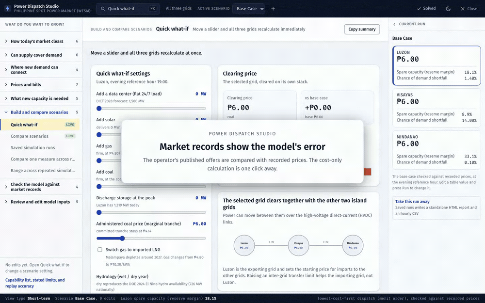
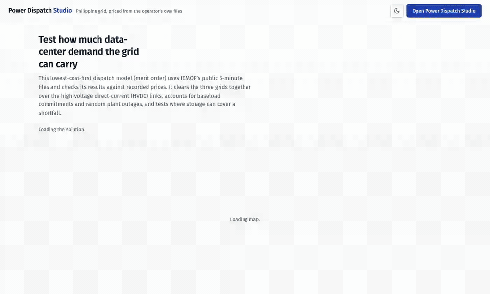
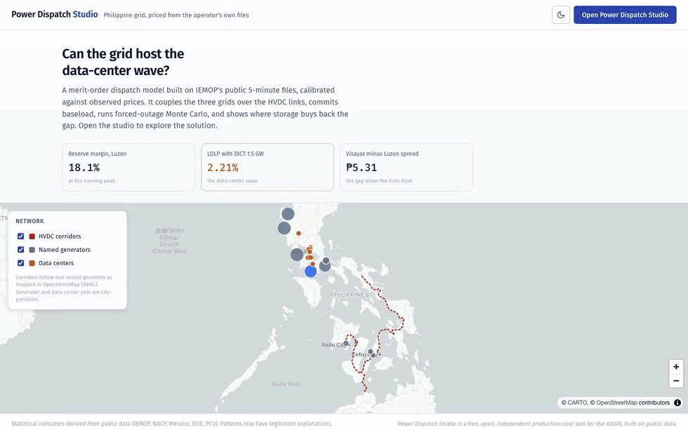
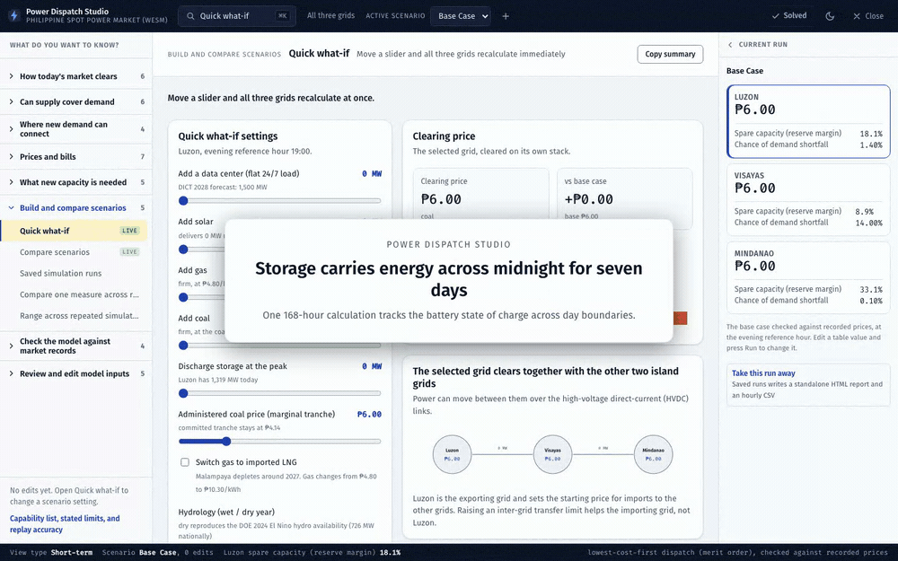
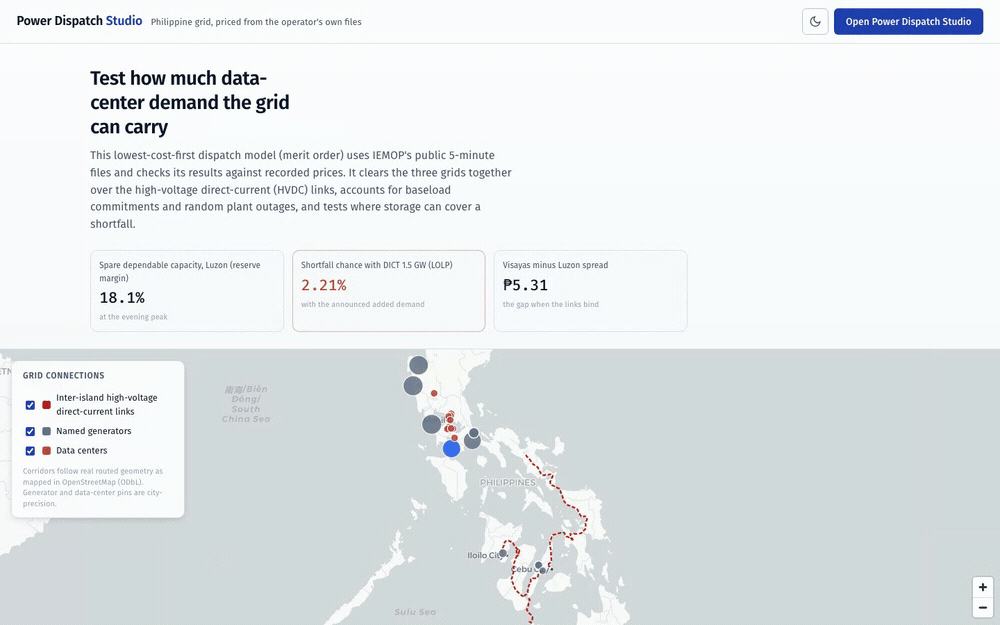
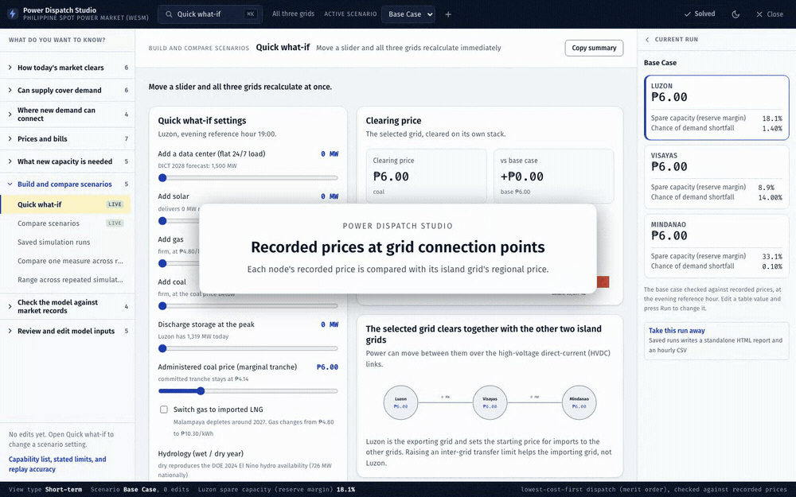
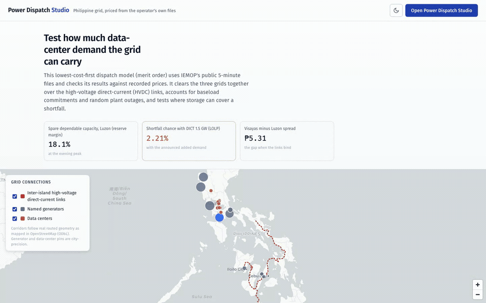
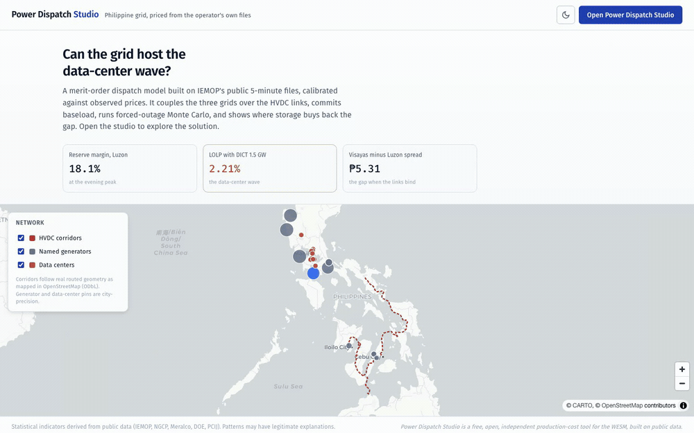
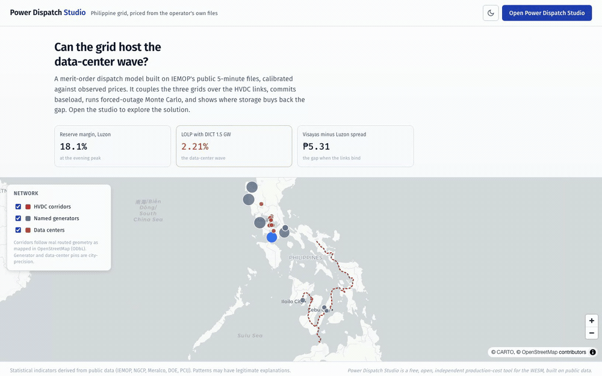

# Power Dispatch Studio

Power Dispatch Studio is a browser tool for the Philippine Wholesale
Electricity Spot Market (WESM). You can edit plant and grid inputs, save cases,
replay recorded market days, and compare calculated prices with market records.
The browser runs the calculations from public data. The URL stores the case and
date range, so the tool needs no account, project file, or license server.

Replay accuracy tests the model against past market results. It
recalculates each recorded day and reports the error for Luzon, Visayas, and
Mindanao. Recorded prices did not set the model inputs.



This recording opens the studio, edits a generator, runs the model, and replays
a recorded day.



## The studio connects editable grid inputs to recorded market results

The browser includes these views and controls.

| Part of the studio | What it shows or changes |
| --- | --- |
| Assumptions and model inputs | Tabs contain plants, fuels, links, grids, storage, sources, and data dates. The 2025 Department of Energy list supplies 355 units. |
| Properties grid with scenario tagging | Each edit belongs to the active case. The x on a changed cell restores its base value. |
| Run | Calculates all three grids together with one linear program in the browser, usually in milliseconds |
| Hourly market replay | Replays a recorded day or the week ending on it with your edits. |
| Long-term | Adds selected DOE committed and indicative projects to the active case. |
| Supply after scheduled outages | Applies scheduled outages, then repeats the shortfall calculation with random forced outages. |
| Load sweep | Adds flat load and shows when links reach their limits, fuels set the price, or supply falls short. |
| Window band | Replays every full day in the archive and reports hourly price percentiles and daily means. |
| Calculated views | Shows dispatch, prices, flows, outages, emissions, and comparisons between cases. |
| Saved runs | Saves the case, dates, calculation version, and hourly results. You can compare, restore, or export a run. |
| Emissions | Reports operational carbon dioxide using sourced factors. Biomass stays uncounted because its factor is contested. |
| Calculated JSON files | Python scripts calculate the browser data from archived IEMOP files. |
| Replay accuracy | Reports error against recorded prices for every full day. It opens on the published-offer replay. |
| What set the price on one day | Separates the cost result, offer effect, and equipment limit at the evening peak. |
| Exports | Writes nightly CSVs to `web/data/exports/`. Each view can download its own CSV. |

The model finds the lowest stated cost for meeting demand each hour. It does not
decide which plants switch on, enforce transmission contingency limits, or model
every grid node. The Annual demand and supply outlook applies the DOE project
lists. It does not choose a build plan.

## The model and its scope

The model shows Luzon, Visayas, and Mindanao with the two high-voltage
direct-current (HVDC) links between them. One calculation meets demand at the
lowest stated generation and transfer cost. A full link can leave the importing
grid with a higher price because cheaper power cannot cross it.

For analysts, this is a three-zone linear dispatch model with marginal prices
and congestion rent. Coal has one block for operating capacity and another at
the published administered price. Hourly market replay recalculates all 24 hours
of each recorded day. Solar follows its daily profile. Storage moves energy when
the price difference covers its losses. The reserve setting holds capacity back
from energy supply.

| Included | Excluded (by design) |
| --- | --- |
| Coupled three-zone dispatch with congestion rent | Within-grid nodal power flow and locational marginal prices. The recorded congestion component was nonzero on 28 of 70 sampled days. |
| DOE unit list for input totals and outage cases; fuel-block dispatch for energy | Unit commitment, run and stop times, and per-resource ramp rates. |
| Hourly replay of recorded days, with each day's real-time scheduled outages matched to the plant list | Load or price forecasting |
| Unserved-energy penalty set to ₱32/kWh, the published WESM offer cap; this is a model coefficient, not a value of lost load | A scarcity-price forecast or participant bidding strategy |
| Storage optimized over the day's hours. The Inter-day storage view carries stored energy across one 168-hour week | Inter-day storage carryover in the default day mode |
| Reserve capacity held out of the energy stack | Joint energy-and-reserve pricing. Administered scarcity prices can exceed every published offer. |
| Repeated shortfall calculations using forced-outage rates, with the day's scheduled outages removable | Maintenance-schedule optimization |
| DOE announced projects as sourced candidates through a selected year | Expansion optimisation, build-cost economics |
| Added-load steps, recorded-day price range, per-hour limit classification, and operational carbon dioxide | Lifecycle or embodied emissions. Only operational emissions from dispatched energy are counted |
| Energy-limited hydro. The daily calculation caps hydro at the day's recorded generation schedule and scales it with edits and the hydrology setting | Inter-day water management. Each day's budget stands alone |

Replay accuracy compares the model with two recorded targets, the
load-weighted average price (LWAP, the settlement-side series) and the
regional market clearing price (MCP, the ex-ante series commensurate with a
dispatch dual). A competitive cost stack under-prices tight hours. That
remaining error is the scarcity and offer premium a cost model cannot see, and
the replay shows it as model error.

## Replay accuracy reports error against settlement and clearing prices

Replay accuracy recalculates every market day with complete data
against the recorded hourly LWAP. In the July 2026 calculated data (window 2026-05-01 to
2026-06-25, 56 market days, 24 hourly points each per grid).

Against the settlement-side LWAP (1,344 hours per grid).

<!-- bc-lwap. updated from profiles.json by scripts/verify_claims.py --write. do not hand-edit -->
| Grid | Recorded mean | Modeled mean | MAE | Bias | Correlation | High-hour hit |
| --- | --- | --- | --- | --- | --- | --- |
| Luzon | P7.53/kWh | P6.00/kWh | P4.25 | -P1.53 | 0.26 | 21% |
| Visayas | P12.38/kWh | P6.00/kWh | P8.20 | -P6.38 | 0.12 | 32% |
| Mindanao | P11.13/kWh | P6.00/kWh | P7.24 | -P5.13 | 0.02 | 6% |
<!-- /bc-lwap -->

Against the recorded regional clearing price (MCP, the ex-ante series
commensurate with a dispatch dual. Tied intervals averaged per interval
before the hourly mean). The table shows coverage because it varies. The MCP
files name a price in fewer Visayas intervals than Luzon ones, and if the
missing intervals skew toward substituted extremes the recorded means here
are subset statistics.

<!-- bc-mcp. updated from profiles.json by scripts/verify_claims.py --write. do not hand-edit -->
| Grid | Coverage | Recorded mean | Modeled mean | MAE | Bias | Correlation | High-hour hit |
| --- | --- | --- | --- | --- | --- | --- | --- |
| Luzon | 2,028 of 2,064 h | P7.00/kWh | P6.00/kWh | P4.07 | -P1.00 | 0.34 | 28% |
| Visayas | 1,297 of 2,064 h | P13.80/kWh | P6.00/kWh | P10.08 | -P7.80 | 0.08 | 23% |
| Mindanao | 1,886 of 2,064 h | P11.36/kWh | P6.00/kWh | P8.00 | -P5.36 | 0.01 | 13% |
<!-- /bc-mcp -->

And the links themselves, the third table (modeled flow vs the recorded
net market imports and exports in the same files).

<!-- bc-flows. updated from profiles.json by scripts/verify_claims.py --write. do not hand-edit -->
| Link | Recorded mean | Modeled mean | MAE | Direction agreement |
| --- | --- | --- | --- | --- |
| Luzon to Visayas | 41 MW | 2 MW | 86 MW | 5% |
| Visayas to Mindanao | -366 MW | 1 MW | 367 MW | 2% |
<!-- /bc-flows -->

The fourth comparison replays each day with the operator's offer books. These
books include every resource's priced curve and self-scheduled capacity. The
calculation omits separate storage and water limits because unit offers already
include that behavior. Reserve withholding remains available as a whole-book
approximation.

The comparison covers 55 days. It excludes June 9, 2026 because that day's
offers do not cover enough intervals. The window covers one quarter after market
operations resumed. It does not support a long-run claim. Direction agreement
partly follows from the native-load calculation, so flow error and time at the
limit are more useful measures.

The operator's real-time HVDC schedule supplies a separate flow record. Its
hourly means agree with the net-import identity within half a MW. Its congestion
flag gives a limit-frequency check independent of the demand calculation.

<!-- bc-offer-target. updated from profiles.json by scripts/verify_claims.py --write. do not hand-edit -->
| Grid | Target | MAE | Bias | Correlation | High-hour hit |
| --- | --- | --- | --- | --- | --- |
| Luzon | LWAP | P3.03 | +P1.78 | 0.73 | 55% |
| Visayas | LWAP | P4.76 | -P0.80 | 0.69 | 38% |
| Mindanao | LWAP | P3.97 | -P1.06 | 0.74 | 49% |
| Luzon | MCP | P3.08 | +P2.24 | 0.76 | 64% |
| Visayas | MCP | P5.66 | -P4.25 | 0.75 | 51% |
| Mindanao | MCP | P3.16 | -P2.18 | 0.86 | 71% |
<!-- /bc-offer-target -->

<!-- bc-offer-flows. updated from profiles.json by scripts/verify_claims.py --write. do not hand-edit -->
| Link (offer mode) | Recorded mean | Modeled mean | MAE | Direction agreement |
| --- | --- | --- | --- | --- |
| Luzon to Visayas | 40 MW | 81 MW | 98 MW | 84% |
| Visayas to Mindanao | -368 MW | -341 MW | 56 MW | 100% |
<!-- /bc-offer-flows -->

A fifth comparison uses the operator's per-interval HVDC schedule. The table
compares recorded and calculated flow, then compares how often each link reached
its limit. The offer-book calculation moves power in the recorded direction but
reaches link limits less often than the operator's record. The cost calculation
rarely reaches them.

<!-- bc-rtdhs. updated from profiles.json by scripts/verify_claims.py --write. do not hand-edit -->
| Link (vs operator record) | Recorded mean | Modeled mean | MAE | Direction | Recorded limit share | Modeled at-cap share |
| --- | --- | --- | --- | --- | --- | --- |
| Luzon to Visayas, cost mode | 41 MW | 2 MW | 86 MW | 5% | 56% | 0% |
| Visayas to Mindanao, cost mode | -366 MW | 1 MW | 367 MW | 2% | 39% | 0% |
| Luzon to Visayas, offer mode | 40 MW | 81 MW | 98 MW | 84% | 56% | 29% |
| Visayas to Mindanao, offer mode | -368 MW | -341 MW | 56 MW | 100% | 40% | 32% |
<!-- /bc-rtdhs -->

At-cap counts a calculated hour only when the limit is above zero. A fully
blocked link cannot reach a usable transfer limit.

Five calculation changes affect these numbers. They are the LP replacement,
recorded water budgets, a fleet-based hydro split, recorded operating limits,
and native-load demand. Native-load demand equals generation plus net market
imports, so each grid carries the load it served.

That demand change gave the Visayas settlement-price series a 0.12 correlation
and 32 percent high-hour hit rate. The peak adequacy margin fell to 1.6 percent
during a 52-day yellow-alert period. MCP agreement fell at the same time.
Correlation dropped from 0.65 to 0.08 and the hit rate from 93 to 23 percent.

The published-offer replay improves the match. Visayas-Mindanao flow reaches 99
percent direction agreement and 56 MW mean absolute error against a 375 MW mean
flow. The cost calculation agrees with recorded direction in under 10 percent
of decisive hours.

The Visayas settlement bias falls from -P6.38 to -P0.80. Mindanao's
clearing-price correlation reaches 0.86. The difference between the offer and
cost calculations gives a direct offer-price effect. Luzon still overprices
settlement by P1.78, and the sparse Visayas MCP subset keeps a -P4.25 bias.

The two calculations disagree on the 1.5 GW DICT demand case. On the day with
the largest price change, the cost calculation adds P3.25/kWh. The recorded
offers add P13.27/kWh. The increase reaches P9.44 in the Visayas and P7.45 in
Mindanao, where the cost calculation shows no change.

Saved cases check both results, and Hourly market replay reproduces them. Treat
cost-only price changes as lower bounds. Under ERC Resolution 26 of 2025, the
P7.423/kWh secondary cap applies when the 72-hour rolling GWAP exceeds
P12.413/kWh. This case raises the series to P11.33/kWh, below that threshold.

An earlier version used the wrong hourly boundary and reported a breach.
Matching the operator's clock changed both the chosen day and the result. The
case approaches secondary-price-cap exposure without crossing it in this data
window.

The raw recorded series crosses the threshold because some intervals exceed the
P32/kWh offer cap. Those values are violation and scarcity coefficients rather
than ordinary market clearing prices. Holding Luzon values at the offer cap
removes every breach and keeps the peak below the trigger.

The same change does not remove every breach. The System and joint
Luzon-Visayas rows still cross the threshold. Visayas and Mindanao stay above
it under either treatment and apply only during an interconnection outage under
ERC Resolution 26 of 2025. No day stays at the cap for every interval. The full
series, above-cap counts, and breach counts are in `market_ops.json` and the
method page.

The reserve replay uses the first five-minute reserve offer book in each hour
and the scheduled capacity in that interval. The last needed offer sets the
calculated price. The comparison uses 140 days and twelve grid-product groups.
Recorded reserve prices did not set the model inputs.

The calculated average is lower in all twelve groups. It is higher in 9.1
percent of about 40,163 scored hours, by at most P0.033/kWh. Official reserve
prices can include lost energy revenue. Public summary files do not pair each
plant's energy and reserve offers, so the data cannot assign the full difference
to one cause.

The table counts scarcity hours separately. In those hours, scheduled capacity
falls below the stated need and administrative prices can exceed every offer.
The last column excludes those hours.

<!-- reserve-table. updated from market_ops.json by scripts/verify_claims.py --write. do not hand-edit -->
| Pool | Hours | Recorded mean | Modeled mean | Bias | Exact hours | Scarcity hours | MAE outside scarcity |
| --- | --- | --- | --- | --- | --- | --- | --- |
| Luzon contingency (Fr) | 3,360 | P5.72 | P2.19 | -P3.53 | 42.0% | 531 | P3.15 |
| Luzon dispatchable (Dr) | 3,357 | P2.67 | P2.06 | -P0.61 | 84.3% | 430 | P0.41 |
| Luzon regulation up (Ru) | 3,360 | P10.02 | P6.84 | -P3.17 | 66.1% | 983 | P2.75 |
| Luzon regulation down (Rd) | 3,360 | P9.56 | P6.79 | -P2.77 | 54.5% | 975 | P3.06 |
| Visayas contingency (Fr) | 3,354 | P12.02 | P5.28 | -P6.75 | 44.8% | 439 | P6.22 |
| Visayas dispatchable (Dr) | 3,221 | P5.71 | P2.04 | -P3.67 | 63.1% | 449 | P1.18 |
| Visayas regulation up (Ru) | 3,360 | P17.02 | P11.48 | -P5.53 | 49.6% | 306 | P5.30 |
| Visayas regulation down (Rd) | 3,360 | P14.96 | P13.08 | -P1.88 | 70.4% | 305 | P1.76 |
| Mindanao contingency (Fr) | 3,360 | P6.56 | P1.51 | -P5.05 | 48.6% | 458 | P3.98 |
| Mindanao dispatchable (Dr) | 3,351 | P1.70 | P0.25 | -P1.44 | 84.1% | 594 | P0.43 |
| Mindanao regulation up (Ru) | 3,360 | P18.01 | P13.43 | -P4.58 | 68.2% | 280 | P4.63 |
| Mindanao regulation down (Rd) | 3,360 | P17.10 | P16.23 | -P0.86 | 89.0% | 268 | P0.82 |
<!-- /reserve-table -->

Exact hours match the official price within half a centavo. On Luzon
dispatchable reserve the book alone reproduces the official price in four
of five hours, and on Mindanao regulation down in six of seven. The
per-resource joint energy-and-reserve calculation uses the raw
resource-found offers (RTDOE energy, RTDOR
reserve), so the blocker is not a data-identity gap. It is that the
scheduled reserve falls short during scarce hours (11 to 36 percent of the
need) and the official price sits
above the entire offer stack, an administered scarcity value the public
offers do not carry. The method page records that limitation and the comparison
results.

Read these tables before trusting any scenario. The cost model explains
the cost floor and the effect of grid-link limits but under-prices scarcity.
The offer mode prices the submitted bids over the current archive window only.
The high-hour hit rate reports n/a when a flat model cannot rank
hours, instead of a fake 100%. The live view recomputes these numbers
from the current archive window.

Two test sets compare the browser and Python calculations. Both create the same
linear-program text from integer micro-units. Fixtures pin its sha256 hash, so a
coefficient difference fails before either solver runs.

Python then writes five snapshot cases and six daily replays. The browser must
match them within P0.02/kWh and 1 MW, including the price-setter labels. A separate
older cost calculation remains in the Python tests.

The first comparison checks that both implementations build the same optimization problem.
A second check runs eight scenarios through the hourly replay calculation
(`pipeline/scenario_validation.py`). Six changed in the expected direction.
Two changed in the opposite direction, which the calculated inter-grid flows explain.
One uses a dated market event for comparison.

| What-if | An analyst expects | The engine does |
| --- | --- | --- |
| +1 GW solar, Luzon | Lower fuel use and emissions. No change at sunset. | Burns 5,900 MWh less coal and gas. The 7pm peak stays unchanged. |
| +300 MW data center, Luzon | The larger grid absorbs it. | The link changes from export to import and stays full for 6 hours. |
| +300 to +1,000 MW data center, Visayas | The smaller grid fills the link. | The link stays full for 17 to 24 hours across six days. A Visayas price premium appears. |
| +50 MW small hydro, Luzon | small, dispatchable, energy-capped | +175 MWh over the day, price flat, bounded by the water budget |
| +600 MW gas, Visayas | local generation relieves the island | Visayas mean falls, link dependence drops |
| Malampaya to imported LNG | Gas cost rises from P4.80 to P10.30/kWh. | Luzon price rises toward the new gas cost. |
| Trip both 647 MW Sual units | Luzon supply tightens. | The recorded evening moves from coal to oil with no unserved load. |
| 935 MW Visayas outage, Jul 1 (dated) | matches the recorded island spread | reproduces 89.9% of the recorded Visayas-over-Luzon spread |

The 250 MW Leyte-Luzon link reaches its limit after a few hundred MW of extra
Visayas load. A separate historical check puts the threshold at 275 MW. Both
results fall below DICT's 1.5 GW national forecast. The same added demand has a
smaller effect in Luzon than in the Visayas because the Visayas link fills.

Use these peso changes only for direction. They are not forecasts. The cost
model uses flat fuel blocks, so each price change equals the height of the next
block. It does not fit a smooth response to past prices.

Tripping both Sual units and adding a dry year to the DICT case each adds
P5.98/kWh. Both move Luzon from the P6 block to the P12 block. Link-limit hours,
the 275 MW threshold, and the 89.9 percent historical result do not depend on
the block height.

### Browser and Python agree to P0.02/kWh. Recorded prices check historical views while future cases stay scenarios

Two checks cover different questions.

1. **Python and the browser agree within P0.02/kWh.** Both build the same
   byte-for-byte linear-program text and match the saved results.

2. **Recorded prices show where the cost model misses.** The comparison scores
   dispatch against 56 market days. Luzon reaches 0.26 correlation with a
   stated negative bias. Other views share the model's limits. Replay accuracy
   does not test each future case.

The engine is a zonal merit-order linear program. It omits unit commitment,
inter-hour ramp limits, and the nodal network. Adding a generic minimum-stable
level, daily solar shape, and RTDHS link limits made the historical price match
worse. Public Philippine data do not support tuning those rules for each unit.
`market_ops.json` reports each measured change.

The 56-day test checks proposed price rules as well. Withholding scheduled reserve
from the cost stack changed no price or accuracy measure. Committed coal absorbed
the reduction without changing the marginal block, so the model leaves this
setting off.

The water-budget calculation made hydro marginal in under five percent of the
hours, so hydro alone cannot reproduce the Mindanao price shape.

A typical-offer case uses the leave-one-out median offer for each grid and hour
of day. It uses bids only, and it never uses a day's prices or its own offer book.
This case closes 91 percent of the Luzon correlation gap. Pooled correlation
rises from 0.30 to 0.68, and median within-day correlation rises from 0.17 to
0.82. Evening-peak MAE falls from P7.94 to P5.63. In the Visayas, the typical
case reaches 0.70 correlation against 0.68 for the same-day offer book.

The results keep three comparisons. They show the cost floor, typical bidding,
and the day's actual offers. Tables report symmetric mean absolute percentage
error beside the published PyPSA-Eur value of 20.76 percent.

No future market records exist yet for comparison. Each case uses sourced
inputs such as DOE demand growth and NREL cost assumptions. The interface labels
them as scenarios on the current archive window. They are not forecasts.

## Three guided cases show demand, outages, and gas-price changes

**Add a data center and see the price.** Open Assumptions and model inputs,
choose Grids, raise Luzon load by the project's MW, and press Run. Hourly market replay
on the demand-peak day shows which hours move from coal to oil. Save the run,
restore the base, save it, and open Compare scenarios to see the price and
congestion-rent difference.


**Turn off the two biggest units.** Open Assumptions and model inputs, choose Plants,
set SPI U1 and SPI U2 (the two 647 MW Sual units) to zero, and press Run. Loss of
one major unit (N-1) and Power-shortfall risk show the supply effect. Hourly
market replay on the stress day shows whether the evening clears on
oil or sheds load, and its congestion-rent tile prices the links binding in
the peak hours.



**Switch gas to imported LNG.** Open Assumptions and model inputs, choose Fuels, and reprice natural gas from the
Malampaya cost (P4.80/kWh) to the imported-LNG cost (P10.30/kWh), Run, and
read the Hourly market replay price shape. Then in Scenario builder, combine the announced
build and a dry year on the LNG switch for the compounding view. Share the exact
scenario with Copy link.


## Current analysis views extend the recorded-day model

Each analysis below has a recording of the running studio. The numbers on screen
come from one dated data release. The live view recalculates them as the archive
window changes. Read [Browser and Python agree to P0.02/kWh. Recorded prices check
historical views while future cases stay scenarios](#browser-and-python-agree-to-p002kwh-recorded-prices-check-historical-views-while-future-cases-stay-scenarios)
to see which results have matching market records.

These views use the same dispatch as the historical price comparison.

**Inter-day storage.** A 168-hour linear program where the battery state of
charge carries across midnight instead of resetting each day. The daily water
budget stays. Today's recorded price spreads give exactly zero inter-day storage
value because the calculated prices are too flat to cover round-trip loss. The
value turns positive only in a case with higher data-center demand. Browser and
Python calculations match the same saved result.



**Capture prices.** Generation-weighted average price per technology over a saved
run's window, the number a project uses for revenue and Green Energy Auction bid support.


**Generator portfolio value.** Values an owner's generation against hourly WESM
prices and a contract-for-differences strike price, which settles the difference
between the market price and the contract price. It shows the value not covered
by a power-supply agreement beside it.



**Saved runs.** Every saved run's headline measures can be compared side by side.
The same view restores a run and exports its hourly results or an HTML report.

**Five-minute replay.** The recorded five-minute offer books for a sample day
cleared to the grid's own generation, 288 intervals, showing the high-price intervals
the hourly replay smooths.


**Prices at grid connection points.** This view calculates each WESM node's
average difference from its regional price over complete market days. It uses
final dispatch and price records and includes a searchable table. The values
come from market records. The interface calls them locational deviations.
WESM's nodal congestion component is small and intermittent, so losses explain
most of the difference. The map's Prices mode draws the same statistic.



**Transmission-loss check.** This view checks the nodal model against market records.
WESM's within-region nodal structure is loss-dominated (the congestion
component is small and sparse), so marginal loss factors from the OpenStreetMap
grid are a testable prediction of each node's recorded deviation. Three scatter
panels, one per grid, with the Spearman rank correlation and the per-grid
result. Luzon and Mindanao pass. Visayas fails with a stable negative rank
correlation (the sign reversal is not yet diagnosed) and is shown failing.
Recomputed nightly.



Future cases use sourced inputs, but no future market record exists for a direct
comparison. Each view labels its output as a case on the current archive window.
The results are not forecasts.

**Forward prices.** This view applies DOE PDP demand growth to the recorded-day
library. It reports 10th-percentile, median, and 90th-percentile prices through
2030. These repeated cases cover one post-suspension quarter and are not a
forecast.



**Assumptions and data dates.** Every calculated value with its primary source,
calculation date, and archive coverage appears with the editable inputs.



## Data

| Input | Source | Refresh |
| --- | --- | --- |
| Hourly demand and recorded prices (150 days) | IEMOP regional summaries and final load-weighted average price files. Git history keeps files after the public window rolls forward. | Daily scheduled job |
| Per-unit fleet (355 units) | DOE List of Existing Power Plants, grid-connected. Luzon and Mindanao as of 2025-04-30, Visayas 2025-03-31 (Internet Archive captures of the DOE's own PDFs. doe.gov.ph refuses non-PH requests). The parser refuses any grid whose rows do not reconcile to the PDF's own per-fuel subtotals | Per DOE edition |
| Link limits | IEMOP monthly reports (Leyte-Luzon 250 MW operating limit) and the MVIP nameplate | Sourced constants |
| Fuel costs | ERC administered coal price, Malampaya FOI, imported-LNG estimate | Sourced constants |
| Reserve needs and prices | IEMOP real-time reserve schedules from sample days. Inferred product-code mappings are labeled | Sample updates |
| Hydro water budgets | Per-resource daily energy from final dispatch schedules, reconciled to regional summaries within 2 percent per day. Grid-connected WESM hydro matched to the Department of Energy fleet, pumped storage excluded | Daily scheduled job |
| Storage fleet | DOE 634 MW BESS and CBK Power 685 MW Kalayaan. Energy duration is an assumption because sources publish MW only. | Sourced constants |
| Announced projects (Long-term plan) | DOE committed and indicative project lists, as of 31 December 2025 (Internet Archive captures). Every fuel section reconciles to the DOE's printed subtotal and every grid to the DOE's LVM summary | Per DOE edition |
| Transmission candidates | NGCP TDP 2025-2050 (March 2025 + September 2025 revision). MW only where the TDP states transfer capacity | Per TDP edition |
| Scheduled outages | IEMOP outage schedules used in real-time dispatch, sized against the Department of Energy fleet through a manually checked name table. Unmatched codes carry no MW | Daily scheduled job |
| Emission factors | IPCC 2006 fuel defaults at the EMB's published Philippine heat efficiencies. EMB diesel figure. DOE grid factor as cross-check | Sourced constants |
| Supply-mix history | Meralco advisories April to June 2026 (WESM 6/7/10%), each month cross-checked in an independent news report | Monthly advisory |

The interface distinguishes recorded inputs, calculated results, and labeled
assumptions. `../web/methodology.html` carries the source record, and calculated
files store assumptions beside the results.

## Quickstart

```bash
cd studio
npm install
npm run dev        # copies the calculated data, starts Vite on http://localhost:5173
```

Run `make data` at the repository root to recalculate `../web/data/`.

## Check the browser build and model agreement

```bash
npm run typecheck  # tsc --noEmit (app + test configs)
npm run lint       # oxlint
npm run format:check
npm run test       # Vitest. Browser/Python agreement and model rules
npm run build      # production build to dist/
```

## Structure

```text
src/
  lib/       types.ts (generated-model types), data.ts (loader hooks + formatters)
  ui/        kit.tsx (Panel, StatTile, Chip, Segmented, ThemeToggle), DataGrid.tsx
  map/       MapView.tsx (MapLibre network view)
  shell/     nav.ts (26 destinations in six workspaces), Shell.tsx (bar, rail, palette, run dock)
  studio/    Studio.tsx (model state, panes, Run button, share links and direct links)
             model.ts (object model + scenario overrides + solveModel)
             lpText.ts (canonical LP text, byte-mirror of pipeline/lp_model.py)
             solver.ts (the HiGHS wasm build, loaded once)
             engine.ts (snapshot clear on the single-hour LP), engine.test.ts +
             model.test.ts
             chrono.ts (day replay as one 24-hour LP), chrono.test.ts (comparison
             with pipeline/lp_dispatch.py reference results and LP text hashes)
             ChronoView.tsx (Hourly market replay), BackcastView.tsx (Replay accuracy)
             insights.ts (binding classification, percentile bands, horizon
             math, CO2), insights.test.ts
             SweepView.tsx (load sweep), DistributionView.tsx (window band)
             LTPlanView.tsx (DOE build pipeline), PasaView.tsx (outage-day
             adequacy), EmissionsView.tsx
             runs.ts + RunsView.tsx (frozen runs, compare, CSV, share links)
             report.ts (self-contained HTML run report), report.test.ts
             model-views.tsx (properties grid + solved views), views.tsx,
             charts.tsx (SVG), Scenario.tsx, Bill.tsx, MarketPower.tsx
  styles/    tokens.css (design tokens, light + dark), base.css, app.css
```

The Python counterparts live in `../pipeline/`. `lp_model.py` (the canonical
LP text) and `lp_dispatch.py` (the highspy reference solve + historical replay build),
`chrono.py` (assembly helpers + the retired clear kept as an independent cost check),
`profiles.py` (recorded-day data including hydro water budgets), `fuelmix.py`
(DIPCEF daily deriver + hydro classification), `fleet_doe.py` (DOE list
parser with a check that the plant rows add up to the published total). The pipeline needs `highspy` (pip). The studio's WebAssembly
solver installs with npm.

## Recording scripts capture the running application

Start the development server on `http://localhost:5173`, then run the recorder.

```bash
python3 scripts/record-demo.py
python3 scripts/record-workflows.py all
python3 scripts/record-views.py all
```

The scripts read caption values from the running studio, so recordings use the
current model results. `scripts/convert-views.sh` converts the recorded videos
to GIF files.

## Limitations to keep in view

- The model has three zones and two links. It does not calculate congestion
  within a zone.
- The snapshot calculation prices one reference hour. Hourly market replay
  prices 24 (or 168), with stored energy carrying between hours.
- Editing a unit shifts the available capacity of its fuel block. This
  approximation dispatches fuel blocks and does not switch individual units.
- Storage optimisation resets daily. No inter-day carryover, and cycling that
  does not pay within the day does not happen, reported as idle.
- Unserved load prices at the dearest block (the documented no-VoLL stance),
  so the model still does not price the scarcity tail.
- Recorded-day replay is not a forecast. Forward cases (the LNG switch, dry
  hydrology, added load) are what-ifs on recorded days.
- The historical replay table above is the accuracy statement. If your use case needs
  the scarcity tail priced correctly, this model does not do that, and says so.

## License and attribution

Code MIT. Calculated data products CC-BY-4.0. Attribution when redistributing.
Power Dispatch Studio (2026), IEMOP public market data archive, DOE List of Existing
Power Plants. The interface is an original work.
